<div align="center">

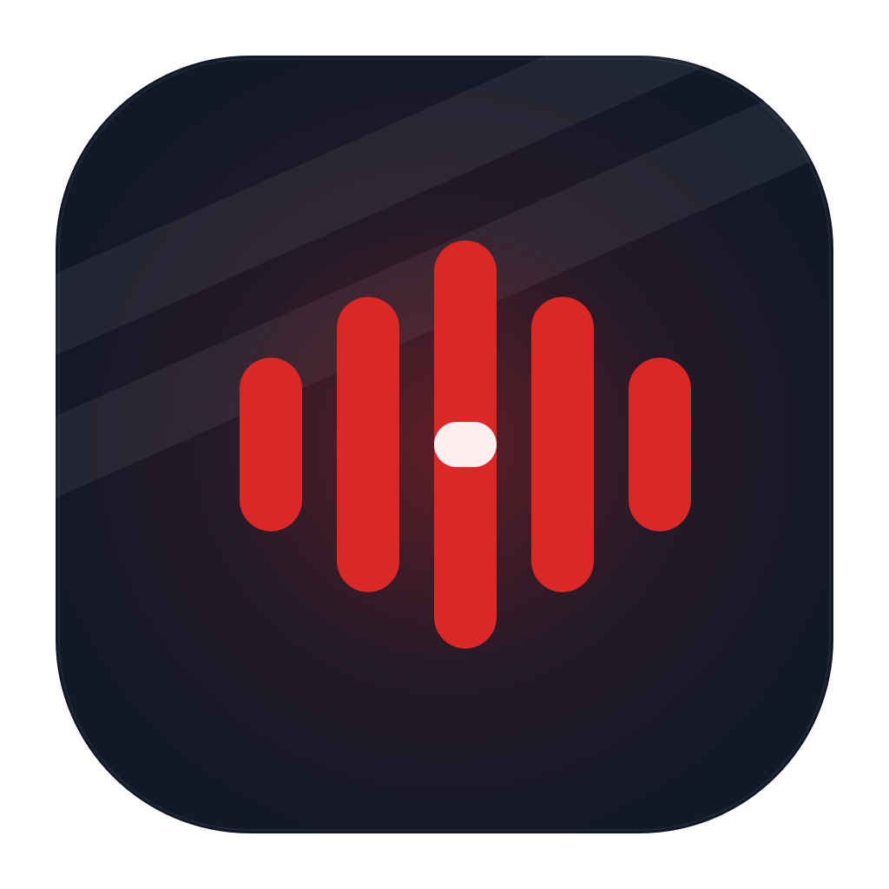

# CAYADEV Visualizer

### Sahip olduğunuz her ekran için sese tepki veren görseller

**Windows** · **macOS** · **Linux** · Electron + WebGL2 · Yerel WASAPI / CoreAudio / PulseAudio yakalama

[](LICENSE)
[](#paketleme--dağıtım)
[](https://www.electronjs.org/)
[](#testler)
[](https://cayadev.com)

</div>

<div align="center">

| | |
|:---:|:---:|
| 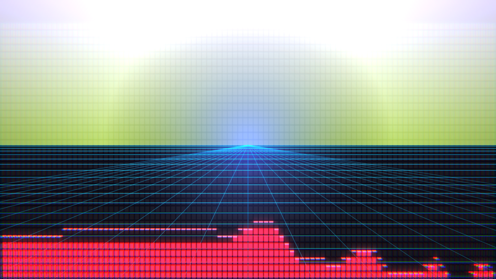 | 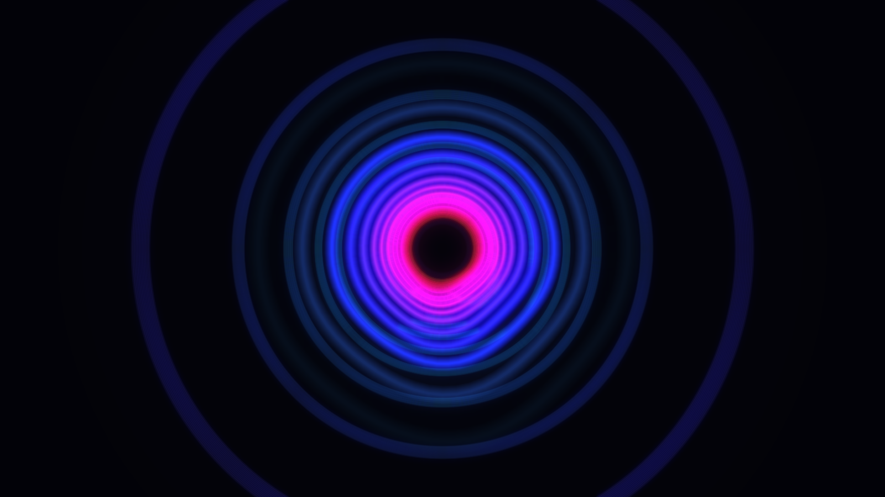 |
| 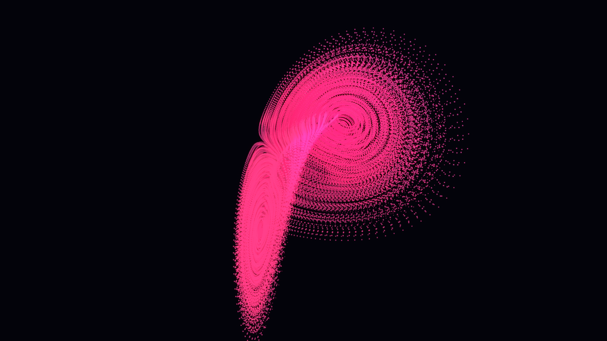 | 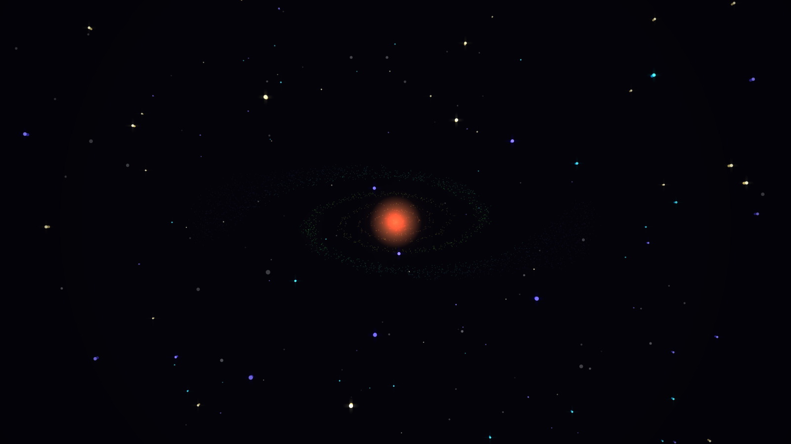 |
| 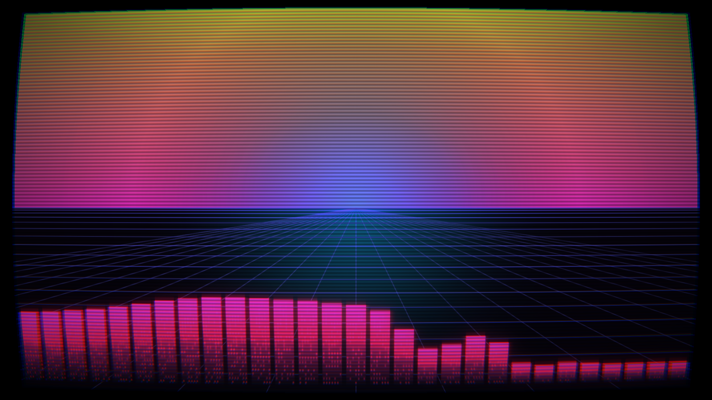 | 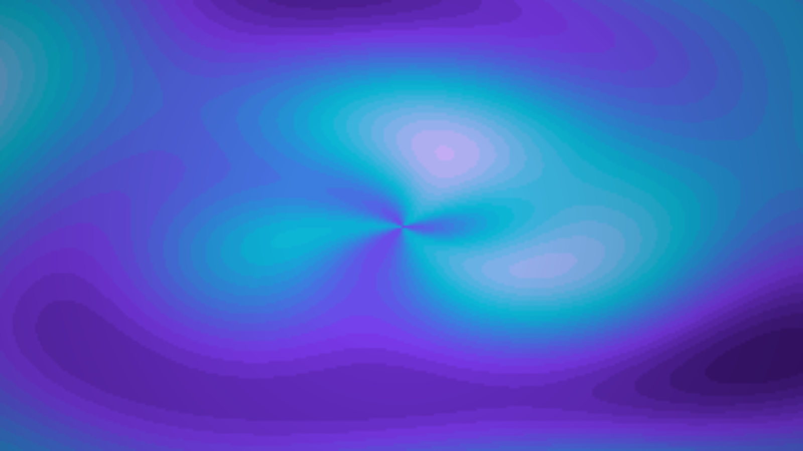 |

</div>

---

## Hareket halinde

<div align="center">

| Hyper Tunnel | 3B çekici |
|:---:|:---:|
| 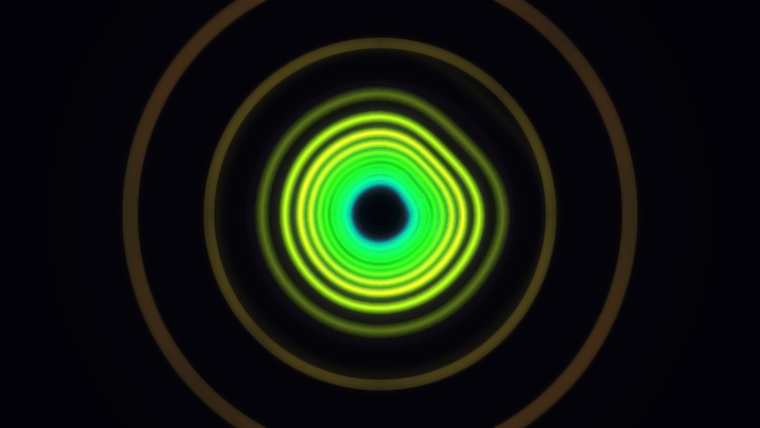 | 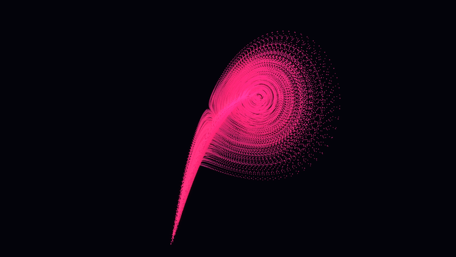 |
| **Akış alanı** | **MilkDrop geri beslemesi** |
| 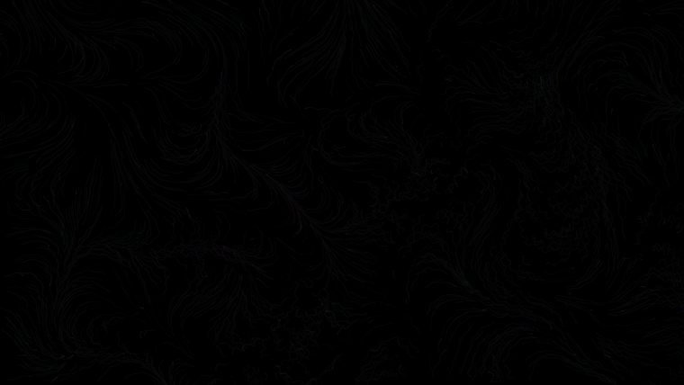 | 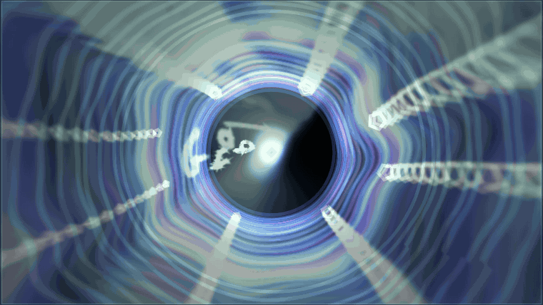 |
| **Katmanlı sahne** | **Frekans barları** |
| 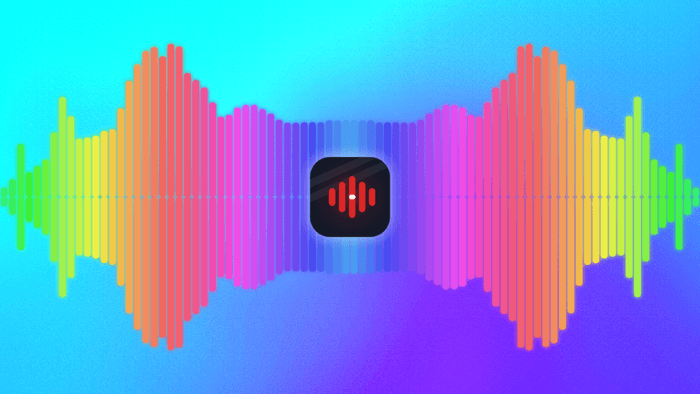 | 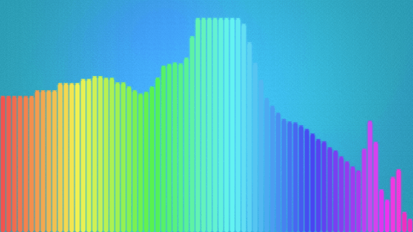 |

</div>

> Bu sayfadaki her görsel ve klip `npm start -- --shots` ile, 120 BPM'lik sentetik bir sinyalle
> üretiliyor. Gerçek seste müziği takip ederler.

---

## Müzik videosu düzenleri

Şarkı videoları ve resmî kanallar için sade düzenler — kulüp ve VJ malzemesinden bilinçli olarak
ayrı tutuldu.

<div align="center">

| | |
|:---:|:---:|
| 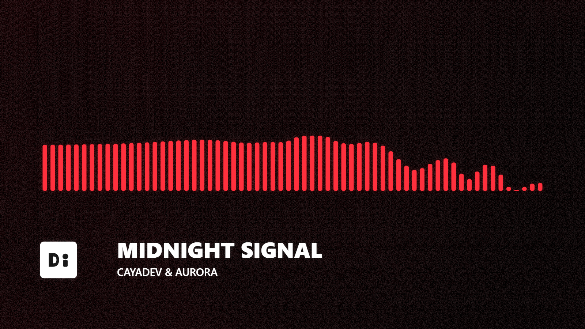 | 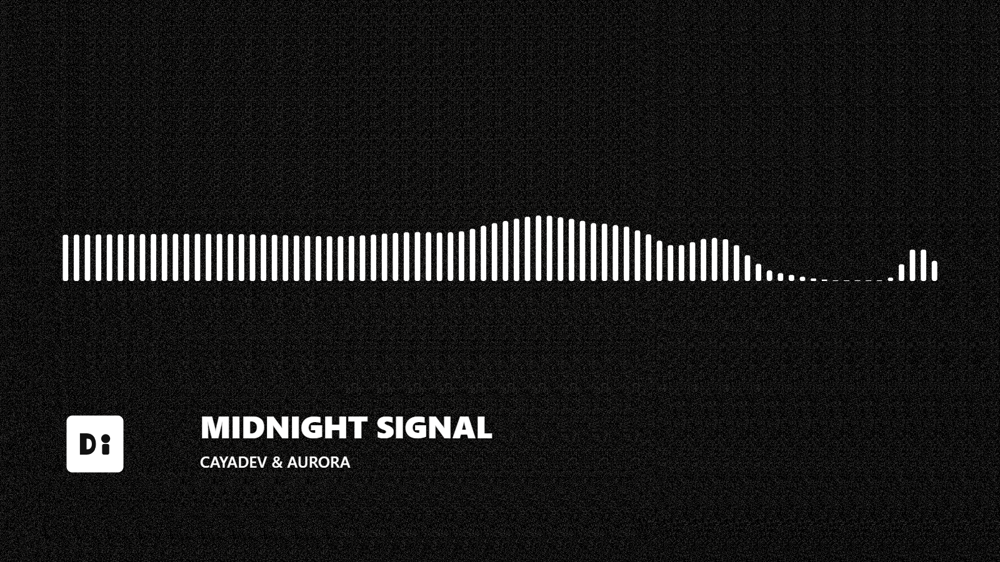 |
| 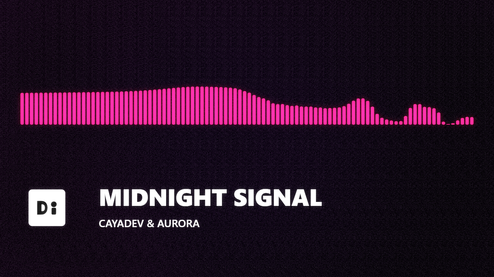 | 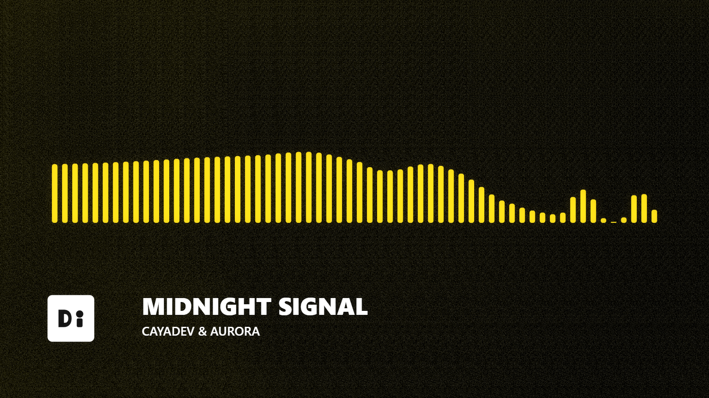 |

</div>

- **Sekiz hazır düzen** — Label Card, Artwork Card, Baseline Bars, Amber Room, Minimal White,
  Quiet Frame, Corner Meter, Centre Strip.
- **Bar yerleşimi** — genişlik, yatay konum, yükseklik ve taban çizgisi; her biri kadranın oranı
  olarak. Bloğu köşeye, ortaya ya da ince bir şerit olarak koyun.
- **Logo barların arkasında değil yanında**, hemen yanında parça ve sanatçı adı.
- **Parça bilgisi** çalan parça alanlarından gelir; başlık ve sanatçı ayrı katmanlar olarak, kendi
  boyut ve kalınlıklarıyla çizilebilir.
- **Arkada sabit bir görsel ya da sakin bir video**, palet sisteminin tamamı kullanılabilir.

---

## Tayf ölçümü

Barlar tahmin edilmiyor, ölçülüyor. Dört frekans ölçeği, desibel genlik ölçeği ve gerçek balistik.

- **Frekans ölçeği** — logaritmik, doğrusal, mel ya da bark.
- **Genlik ölçeği** — doğrusal ya da desibel, ayarlanabilir tabanla. Müziğin sessiz ayrıntısını
  taban çizgisine yapışmaktan kurtaran şey dB'dir.
- **Balistik** — ayrı atak ve bırakma; barlar hızlı fırlar, yavaş iner. Kare hızından bağımsız.
- **Komşu yayılımı** — tepeleri ezmeden genişletir.
- **Profil yumuşatma** — daha yumuşak bir zarf için simetrik komşu ortalaması.
- **Eğim** — oktav başına dB, böylece tiz uç kalıcı olarak ezik kalmaz.

Bir FFT kutusundan dar olan bantlar, bandın merkez frekansında interpole edilir; böylece komşu
barlar aynı kutuyu paylaşmak yerine kendi değerlerini okur. Motoru 27 test kapsıyor; biri bar
profilinde basamak olmadığını doğruluyor.

---

## Yönetici paneli

<div align="center">

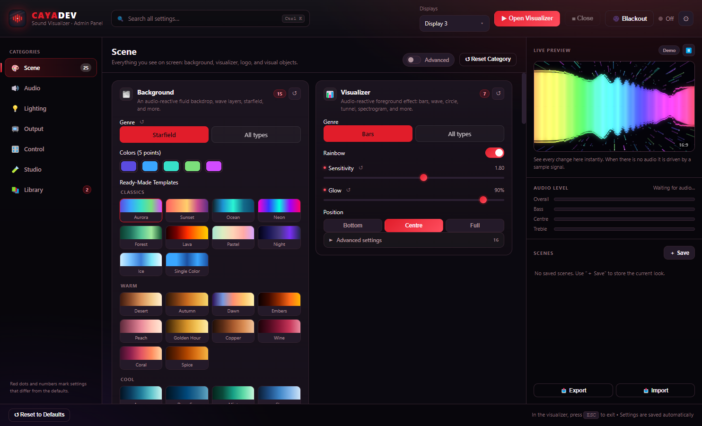

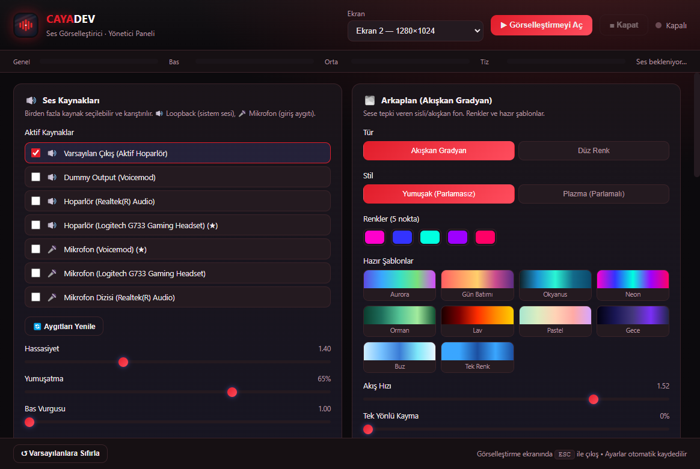

</div>

- **Yedi kategori** — Sahne, Ses, Işık, Çıkış, Kontrol, Studio, Kitaplık.
- **Her şey canlı** — her değişiklik çıkış pencerelerine anında gider ve kendini kaydeder.
- **Değişiklik rozetleri** her kartta ve kategoride; bölümü ya da kategorinin tamamını varsayılana
  döndürme düğmesiyle.
- **Arama** her kategorideki her ayarda.
- **Türkçe ve İngilizce**, çalışırken değişir; arayüzde çevrilmemiş tek bir metin kalırsa öz test
  başarısız olur.

---

## Katmanlar ve efektler

<div align="center">

| Katmanlar | Efekt zinciri |
|:---:|:---:|
| 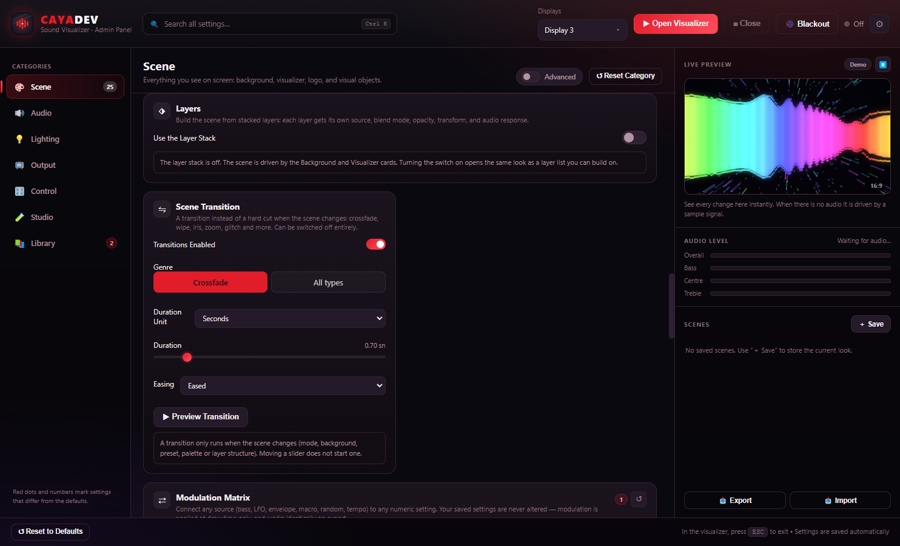 | 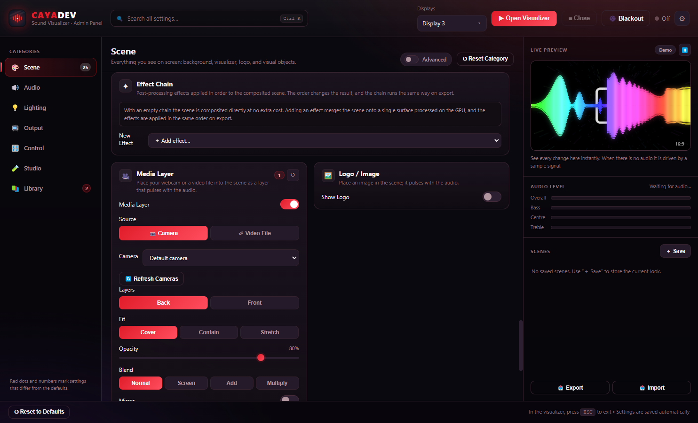 |

</div>

- **Sınırsız katman**; her birinin kendi kaynağı, karışım modu, saydamlığı, dönüşümü ve ses
  tepkisi var. Listede en üstteki katman görüntüde de en üsttedir.
- **17 karışım modu**, tek fader'lı gruplar, solo, sessiz ve kilit.
- **Maskeler** — başka bir katmandan alfa, ayrıca şekil ve gradyan maskeleri.
- **40 GPU efekti**; sıralanabilir, sese bağlanabilir ve bileşiğin yanı sıra katman başına da
  kullanılabilir.
- **A/B çapraz geçişi** katman grupları arasında, eşit güç eğrisiyle.
- **Yığının tamamı kapatılabilir**; sahne katman listesini kaybetmeden yalın Arkaplan +
  Görselleştirici kurulumuna döner.

---

## Modülasyon

<div align="center">

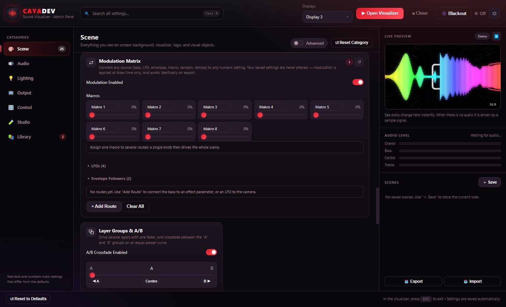

</div>

- **Her kaynaktan her ayara** — LFO'lar, zarf takipçileri, örnekle-ve-tut ve rastgele; yapılandırmadaki
  herhangi bir değere yönlendirilir.
- **Sekiz LFO şekli**, hız Hz cinsinden ya da algılanan tempoya kilitli vuruş bölmeleriyle.
- **Eğri şekillendirme** — üs, S eğrisi, kuantalama, ters çevirme — artı yönlendirme başına
  yumuşatma ve eğim sınırlama.
- **Sekiz makro düğmesi**, atanabilir; MIDI ve uzaktan kumandaya açık.
- **Çevrimdışı dışa aktarımda deterministik**: LFO fazı çizim saatinden geliyor, kare atlamak onu
  kaydıramaz.

---

## Derin ses çözümlemesi

<div align="center">

| Canlı ölçümler | Kroma çemberi |
|:---:|:---:|
| 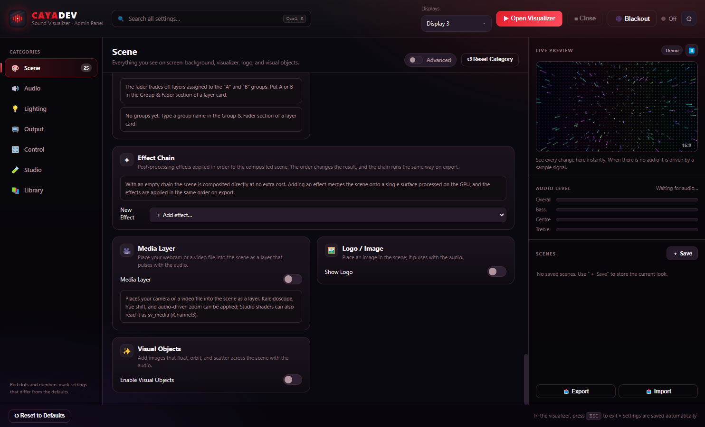 | 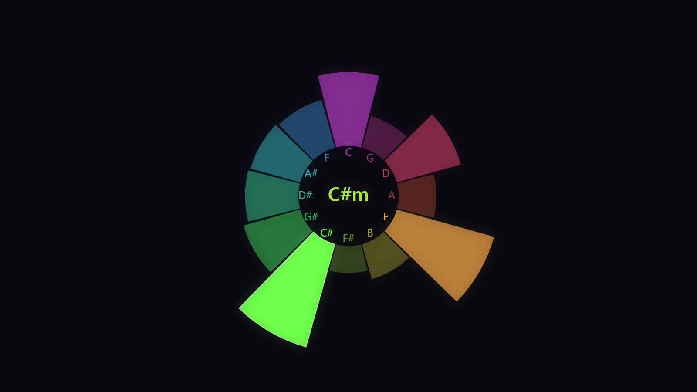 |

</div>

- **Tonalite ve akor**, sabit-Q kroma vektöründen — FFT kutuları yerine Goertzel filtre bankasıyla,
  çünkü 2048 örnekte bas bölgesi kutularla ayrılamıyor.
- **Perde takibi** YIN ile.
- **Armonik / vurmalı ayrıştırması** ve bant başına vuruş algılayıcıları (kick, snare, hat).
- **Tınısal betimleyiciler** — merkez, dönüm, düzlük, tepe faktörü.
- **Gürlük, dinamik, gerçek tepe, stereo genişlik ve korelasyon.**
- Ölçümlerin hepsi modülasyon kaynağı olarak kullanılabilir.

---

## 3B geometri ve formüller

<div align="center">

| | |
|:---:|:---:|
| 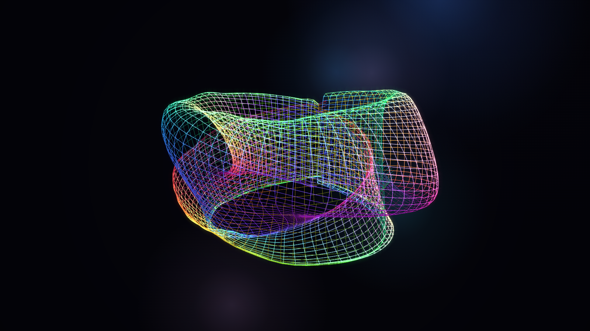 | 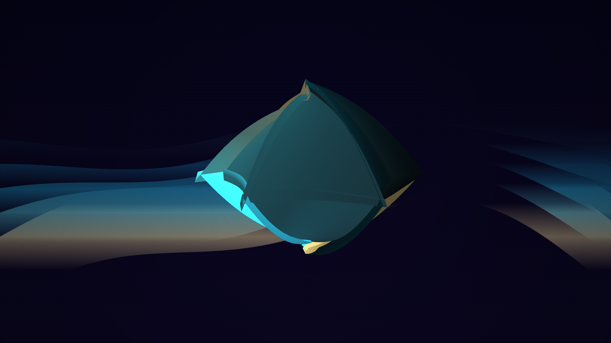 |
|  | 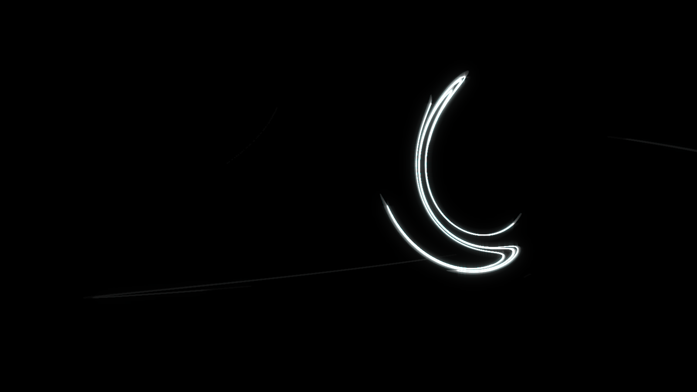 |

</div>

<div align="center">

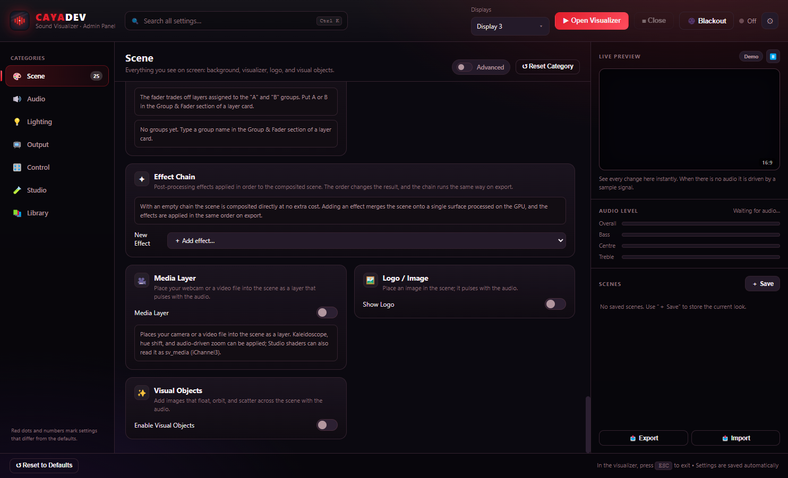

</div>

- **98 formül** — 30 düzlem eğrisi, 12 uzay eğrisi, 29 yüzey, 27 garip çekici.
- **13 katı cisim** — beş platonik katı, alt bölme denetimli jeodezik küreler, dört L-sistemi ve üç
  yinelemeli fonksiyon sistemi.
- **Kendi matris matematiği.** Üçüncü parti 3B kütüphanesi yok.
- **Kadraj bildirilmiyor, ölçülüyor.** Bir çekicinin ilk yinelemeleri sınırlayıcı kutusu için
  taranıyor ve bir test her sistemin görüş hacminin içine düştüğünü doğruluyor.

---

## MilkDrop

<div align="center">

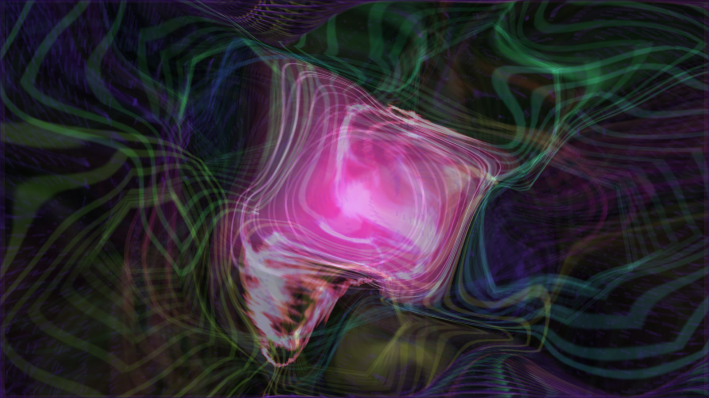

</div>

- **Preset dili gerçekten çalışıyor** — sözcük çözümleyici, ayrıştırıcı ve JavaScript kapanışlarına
  derleme. `per_frame` ve `per_pixel` denklemleri gerçek bir warp ağını geri beslemeyle sürüyor.
- **`.milk` içe aktarma**, çok dosyalı paketler dahil; derleme hataları dosya dosya bildiriliyor.
- **Preset metninden üretilen koda hiçbir şey kopyalanmıyor.** Tanımlayıcılar havuz indekslerine
  dönüşüyor, yani bir preset JavaScript kaçıramaz. Bir fuzz testi bunu doğruluyor.

---

## Studio — kendi shader'ınızı yazın

<div align="center">

| Studio | Yerleşik shader'lar |
|:---:|:---:|
| 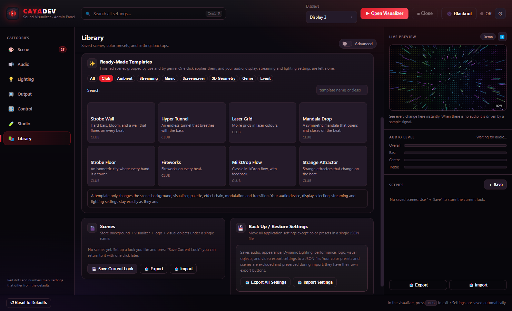 | 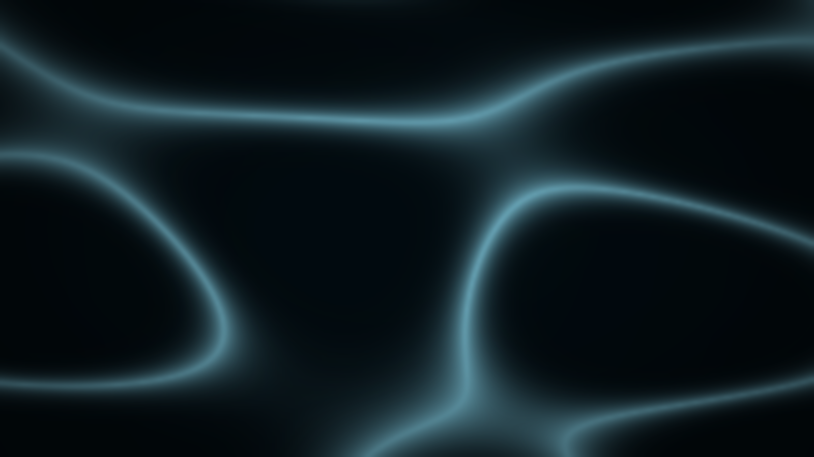 |

</div>

- **GLSL düzenleyici**; canlı önizleme, hata satırı bildirimi ve kendi kaydırıcılarınız.
- **42 yerleşik shader**, hepsi öz testte gerçek GPU'da derleniyor.
- **Shadertoy ve ISF içe aktarma**, yerel dönüştürücülerle. Hiçbir servise bağlanılmıyor.

---

## Projeksiyon haritalama

<div align="center">

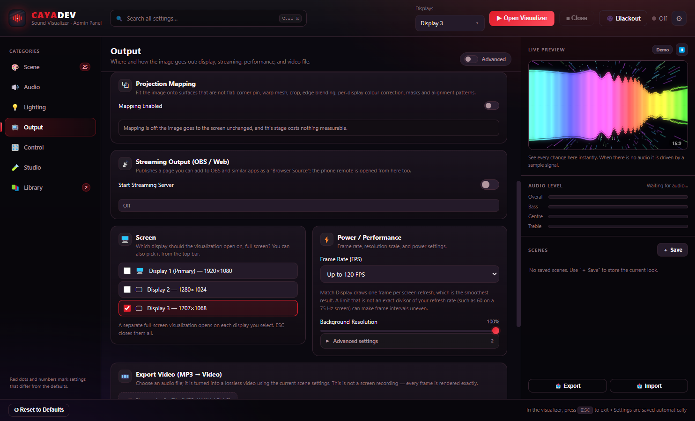

</div>

- **Köşe düzeltme** gerçek bir homografi olarak; payda `gl_Position.w` alanına yazılıyor, böylece
  doku perspektif olarak doğru kalıyor.
- **Ağ bükme**, kontrol noktalarından geçen Catmull-Rom ızgarasıyla.
- **Kenar harmanlama** çoklu projeksiyon kurulumları için; eğrilerin örtüşme boyunca tam olarak
  1'e toplandığı test ediliyor.
- **Ekran başına kırpma, renk düzeltme ve çokgen maskeler**, artı hizalama ızgaraları ve test
  desenleri.

---

## Sahne geçişleri

<div align="center">

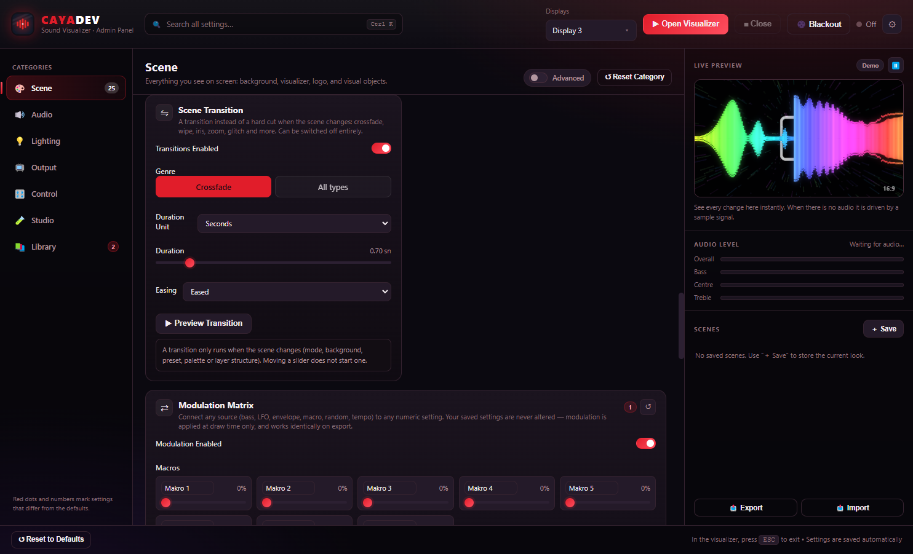

</div>

- **18 geçiş** — çapraz geçiş, erime, silme, kaydırma, parlaklık silme, glitch, zum, bulanıklık,
  flaş.
- **Kapatılabilir**, sahnelerin kesme ile değişmesini istiyorsanız.
- Herhangi bir ayar değil, **sahne** değiştiğinde tetikleniyor; kaydırıcı sürüklemek geçiş
  başlatmaz.

---

## Hazır şablonlar

<div align="center">

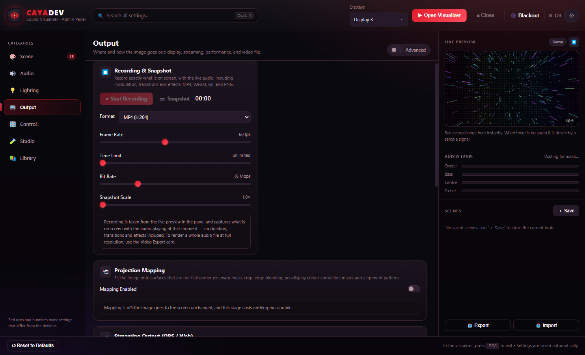

</div>

- **Dokuz grupta 72 bitmiş sahne**: Kulüp, Ambiyans, Yayın, Müzik Videosu, Müzik, Ekran Koruyucu,
  3B Geometri, Tür ve Etkinlik.
- **Tek tık**, ve ses aygıtınız, ekran seçiminiz, yayın ve aydınlatma ayarlarınız korunur — bir
  şablonu denemek çalışan kurulumu bozmamalı. Bir test bunu doğruluyor.

<div align="center">

| | |
|:---:|:---:|
| 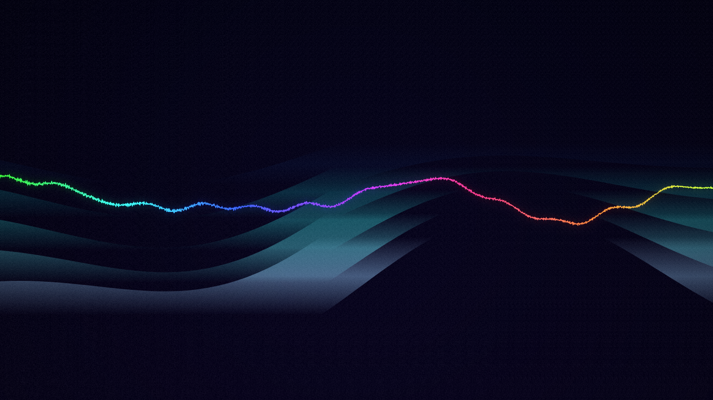 | 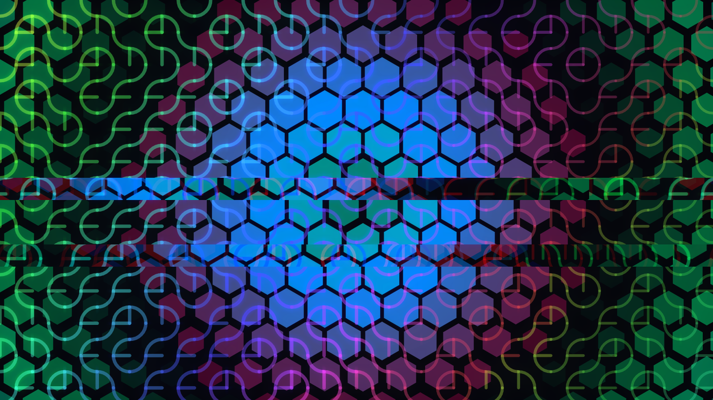 |
| 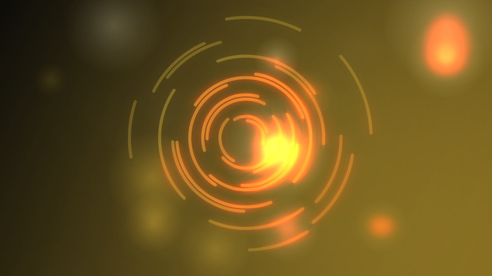 | 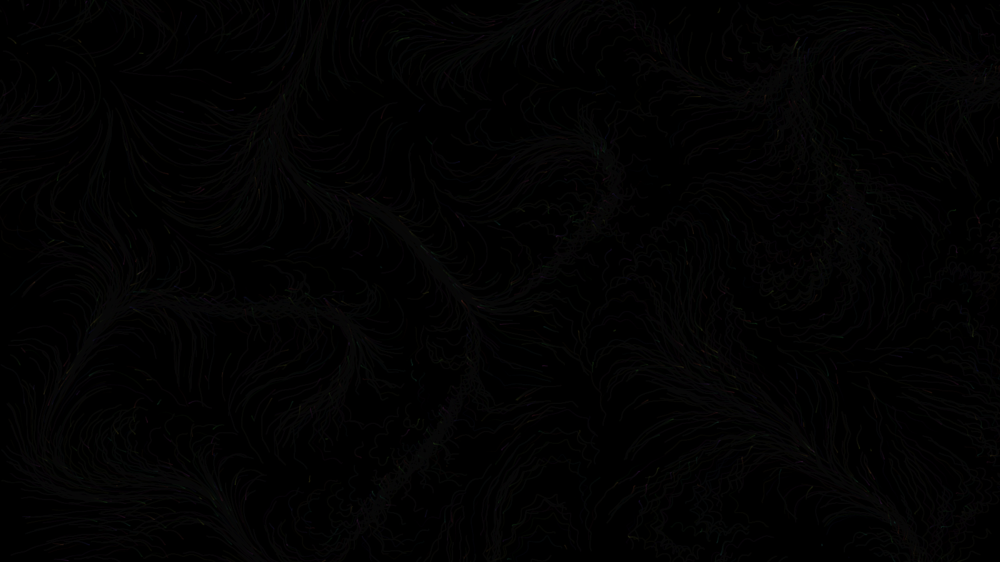 |

</div>

---

## Metin ve şarkı sözü

<div align="center">

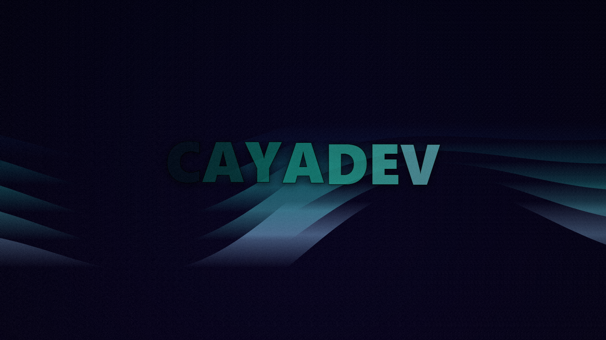

</div>

- **Sese tepki veren tipografi**, karakter başına tepkiyle.
- **LRC ve SRT içe aktarma**; biçim içerikten anlaşılıyor, gelişmiş LRC kelime zamanlamaları
  destekleniyor.
- **Zamanlama düzenleyici**, LRC'ye geri yazan bir senkron kaydırmasıyla.
- **Çalan parça bilgisi**, düzenlenebilir; başlık ve sanatçı ayrı katmanlara bağlanabilir.

---

## Kayıt ve dışa aktarma

<div align="center">

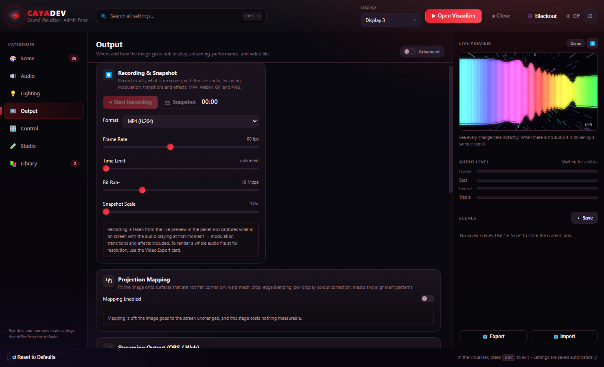

</div>

- **Tek tuşla kayıt**: ekranda göründüğü gibi — canlı sesle, modülasyon, geçiş ve efektler dahil.
- **MP4, WebM, GIF ve PNG.** GIF iki geçişli palet üretimi kullanıyor, çünkü tek geçiş gözle
  görülür bantlanma yapıyor.
- **PNG anlık görüntü** 4× çözünürlüğe kadar.
- **En sık kullanılan en-boy oranları** için hazır profiller.
- **Çevrimdışı video dışa aktarımı** bir ses dosyasını kare kare, deterministik olarak render
  ediyor — görsel regresyon testlerinin dayandığı özellik de bu.

---

## Yayın çıkışı — OBS ve tarayıcı

**Çıkış → Yayın Çıkışı**'nı açın; uygulama saydam bir katman sayfası servis eder.

- OBS'ye **Tarayıcı Kaynağı** olarak ekleyin. Eklenti yok, gerçek saydamlık var.
- Katman sayfası masaüstü penceresiyle **aynı motoru** çalıştırır; gördüğünüz şey yayına giden şeydir.
- Ağ üzerinden çalışır, yani görselleştirici bir bilgisayarda, OBS başka birinde olabilir.

### Mobil kumanda

<div align="center">

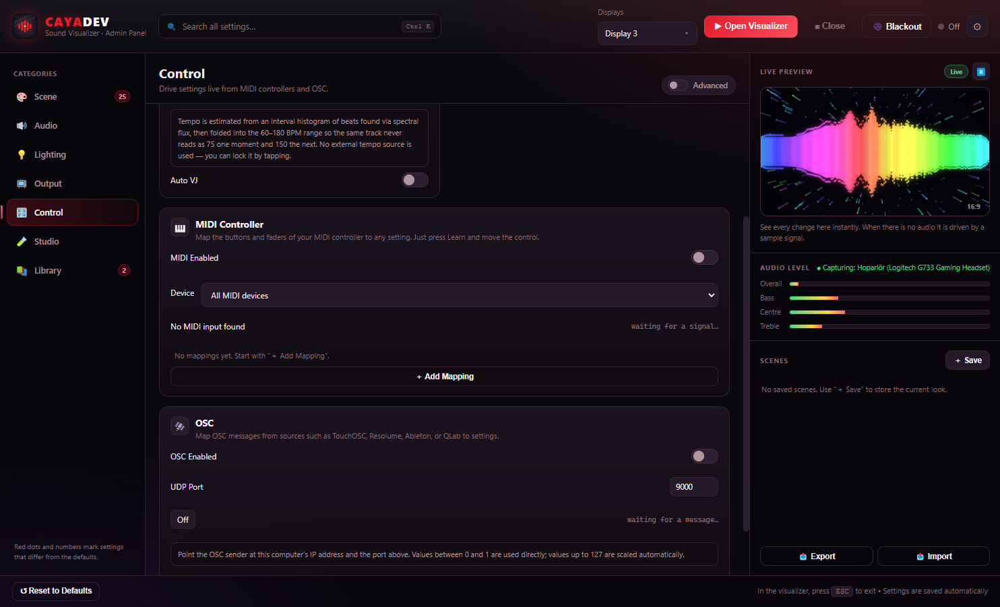

</div>

Aynı sunucu, sahneler, şablonlar ve Studio presetleri için telefon boyutunda bir kumanda sayfası da
barındırıyor; yanında MIDI ve OSC kontrol yüzeyleri.

---

## GPU çıkışı — Spout ve Syphon

Görüntü, aynı makinedeki başka bir uygulamaya **GPU üzerinden** verilebilir: pencere yakalama yok,
eklenti yok, CPU kopyası yok.

- Windows'ta **Spout**, macOS'ta **Syphon**. Alıcılar arasında Resolume, OBS, TouchDesigner,
  MadMapper — bu protokollerden birini konuşan her şey var.
- Alıcıların arayacağı **kaynak adını**, çözünürlüğü ve kare hızını siz seçersiniz.
- Kendi gizli penceresinde çizer; bu yüzden hiçbir ekranda görselleştirme penceresi açık olmasa da
  yayın sürer.
- **Linux'ta yoktur.** Spout bir Windows, Syphon bir macOS teknolojisi ve Linux'ta yerleşik bir
  eşdeğeri yok. Panel bunu söyler ve her platformda çalışan OBS tarayıcı kaynağına yönlendirir.

---

## Klasik görünüşler

Uygulamanın ilk günden beri gelen biçimleri, hâlâ tek tık uzakta.

<div align="center">

| Barlar | Barlar (aynalı) | İnce barlar |
|:---:|:---:|:---:|
| 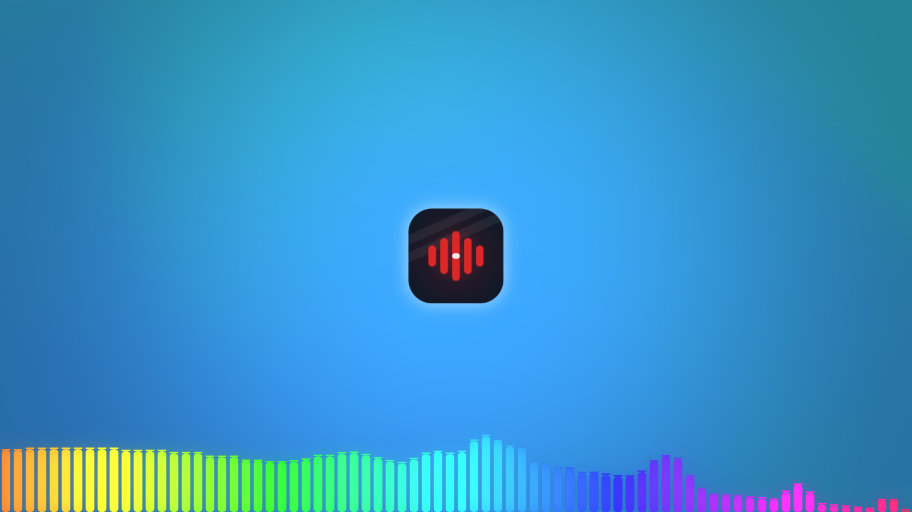 | 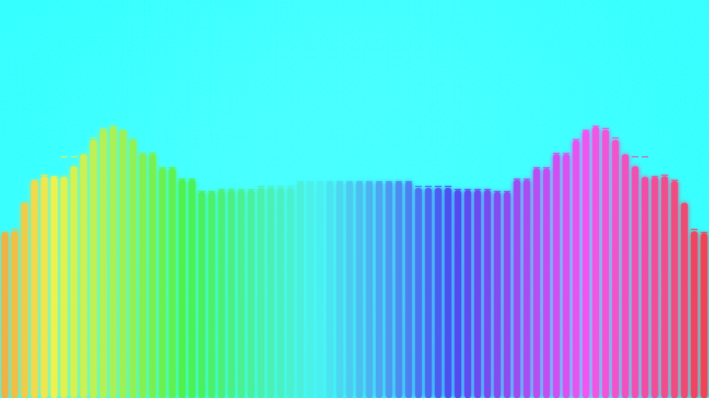 | 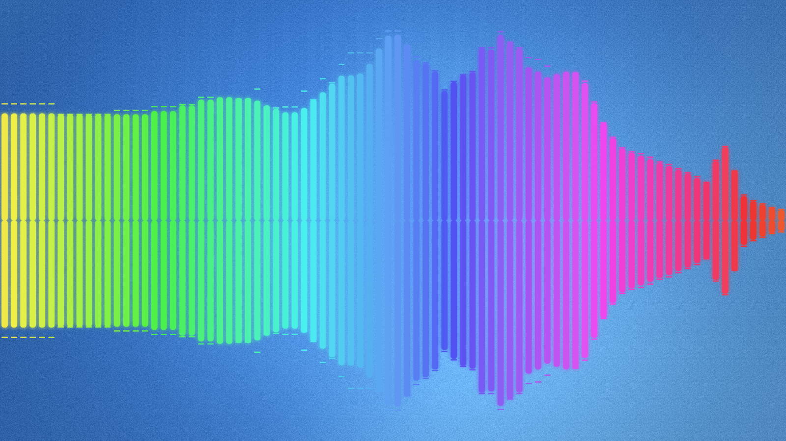 |
| **Merkez** | **Çember** | **Çember (gökkuşağı)** |
| 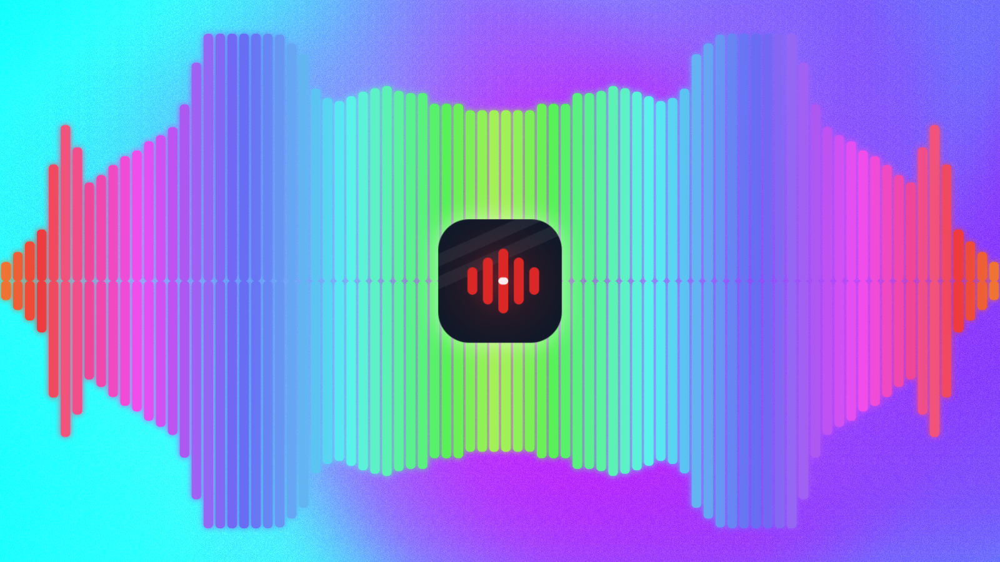 | 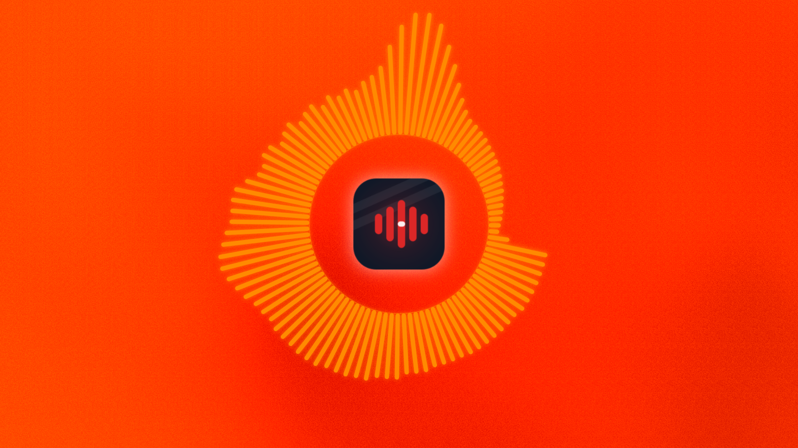 | 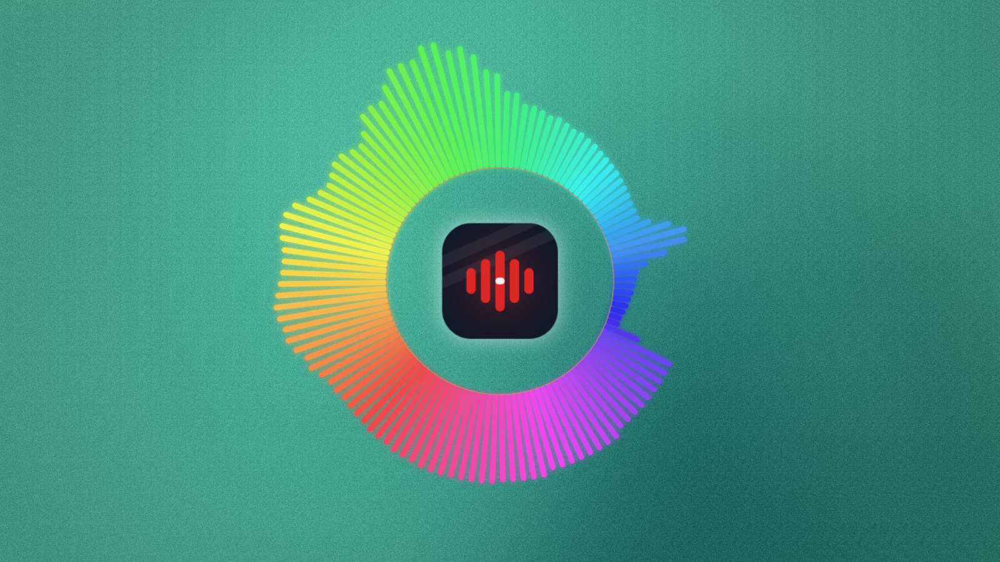 |
| **Dalga** | **Dalga çizgisi** | **Düz renk** |
| 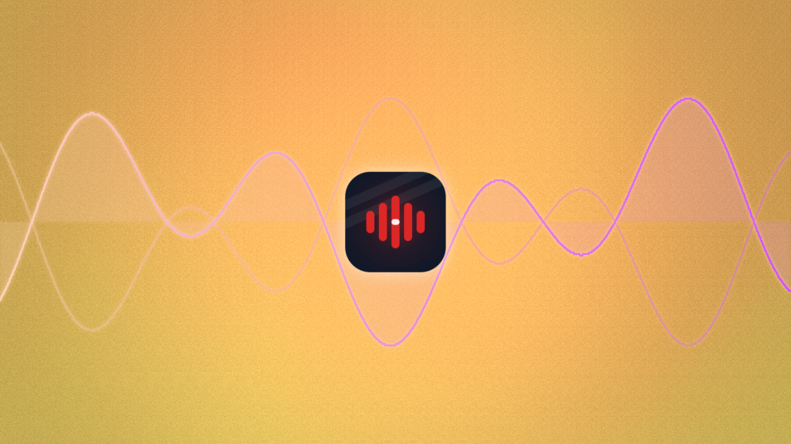 | 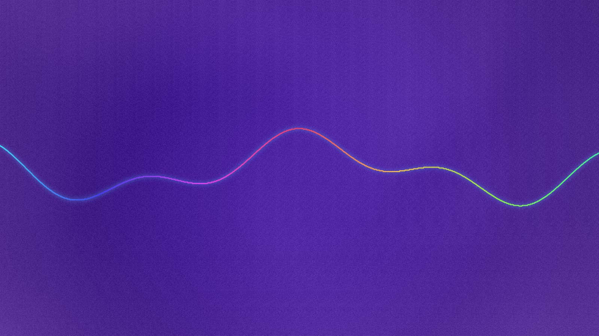 | 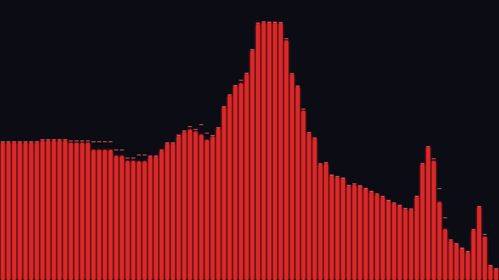 |

</div>

<div align="center">

| Tüm görselleştirici modları | Tüm arkaplanlar |
|:---:|:---:|
|  |  |

</div>

---

## Her şey, ayrıntısıyla

Yukarıdaki bölümler uygulamanın nasıl göründüğünü gösteriyor. Bu bölüm içinde
gerçekte ne olduğunu adıyla sayıyor.

### Arkaplanlar — 31 tür

**Akışkan** — **Akışkan Gradyan** (WebGL shader'da sese tepki veren ağ gradyanı; *Yumuşak* ve
*Plazma* biçimleri, akış hızı, gezinme, yörünge, iç dönüş, bozulma, ölçek, gren, vinyet, ses
patlaması parlaklığı ve ses ile renk kayması) · **Mürekkep** (akarken burulan sıvı damlalar: damla
sayısı, akışkanlık, burulma, yayılma) · **Bulutsu** (üst üste binen yumuşak gaz bulutları: katman
sayısı, boyut, yumuşaklık, yoğunluk) · **Dalga Katmanları** (sesle kabaran tepeler: katman sayısı,
tepe yüksekliği, dalga sıklığı, açıklık, saydamlık) · **Kutup Işıkları** (dalgalanan ışık perdeleri:
perde sayısı, kalınlık, dalgalanma, kenar yumuşaklığı, dikey konum)

**Geometrik** — **Retro Izgara** (ufka giden perspektif ızgara: ufuk yüksekliği, satır ve sütun
sayısı, çizgi kalınlığı, ufuk parlaması, gökyüzü yoğunluğu, spektrum tepkisi) · **Petek Izgara**
(merkezden yayılan dalgayla ve spektrumla aydınlanan altıgen hücreler) · **Mozaik** (düzensiz hücre
ızgarası; her hücre bir frekans bandını izler) · **Koridor** (izleyiciye gelen halkalar ya da
çokgenler: halka sayısı, hız, kenar sayısı, burulma) · **Sarmal** (dönen çok kollu sarmal: kol
sayısı, tur, incelme) · **Nabız Halkaları** (merkezden genişleyen halkalar, bas vuruşlarında ek
halkalar: doğma hızı, genişleme, kalınlık, sönme) · **Ağ** (yakın komşularına bağlanan sürüklenen
düğümler: düğüm sayısı ve boyutu, bağlantı mesafesi, çizgi kalınlığı, hız)

**Atmosfer** — **Yıldız Alanı** (merkezden akan yıldızlar: sayı, boyut, hız izi, derinlik,
parıldama) · **Kar / Kor** (derinlikle salınarak düşen parçacıklar) · **Işık Parçacıkları** (odak
dışı yumuşak toplar: sayı, boyut, boyut çeşitliliği, süzülme, bas nabzı) · **Dijital Yağmur** (düşen
parlak çizgiler: sütun sayısı, düşme hızı, iz uzunluğu, yoğunluk, kalınlık) · **Şehir** (pencereleri
müzikle yanan iki katmanlı paralaks silüet)

**Üretken** — **Sıvı Metal** · **Plazma** · **Su Yüzeyi** · **Şeritler** · **Eşyükselti** ·
**Dalga Alanı** · **Kıvılcım** · **Kum** · **Vitray** · **Devre Kartı** · **Prizma** ·
**Küre Ağı** · **Tel Tüneli** · **Petek Nabzı**

**Diğer** — **Studio Preseti** (kendi yazdığınız GLSL shader) · **Düz Renk**

Beş renk durağı, yedi grupta **58 yerleşik palet** (Klasikler, Sıcak, Soğuk, Neon ve Siber, Karanlık,
Aydınlık, Tek Renk Aileleri) ve kendi kaydettiğiniz paletler her arkaplan türünde, Studio motorunda ve
3B motorda geçerlidir.

### Görselleştirici — 48 mod

**Temel** — **Barlar** · **Merkez** · **Segment** (LED ekolayzer) · **Nokta Matris** ·
**Şehir Silüeti** (pencereleri yanan binalar)

**Dalga formu** — **Dalga** (osiloskop) · **Şerit** (dalga formu geçmişi) · **3B Dalga** (geçmiş
perspektifte üst üste) · **Lissajous** (XY osiloskop) · **Teller** (her tel kendi bandıyla titrer) ·
**Arazi** (perspektif tel kafes manzara)

**Işınsal** — **Çember** · **Dairesel Dalga** · **Işın** · **Yaylar** (bant başına bir yay) ·
**Fırıldak** · **Mandala** (kutupsal gül eğrisi) · **Kaleydoskop** · **Girdap** · **Sarmal** ·
**Tünel** · **Küre**

**Parçacık ve olaylar** — **Parçacık** · **Havai Fişek** (vuruşta patlamalar) · **Şimşek** (basta
dallanan yıldırımlar) · **Baloncuk** · **Sıvı Damla** (metaball) · **Dalgalı Izgara** (vuruşta
yayılan halkalar) · **Spektrogram**

**Üretken** — **Akış Alanı** (gürültü alanında sürülen parçacıklar) · **Sürü** (spektrumla sürülen
boid'ler) · **Voronoi** · **Truchet** · **Moiré** · **Dalga Girişimi** · **İpler** (vuruşla
tekmelenen verlet fiziği) · **Galaksi** · **DNA Sarmalı** · **İzometrik Şehir** · **Çekici Alanı**
(formül kitaplığından ayrık haritalar; iki parametresi sese bağlı)

**Ölçüm** — **Osiloskop (XY)** · **Gonyometre** (stereo faz göstergesi) · **Kroma Çemberi**
(beşliler çemberi sırasında nota sınıfları; algılanan akorun kökü vurgulanır)

**Motorlar** — **3B Geometri** · **MilkDrop** · **Geri Besleme** · **Metin / Şarkı Sözü** ·
**Studio Preseti**

Bar sayısı, min ve maks frekans, boşluk, yerleşim, ayna, çizgi kalınlığı, genlik, duyarlılık ve
parlama, seçili mod için anlamlı oldukları her yerde görünür. **Gökkuşağı** kapatılıp tek ya da çift
renk seçilebilir.

### Tayf ölçümü

- **Frekans ölçeği** — logaritmik, doğrusal, mel ya da bark.
- **Genlik ölçeği** — doğrusal ya da desibel; taban −24 ile −96 dB arasında ayarlanır.
- **Atak ve bırakma** ayrı zaman sabitleri olarak, kare hızından bağımsız.
- **Komşu yayılımı** (tepeleri ezmeden genişletir) ve **profil yumuşatma** (simetrik komşu
  ortalaması).
- **Eğim**, oktav başına dB; 1 kHz'de nötr.
- **Bar yerleşimi** — genişlik, yatay konum, yükseklik ve taban çizgisi; her biri kadranın oranı.

### Katmanlar, maskeler ve gruplar

- Sınırsız katman; her birinin kendi kaynağı, karışım modu, saydamlığı, dönüşümü (ölçek, döndürme,
  X/Y, çevirme) ve ses tepkisi (bant, saydamlık, ölçek, döndürme) var.
- **17 karışım modu** — Normal, Toplama, Ekran, Çarpma, Kaplama, Koyulaştır, Açıklaştır, Renk
  Soldurma, Renk Yakma, Sert Işık, Yumuşak Işık, Fark, Dışlama, Renk Tonu, Doygunluk, Renk,
  Parlaklık.
- **Maskeler** — başka bir katmandan alfa, ayrıca dikdörtgen, elips, doğrusal ve ışınsal gradyan;
  konum, boyut, açı, yumuşatma ve tersine çevirmeyle.
- Tek fader'lı **gruplar** ve eşit güç eğrisinde **A/B çapraz geçişi**.
- **Solo, sessiz ve kilit** — solo bir katmanı geri alınabilir biçimde yalnız bırakır, sessiz
  ayarlarını kaybetmeden gizler, kilit kazara düzenlemeyi engeller.
- Bileşik zincire ek olarak **katman başına efekt zinciri**.
- Katmanları sahneler arasında kopyala, yapıştır ve çoğalt.
- Yığının tamamı kapatılabilir; liste kaybolmadan yalın Arkaplan + Görselleştirici kurulumuna
  dönülür.

### Son işlem — 40 efekt

**Kompozisyon** — Bloom · Parlama · Vinyet · İzler / Eko · Kenar Vurgusu · Renk Derecelendirme

**Bulanıklık ve odak** — Gauss Bulanıklığı · Işınsal Bulanıklık · Yönlü Bulanıklık · Zum
Bulanıklığı · Tilt-Shift · Alan Derinliği (Bokeh) · Keskinleştirme · Kabartma

**Halftone ve desen** — Dither (Bayer) · Halftone · ASCII Mozaik · Çapraz Tarama · Yağlı Boya
(Kuwahara) · Pikselleştirme · Posterize / Ters Çevirme · Eşik · Solarize

**Analog ve bozulma** — Film Greni · CRT / Tarama Çizgileri · VHS / Analog Bant · Glitch (Dilim
Kaydırma) · Datamosh (Blok Kaydırma) · Bozuk Sinyal · Renk Kayması

**Bozunma** — Lens Bozulması · Burgu · Kutupsal Dönüşüm · Dalgacık Bozulması · Slit-Scan ·
Kaleydoskop · Ayna

**Renk ve ışık** — Gradyan Eşleme · Seviyeler ve Eğri · Tanrı Işınları · Yıldız Filtresi

Her biri sıralanabilir, kendi saydamlığı vardır, açılıp kapatılabilir ve her parametresi modülasyon
matrisiyle sürülebilir.

### Sahne geçişleri — 18

**Kesme** · **Çapraz Geçiş** · **Erime** · **Silme** · **Işınsal** · **Saat** · **Kanat** ·
**Panjur** · **Şeritler** · **Dama** · **İris** · **Parlaklık** (giden karenin kendi parlaklığına
göre, kendi aralığına normalize edilerek) · **Zum** · **İtme** · **Kaydırma** · **Flaş** ·
**Glitch** · **Bulanıklık**

Altı yumuşatma eğrisi — doğrusal, yumuşak, yavaş giriş, yavaş çıkış, yavaş giriş-çıkış ve ani —
artı saniye ya da vuruş cinsinden süre. Geçişler tamamen kapatılabilir ve herhangi bir ayar değil
**sahne** değiştiğinde tetiklenir; kaydırıcı sürüklemek geçiş başlatmaz.

### Modülasyon

**Kaynaklar** — bas, orta, tiz, seviye, vuruş zarfı ve vuruş tetiği · sekiz spektrum bandı · dört ve
üzeri LFO · iki ve üzeri zarf takipçisi · örnekle-ve-tut · rastgele · vuruş saati · makro düğmeleri ·
ve tüm derin çözümleme ölçümleri.

**LFO şekilleri** — sinüs, üçgen, yükselen testere, alçalan testere, kare, darbe, rastgele rampa ve
gürültü; hız Hz cinsinden ya da algılanan tempoya kilitli vuruş bölmeleriyle (1/16'dan 8 ölçüye),
artı faz kaydırma ve darbe genişliği.

**Yönlendirme** — herhangi bir kaynaktan, mevcut ayarların canlı ağacından seçilen herhangi bir
yapılandırma yoluna. Her yönlendirmenin alt sınırı, üst sınırı, miktarı, kipi (ata ya da ekle),
eğrisi (doğrusal, üs, S eğrisi, kuantalama, ters çevirme) ve kendi yumuşatma ile eğim sınırlaması
vardır.

**Makrolar** — sekiz atanabilir düğme; MIDI öğretmeye ve mobil kumandaya açık.

Değerler kopyala-yaz ile uygulanır, yani modülasyon kayıtlı ayarlarınızı hiç değiştirmez; LFO fazı
biriktirilmek yerine çizim saatinden hesaplanır, böylece çevrimdışı dışa aktarma kare kare kesindir.

### Derin ses çözümlemesi

Kroma vektörü (sabit-Q Goertzel filtre bankası), tonalite (Krumhansl-Schmuckler profilleri), şablon
tabanlı akor, armonik/vurmalı ayrıştırması, kick/snare/hat için bant başına vuruş algılama, tınısal
merkez, dönüm, düzlük ve tepe faktörü, gürlük, dinamik, gerçek tepe, stereo genişlik, korelasyon,
mid/side bantları, temel frekans (YIN), sessizlik algılama ve otomatik kazanç, artı kayan tayf
geçmişi tamponu. Hepsinin canlı ölçeri var ve hepsi modülasyon kaynağı olarak kullanılabilir.

### 3B geometri — 98 formül ve 13 katı cisim

**Düzlem eğrileri (30)** — gül eğrileri, lemniskatlar, kardioidler, epizikloidler, hipozikloidler,
sarmallar, ruletler, Lissajous şekilleri, kelebek ve süperformül eğrileri bunlar arasında.

**Uzay eğrileri (12)** — yonca ve simit düğümleri, Viviani eğrisi, helisler, konik sarmallar ve
benzerleri.

**Yüzeyler (29)** — simit, Klein şişesi, Möbius şeridi, Boy yüzeyi, Dini yüzeyi, breather,
süperelipsoid, Gielis süpershape'leri, Chladni şekilleri, yonca borusu ve daha fazlası.

**Çekiciler (27)** — Lorenz, Rössler, Chen, Halvorsen, Thomas, Aizawa, Chua, Dadras, Sprott,
Clifford, de Jong, Hénon ve diğerleri; hem sürekli hem ayrık.

**Katı cisimler (13)** — dörtyüzlü, küp, sekizyüzlü, onikiyüzlü, yirmiyüzlü, alt bölme denetimli
jeodezik küre, dört L-sistemi (ağaç, eğrelti, ejderha eğrisi, 3B Hilbert eğrisi) ve üç yinelemeli
fonksiyon sistemi (Barnsley eğreltisi, Sierpinski dörtyüzlüsü, sarmal).

Tel kafes, nokta ya da gölgeli olarak çizilir; çözünürlük, deformasyon, dönüş, renk kipi ve her
parametrede ses bağlama vardır. Matematik projenin kendi matematiğidir — üçüncü parti 3B kütüphanesi
yok — ve kadraj elle bildirilmek yerine her sistemin gerçek sınırlayıcı kutusundan ölçülür.

### Studio — 42 yerleşik shader

**Arkaplanlar (25)** — Bulut Katmanları · Kıvrım Akışı · Lav Lambası · Mürekkep Yayılması · Duman
Halkaları · Petek Akışı · Bükülmüş Izgara · Truchet Dokuması · Moiré Girişimi · Kristal Mağara ·
Mandelbrot Zumu · Julia Kümesi · Burning Ship · Apollon Contası · Kaleydoskopik IFS · Menger
Süngeri · Mandelbulb · Işık Tüneli · Yıldız Sıçraması · Kutup Perdesi · Sıvı Metal · Neon Yağmur ·
Tepkime Deseni · Su Kostikleri · Prizma Parıltısı

**Görselleştiriciler (11)** — Parlayan Barlar · Spektrum Halkası · Dalga Alanı · Vuruş Patlaması ·
Parlayan Osiloskop · Frekans Ağı · Nota Halkası · Parçacık Akışı · Kaleydoskop Spektrumu · Nabız
Izgarası · Sıvı Barlar

**Artı altı önceki preset** — Plazma Deniz, Frekans Halkaları, Sıvı Metal, Yıldız Geçidi, Dalga
Perdesi, Bas Küresi.

Düzenleyici canlı önizleme, hata satırı bildirimi ve kendi tanımladığınız kaydırıcıları verir.
Shader'lar `sv_resolution`, `sv_time`, `sv_level`, `sv_bass`, `sv_mid`, `sv_treble`, `sv_beat`,
`sv_spec(x)`, `sv_waveAt(x)`, kullanıcının paleti için `sv_col(x)` ve kamera/video katmanı için
`sv_media` alır. Shadertoy ve ISF presetleri yerel dönüştürücülerle içe aktarılır.

### MilkDrop

Preset dili gerçekten çalışıyor: sözcük çözümleyici, AST'ye ayrıştırıcı, JavaScript kapanışlarına
derleme, değişken havuzu (`q1`–`q32`, `t1`–`t8`, `regNN`), yerleşik fonksiyon kitaplığı — her
yerleşik sonlu bir sayı döndürür, `log(0)` ve sıfıra bölme dahil — kare başına denklemler, warp ağı
boyunca piksel başına denklemler ve geri besleme çizici. `.milk` dosyaları tek tek ya da paket
olarak içe aktarılır; derleme hataları dosya dosya bildirilir.

### Metin ve şarkı sözü

Yazı tipi, kalınlık, boyut, hizalama, X/Y konumu, saydamlık, kontur ve gölge · süreli canlandırma
presetleri · ölçek, titreme ve kaldırmayla karakter başına ses tepkisi · kayan yazı ve bant ·
karaoke vurgusu · biçimi içerikten anlaşılan LRC ve SRT içe aktarma, gelişmiş LRC kelime
zamanlamalarıyla · LRC'ye geri yazan senkron kaydırması · çalan parça bilgisi; tek satır olarak ya
da ayrı başlık ve sanatçı katmanları olarak bağlanabilir.

### Medya katmanı

Web kamerası ya da video dosyası; görselleştiricinin önüne ya da arkasına yerleşir. Sığdırma
(kapla, sığdır, ger), aynalama, 3–12 dilimli kaleydoskop, renk kayması, doygunluk, karışım modu,
saydamlık ve sese bağlı yakınlaşma ile saydamlık. Aynı kare Studio shader'larında `sv_media` olarak
okunabilir.

### Sahneler, şablonlar ve sahne üreticisi

- **Sahneler** görünüşün tamamını — arkaplan, görselleştirici, katmanlar, logo ve görsel nesneler —
  bir adla saklar. Tek tıkla geri yüklenir, mevcut görünüşten güncellenir, JSON olarak dışa/içe
  aktarılır.
- Dokuz grupta **72 şablon**:
  - *Kulüp (8)* — Strobe Wall, Hyper Tunnel, Laser Grid, Mandala Drop, Strobe Floor, Fireworks,
    MilkDrop Flow, Strange Attractor
  - *Ambiyans (9)* — Aurora, Ink in Water, Topography, Underwater, Embers, Liquid Metal, Night
    Globe, Flow Field, Interference
  - *Yayın (6)* — Corner Bars, Clean Wave, Ring Meter, Scope Overlay, Lower Third, Studio Meters
  - *Müzik Videosu (8)* — Label Card, Artwork Card, Baseline Bars, Amber Room, Minimal White, Quiet
    Frame, Corner Meter, Centre Strip
  - *Müzik (6)* — Chroma Wheel, Helix, Silk Ribbons, Strings, Spectrogram, Galaxy
  - *Ekran Koruyucu (6)* — Plasma, Stained Glass, Circuit, Wire Tunnel, Dunes, Prism
  - *3B Geometri (8)* — Klein Bottle, Lorenz, Supershape, Trefoil Tube, Chladni, Rose Curve, Chua
    Circuit, Möbius
  - *Tür (16)* — Techno, House, Drum & Bass, Hip-Hop, Lo-Fi, Synthwave, Rock, Metal, Jazz,
    Classical, Ambient, Pop, Trance, Dubstep, Chiptune, Experimental
  - *Etkinlik (5)* — Minimal Line, Corporate, Gala, Festival, Projection Test
- **Sahne Üreticisi** bir tarifden sahne kurar. Sinir ağı **değildir** ve öyle sunulmaz: metni
  ağırlıklı bir anahtar kelime sözlüğüyle dört eksene indirger ve deterministik bir üreteci bu
  eksenlerden tohumlar. Tamamen çevrimdışı çalışır.
- Sahneler ve renk paletleri genel ayar yedeğinin **dışındadır** ve yedek içe aktarıldığında
  korunur; her birinin kendi dışa/içe aktarımı vardır.

### Logo, görsel ve görsel nesneler

- **Logo** — kadranın istediğiniz yerine konan, boyutu otomatik ayarlanan bir görsel; boyut,
  saydamlık, parlama, X/Y konumu ve ses nabzıyla. Şablon uygulamak logo dosyasını değiştirmez,
  yalnızca yerleşimini değiştirir.
- **Görsel nesneler** — görselleştiricinin önüne ya da arkasına yerleşen resim nesneleri; sayı,
  boyut, süzülme, dönme ve ses tepkisiyle.

### Ses

- **Sistem çıkışı** (loopback), **mikrofon ve giriş aygıtları** ya da aynı anda birden çok kaynak;
  çözümlemeden önce karıştırılır.
- Çıkış aygıtları Windows'ta WASAPI loopback, macOS'ta CoreAudio ile; Linux'ta aynı sinyali
  PulseAudio ya da PipeWire **monitor** kaynağı taşır. Giriş aygıtları yerel `audify`
  modülüyle doğrudan yakalanır.
- Duyarlılık, yumuşatma ve bas vurgusu; genel, bas, orta ve tiz için canlı ölçerler.

### Kayıt ve video dışa aktarma

- Çıkışın göründüğü gibi **canlı kaydı** — canlı sesle, modülasyon, geçiş ve efektler dahil — MP4
  ya da WebM olarak.
- İki geçişli palet üretimiyle **GIF dışa aktarma**; tek geçiş gözle görülür bantlanma yapıyor.
- Kısayolla 4×'e kadar **PNG anlık görüntü**.
- Sık kullanılan hedefler için **en-boy oranı profilleri**.
- **Çevrimdışı dışa aktarma** seçilen ses dosyasını ayarlanabilir çözünürlük, kare hızı, kalite ve
  kodlayıcıyla MP4'e render eder; ilerleme, iptal ve GPU'dan CPU'ya geri düşüşle. Kare kare kesin ve
  deterministiktir — görsel regresyon testlerinin dayandığı özellik de bu.

### Projeksiyon haritalama

Gerçek homografi olarak köşe düzeltme · Catmull-Rom ağ bükme · ekran başına kırpma · ekran başına
renk düzeltme · Bézier çokgen maskeleri · çoklu projeksiyon için kenar harmanlama · hizalama
ızgaraları, artılar, renk çubukları ve odak halkaları · sürükleme, ok tuşuyla ince ayar ve tam
sayısal giriş.

### Kontrol yüzeyleri

- **MIDI** — kontrolü öğret, sonra herhangi bir CC ya da notayı herhangi bir ayara veya eyleme bağla.
- **OSC** — elle yazılmış OSC 1.0 ayrıştırıcılı UDP dinleyici.
- **Art-Net / DMX** — ArtDMX çıkışı; paket düzeni bayt bayt test edilmiş.
- **Mobil kumanda** — OBS katmanını barındıran aynı sunucudan, telefonla sahneler, şablonlar ve
  Studio presetleri.
- **Tempo** — periyot histogramından BPM kestirimi, elle tempoya vurma ve BPM kilidi.
- **Otomatik VJ** — ölçüye hizalı sahne, mod ve palet değişimleri.

### Windows Dynamic Lighting

- Varsayılan olarak kapalıdır ve yalnızca uyumlu aygıtlar algılandığında görünür.
- Dinamik modlar: görselleştirici renk akışı, bar-spektrum eşlemesi, gelişmiş bas/orta/tiz bölgeleri,
  arkaplan ışığı senkronu, senkron vuruş flaşları, frekans dalgacıkları, bar ve arkaplan füzyonu,
  aygıtlar arası renk akışı, gökkuşağı akışı ve eşik tetikli arkaplan patlamaları.
- Eşik patlamaları tam olarak seçilen tek bir kaynağı (bas, orta, tiz, genel seviye ya da en güçlü
  bant) izler ve yalnızca eşiği aşınca tetiklenir. Parlaklık eşiğin üstünde kalan miktara göre
  ölçeklenir; renk gerçek arkaplan piksellerinden gelir.
- Bant tepkisi anlık/sert, vurgulu/sert ya da yumuşak/akışkan olabilir; eşik, sertlik, atak, bırakma
  ve bant ayrımı ayarlanabilir. Gökkuşağı LED'ler boyunca sırayla ya da tek ortak ton olarak
  çalışabilir ve seçilen bir bandın parlaklığına tepki verebilir.
- Elle modlar: tüm aygıtlarda tek renk, aygıt başına renk ve donanım destekliyorsa LED/bölge başına
  renk.
- Parlaklık, ses tepkisi, yumuşatma, güncelleme hızı, LED düzeni, palet kaynağı, bant başına renk ve
  duyarlılık, flaş eşiği, gücü ve sönümü, dalgacık hızı, yönü ve genişliği ile renk yayılımı ayrı
  ayrı ayarlanır.
- Kurulum paketi Windows arkaplan aydınlatma kimliğini otomatik kaydeder. Taşınabilir sürüm
  kaydetmez ve aydınlatmayı yalnızca uygulama öndeyken denetler — arkaplanda sürmesi gerekiyorsa
  kurulum paketini kullanın ve uygulamayı Windows **Dynamic Lighting → Arkaplan ışık denetimi**
  listesinde üst sıralara alın.

### Diğer platformlarda RGB aydınlatma — OpenRGB

Dynamic Lighting bir Windows hizmeti; bu yüzden macOS ve Linux'ta o kart yerine bunu söyleyen bir
not çıkıyor. O platformlarda cevap **OpenRGB**, Windows'ta ise ek bir seçenek:

- Çalışan bir **OpenRGB** sunucusuyla kendi protokolü üzerinden konuşur (öntanımlı TCP 6742) — üretici
  yazılımı yok, sürücü yok, sunucu başka bir makinede bile olabilir.
- OpenRGB'nin gösterdiği her aygıtı, donanım izin verdiğinde LED başına sürer; **Windows Dynamic
  Lighting ile aynı modları ve aynı renk matematiğini** kullanır. İkisi tek bir çizici paylaşıyor,
  yani bir sahne hangi yoldan geçerse geçsin aynı görünür.
- Aygıtlar LED sayılarıyla listelenir; doğrudan denetimi kabul etmeyen bir aygıt, renkleri sessizce
  yutmak yerine bunu söyler.
- Öntanımlı olarak kapalı ve yalnızca OpenRGB sunucusu çalışırken işe yarar — panel, sessizce
  başarısız olmak yerine bağlantı durumunu bildirir.

### Ayar yedeği ve geri yükleme

- Tüm uygulama ayarlarını tek bir JSON dosyasına aktarır: ses, görseller, Dynamic Lighting,
  performans, logo, görsel nesneler, ekran seçimi ve video dışa aktarma.
- Kullanıcının oluşturduğu **renk paletleri ve sahneler** bilinçli olarak dışarıda tutulur ve içe
  aktarımda korunur; her birinin kendi dışa/içe aktarımı vardır.
- İçe aktarılan ayarlar güncel varsayılanlarla birleştirilir, böylece yeni alanlar geçerli kalır.
  1.3 ve 2.0 ile yazılmış dosyalar tek bir değer kaybetmeden açılır ve bunu bir test kanıtlar.

### Güç ve performans

- **Kare hızı** — *Ekranla Eşle* (tazeleme başına bir kare, en akıcısı) ya da 120, 60, 30 FPS sınırı.
  Sınır tazeleme hızının tam böleni değilse (75 Hz ekranda 60 gibi) uzun vadeli ortalama doğru kalır
  ama kare aralıkları düzensizleşir; bu yüzden *Ekranla Eşle* önerilir.
- Arkaplan çözünürlük ölçeği, sessizlikte duraklat, imleci gizle.

### Uygulama ayarları (⚙ menüsü)

- **Dil** — otomatik (sistem), Türkçe ya da İngilizce.
- **Görselleştirmeyi Her Zaman Üstte Tut** *(varsayılan kapalı)* — görselleştirme penceresi odağı
  kaybettiğinde kendini yeniden öne alır.
- **Genişletilmiş Ayar Aralıkları** *(varsayılan kapalı)* — kaydırıcıların üst sınırını 5×
  yükseltir. Algoritma gereği gerçekten sınırlı olan birkaç ayar (yumuşatma, arkaplan çözünürlüğü)
  hariçtir. Kapatınca girilmiş yüksek değerler korunur.

---

## Nedir

Tek motor, dört çıkış yolu:

- **Yönetici paneli** — her ayarın canlı değiştirildiği kontrol ekranı.
- **Görselleştirme pencereleri** — seçtiğiniz *her* ekranda tam ekran.
- **Yayın sayfası** — OBS için saydam bir katman, artı telefonunuz için kumanda.
- **Spout / Syphon** — karenin GPU üzerinden doğrudan başka bir uygulamaya verilmesi
  (Windows ve macOS).

Ses; **sistem çıkış aygıtlarından** (hoparlör veya kulaklık loopback), **mikrofon ve giriş
aygıtlarından** ya da aynı anda birden çok kaynaktan gelir ve yerel `audify` modülüyle FFT
çözümlemesinden önce karıştırılır.

---

## Ses yakalama nasıl çalışır

Yakalama tarayıcı penceresinde değil, **ana süreçte** çalışır. Yerel modül seçilen aygıtı
— Windows'ta WASAPI loopback, macOS'ta CoreAudio, Linux'ta PulseAudio ya da PipeWire ile —
okur, FFT'yi hesaplar ve kareleri arayüze gönderir.

- **Sistem sesi** doğrudan çıkış aygıtından yakalanır — "stereo mix" gerekmez.
- **Mikrofon ve hat girişleri** aynı yolla yakalanır.
- **Birden çok kaynak** çözümlemeden önce karıştırılır.
- **macOS'ta** sistem sesini yakalamak için **BlackHole** gibi sanal bir aygıt gerekir; mikrofon
  doğrudan çalışır. macOS'un kendi loopback'i yok, bunun etrafından dolaşmanın yolu da yok.
- **Linux'ta** sistem sesi, çıkış aygıtınızın PulseAudio ya da PipeWire **monitor**'üdür. Bu bir
  *giriş* aygıtıdır; uygulama onu loopback olarak işaretler ve öntanımlı olarak tercih eder.

---

## Geliştirme ortamında çalıştırma

```bash
npm install
```

```bash
npm start
```

Geliştirici kipi (DevTools açık):

```bash
npm run dev
```

> `npm install` kurumsal ağ/proxy yüzünden sertifika hatası verirse PowerShell'de
> `$env:NODE_OPTIONS="--use-system-ca"` ile yeniden deneyin.

> **Kaynaktan** çalıştırmak için **Node.js** gerekir. Sürüm paketleri için gerekmez: ses yardımcısı
> Electron'un kendi ikilisi altında çalışır (`ELECTRON_RUN_AS_NODE`), bu yüzden üç platformun
> hiçbirinde yanına bir şey kurmak gerekmez.

---

## Paketleme / dağıtım

```bash
npm run icons
```

```bash
npm run dist:win
```

```bash
npm run dist:mac:arm64
```

```bash
npm run dist:linux
```

| Platform | Çıktı | Nerede paketlenir |
|----------|-------|-------------------|
| Windows | `CAYADEV Visualizer Setup ….exe` (kurulum), `…-portable.exe` | Windows |
| macOS | `….dmg` ve `….zip` (içinde `.app`) — Apple Silicon | macOS |
| Linux | `….AppImage` ve `….deb` — x64 | Linux |

**Her platform kendi üzerinde paketlenir.** `audify` yerel bir modül ve **çapraz derlenemez**:
Windows'ta üretilen bir macOS paketinde arayüz görünür ama ses yakalanmaz. Bu yüzden GitHub Actions
iş akışı macOS'u `macos-latest`, Linux'u `ubuntu-latest` üzerinde paketliyor. Windows ise CI'da
değil, yerelde paketleniyor: kurulum Dynamic Lighting kimliğini kaydediyor ve bu, koşucuda olmayan
bir sertifika istiyor — CI'da üretilmiş bir kurulum başka bir ürün olurdu.

**macOS paketleri imzasızdır** ve noter onayı yoktur. macOS, imzasız indirmeleri karantinaya alıp
*hasarlı ve açılamıyor* diye bildirir; macOS 15 ve sonrasında sağ tık → **Aç** bunu temizlemez.
Uygulamayı Applications klasörüne sürükleyin ve bayrağı bir kez kaldırın:

```bash
xattr -dr com.apple.quarantine "/Applications/CAYADEV Visualizer.app"
```

Sonrasında her seferinde normal açılır. Orada sistem sesini yakalamak için ayrıca **BlackHole**
gibi sanal bir aygıt gerekir.

**Linux** PulseAudio ya da PipeWire ister. `.deb` bağımlılıkları arasında `libpulse0` bildiriliyor;
AppImage de aynı kitaplığın halihazırda kurulu olmasını bekliyor.

---

## Kullanım

1. **Ekranlar** menüsünden bir veya **birkaç** ekran, ardından bir veya daha fazla **ses kaynağı**
   seçin.
2. **▶ Görselleştiriciyi Aç**'a basın; seçili her ekranda tam ekran görsel başlar.
3. Sağdaki kartlardan istediğinizi değiştirin — anında uygulanır ve kendini kaydeder.
4. Yayın yapıyorsanız **Çıkış → Yayın Çıkışı**'nı açıp verdiği adresi OBS'de bir **Tarayıcı
   Kaynağı**'na yapıştırın.
5. Kendi efektinizi yazmak için **Studio**'ya, bitmiş bir sahneden başlamak için **Kitaplık →
   Hazır Şablonlar**'a gidin.
6. **Video Dışa Aktarma** ile bir ses dosyasını seçtiğiniz çözünürlük, kare hızı ve kalitede MP4'e
   render edin.
7. Herhangi bir görselleştirme penceresinde **ESC** hepsini kapatır.

---

## Testler

```bash
npm test
```

```bash
npm start -- --smoke
```

**900 birim testi, hepsi geçiyor.** Satır çalıştırmak için değil, cevap denetlemek için yazıldılar:

- **Formüller**, tanımlarından elle türetilmiş değerlerle sınanıyor — Viviani eğrisinin küre
  üzerinde kalması, simidin boru yarıçapı, Chladni'nin m↔n antisimetrisi, her çekicinin sınırlı
  kalması ve görüş hacminin içine düşmesi.
- **Tempo**, bilinen BPM'li sentetik sinyallerle ölçülüyor (90/120/128/140/174 →
  89.8/120.4/127.9/140.0/173.7).
- **Çözümleme**, cevabı bilinen sinyallerle sınanıyor: bilinen bir akor o akor olarak, 220 Hz'lik
  bir ton 220 Hz olarak dönmeli.
- **Art-Net**, ArtDMX başlığına karşı bayt bayt doğrulanıyor.
- **Yapılandırma göçü**, 1.3 ve 2.0 ayar dosyalarını tek bir değer kaybetmeden açıyor.
- **Preset ve paket yükleyicilerinin fuzz'lanması**, hiçbir MilkDrop presetinin JavaScript
  kaçıramayacağını doğruluyor.

**GPU öz testi** kayıtlı her modu, arkaplanı, efekti, shader'ı, formülü ve geçişi gerçek GPU'da
çizip sonucun boş olmadığını ölçüyor. Ardından arayüzü İngilizceye alıp çevrilmemiş metin arıyor ve
otomasyonun kamerayı hiç açmadığını doğruluyor.

---

## Proje yapısı

```
src/
  main/        Electron ana süreci: pencereler, ses yakalama, IPC, yayın sunucusu
  admin/       Yönetici paneli
  visualizer/  Çıkış penceresi: katman yığını, modlar, efektler
  exporter/    Çevrimdışı, deterministik video dışa aktarımı
  shared/      DOM'suz motorlar: tayf, modülasyon, çözümleme, formüller,
               geçişler, bükme, MilkDrop, şablonlar, şarkı sözü, katı cisimler
  web/         OBS katmanı ve mobil kumanda
tests/         Birim testleri, `npm test` ile koşar
docs/          Yol haritası, plan ve ekran görüntüleri
```

Ortak motorlar DOM, GPU ve ses aygıtı bilmeyen saf aritmetiktir; testleri Node'da koşar.

---

## Kısayollar

| Tuş | Eylem |
|-----|-------|
| `ESC` | Tüm görselleştirme pencerelerini kapat |
| `F11` | Tam ekranı aç/kapat |
| `Space` | Karartma |
| `Ctrl` + `S` | PNG anlık görüntü |
| `Ctrl` + `R` | Kaydı başlat / durdur |

---

## Yol haritası

[ROADMAP.md](ROADMAP.md) neyin gerçekten yapıldığını ve planlanan her sürümün neye ayrıldığını
kaydediyor — v3.1.0'da Timeline ve Clip Deck, v3.1.1'de çoklu platform paketleri ile OpenRGB ve
Spout/Syphon, v3.1.2'de uygulama başına ses yakalama, v3.1.3'te çok daha geniş ve çok daha hızlı
video dışa aktarımı, v3.1.4'te yayın düzeni editörü, v3.2.0'da yedeklilik ve kare senkronu.
Ayrıca neyin **yapılmadığını** ve nedenini de dürüstçe listeliyor.

---

## Lisans

MIT — bkz. [LICENSE](LICENSE).

<div align="center">

**[cayadev.com](https://cayadev.com)**

</div>
