<div align="center">

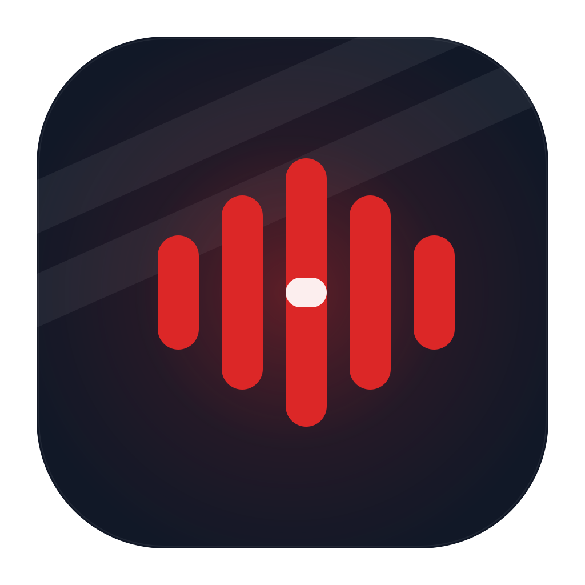

# CAYADEV Visualizer

### Sahip olduğunuz her ekran için ücretsiz, açık kaynak müzik görselleştirici ve VJ yazılımı

Bilgisayarınızda ne çalıyorsa — Spotify, YouTube, bir DAW, bir DJ seti, bir oyun — bir ekranda ya
da on ekranda sese tepki veren görsellere dönüştürür. Gerçek bir **MilkDrop** motoru, **59
görselleştirici modu**, katmanlar ve **40 GPU efekti**, bir **OBS katmanı**, **Spout / Syphon**,
**projeksiyon haritalama**, **RGB aydınlatma**, canlı gösteriler için **zaman çizelgesi ve klip
destesi**, ve **MCP üzerinden yapay zekâ kontrolü**.

**Windows** · **macOS** · **Linux** — hesap yok, telemetri yok, MIT lisanslı.

[](https://github.com/CaYatur/SoundVisualizer/releases/latest)
[](https://github.com/CaYatur/SoundVisualizer/releases)
[](LICENSE)
[](#hızlı-başlangıç)
[](#testler)
[](https://www.electronjs.org/)

<a href="https://github.com/CaYatur/SoundVisualizer/releases/latest"></a>
<a href="https://github.com/CaYatur/SoundVisualizer/releases/latest"></a>
<a href="https://github.com/CaYatur/SoundVisualizer/releases/latest"></a>

**[Kaynaktan çalıştır](#kaynaktan-çalıştırma)** ·
**[Özellikler](#tüm-özellikler-ayrıntısıyla)** ·
**[SSS](#sss)** ·
**[English](README.md)**

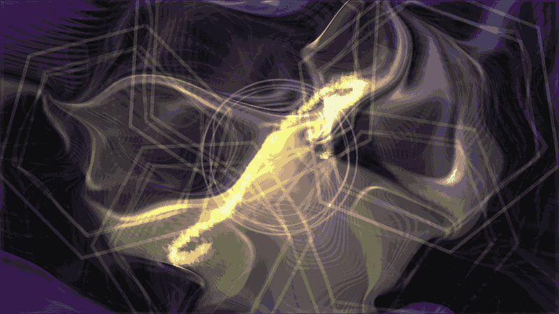

</div>

---

## Bir bakışta

<div align="center">

| **59** görselleştirici modu | **43** arkaplan | **40** GPU efekti | **18** sahne geçişi |
|:---:|:---:|:---:|:---:|
| **81** hazır sahne | **98** formül + **13** 3B katı cisim | **42** yerleşik GLSL shader | **58** renk paleti |
| **10.347** MilkDrop presetiyle sınandı | Yapay zekâ ajanları için **96** MCP aracı | **17** katman karışım kipi | **2** dil (TR / EN) |

</div>

> **Sürüm etiketleri hakkında.** Güncel sürüm **v3.1.4**. Bu sayfadaki her şey `main` dalındaki
> kaynakta var; <kbd>3.1.5</kbd> ile işaretlenenler bir sonraki sürümle, v3.1.5 ile geliyor ve
> v3.1.4 indirmesinde henüz yok. Bugün kullanmak için kaynaktan çalıştırın.

---

## Neden CAYADEV Visualizer

- **Windows'ta Stereo Mix yok, sanal kablo yok.** Sistem sesi doğrudan hoparlörden ya da
  kulaklıktan yakalanıyor (WASAPI loopback), mikrofon ve hat girişleriyle birlikte — ya da **tek bir
  uygulamadan**: görseller Spotify'ı izler, oyunu ve sesli sohbeti duymaz.
  [→ Ses](#ses-yakalama-ve-çözümleme)
- **Her ekran, tek motor.** Seçtiğiniz her ekranda tam ekran pencere, saydam bir **OBS tarayıcı
  kaynağı**, Resolume, TouchDesigner ve MadMapper için **Spout / Syphon**, ve bir **telefon
  kumandası** — hepsi aynı görüntüyü çiziyor. [→ Çıkışlar](#çıkışlar-ekranlar-obs-spout-ve-syphon)
- **Presetlerinizi gerçekten çalıştıran MilkDrop.** Kare ve piksel denklemleri, warp ağı, GLSL'e
  çevrilen HLSL shader'lar; **10.347 gerçek presetle** ve kare kare bir MilkDrop 2 başvuru
  çizicisiyle ölçüldü. Bütün kütüphaneleri içe aktarın, küçük resimlerle gezin, presetleri canlı
  düzenleyin ya da yenilerini üretin <kbd>3.1.5</kbd>. [→ MilkDrop](#milkdrop)
- **Tek bir efekt değil, bir birleştirici.** Sınırsız katman, 17 karışım kipi, maskeler, A/B
  geçiş sürgüsü, katman başına ya da tüm kareye 40 GPU efekti, ve LFO'ları, zarfları ve canlı ses
  çözümlemesini herhangi bir ayara yönlendiren bir modülasyon matrisi.
  [→ Katmanlar](#katmanlar-maskeler-ve-efektler)
- **Canlı gösteri için yapıldı.** Otomasyon şeritli bir **zaman çizelgesi**, vuruşa hizalı
  ateşlenen bir **klip destesi**, sahneleri ölçüde değiştiren **Otomatik VJ**, tap tempo, **MIDI** ve
  **OSC**. [→ Gösteri kontrolü](#gösteri-kontrolü-zaman-çizelgesi-klip-destesi-otomatik-vj-midi-ve-osc)
- **Sahneye hazır.** Köşe sabitleme, ağ bükme ve çok projektörlü kurulumlar için yumuşak kenar
  harmanlamalı projeksiyon haritalama; pikselleri kare olmayan LED duvarlar için **basıklık
  düzeltme**. [→ Sahne](#sahne-projeksiyon-haritalama-ve-basıklık-düzeltme)
- **Işıklarınız müziği izler.** **Windows Dynamic Lighting**, her platformda **OpenRGB** ve **Art-Net /
  DMX**, hepsi tek bir çiziciyle — renklerini MilkDrop görüntüsünden bile alabilirler
  <kbd>3.1.5</kbd>. [→ Aydınlatma](#rgb-aydınlatma-dynamic-lighting-openrgb-ve-art-net)
- **İçerik üreticileri için.** Bir ses dosyasından kare kare **çevrimdışı video dışa aktarma**, tek
  tuşla kayıt, müzik videosu düzenleri, albüm kapaklı bir **Çalan Parça** katmanı ve zamanlı **şarkı
  sözleri** (LRC / SRT). [→ Dışa aktarma](#kayıt-ve-video-dışa-aktarma)
- **Yapay zekâya hazır.** 96 araçlı yerel bir **MCP sunucusu**; Claude, Codex, Cursor ve diğer
  ajanlar gösteriyi okur, sahne kurar ve çıkışları yönetir — beş izin düzeyinin ardında, yalnız
  `127.0.0.1` üzerinde <kbd>3.1.5</kbd>. [→ MCP](#mcp--bir-yapay-zekâ-ajanıyla-kontrol)
- **Gizli ve çevrimdışı.** Hesap yok, telemetri yok, bulut yok. Uygulamanın kendiliğinden yaptığı
  tek çağrı GitHub'ın son sürüm denetimi; onu da kapatabilirsiniz.
  [→ Gizlilik](#gizlilik-ve-güvenlik)

---

## Galeri

<div align="center">

| | |
|:---:|:---:|
| 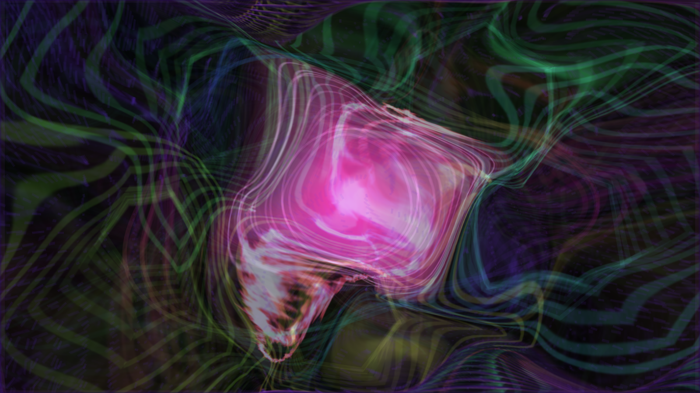 | 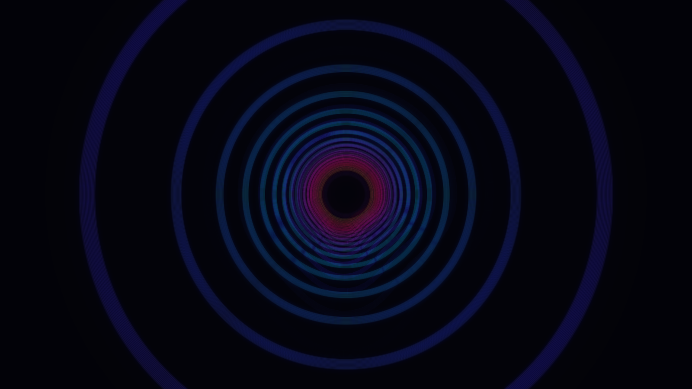 |
| 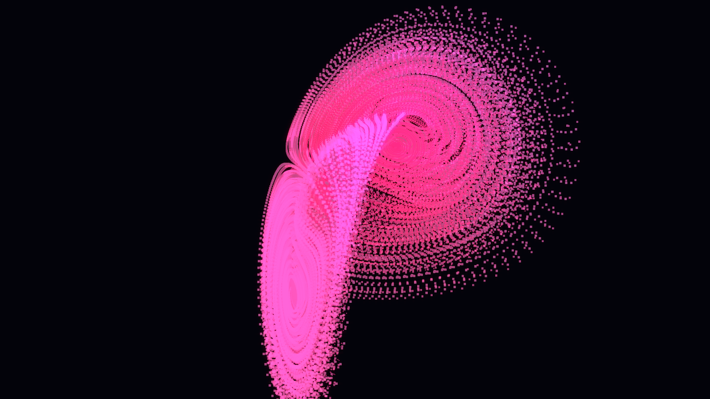 | 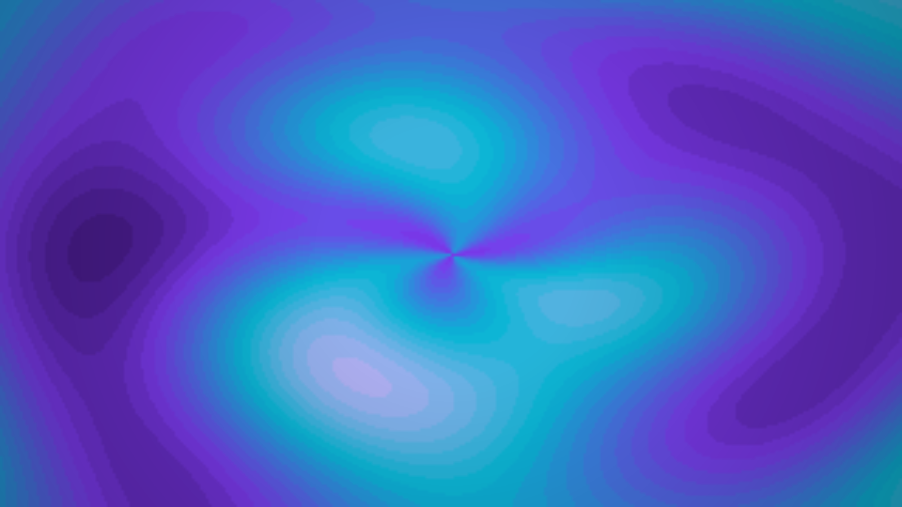 |
| 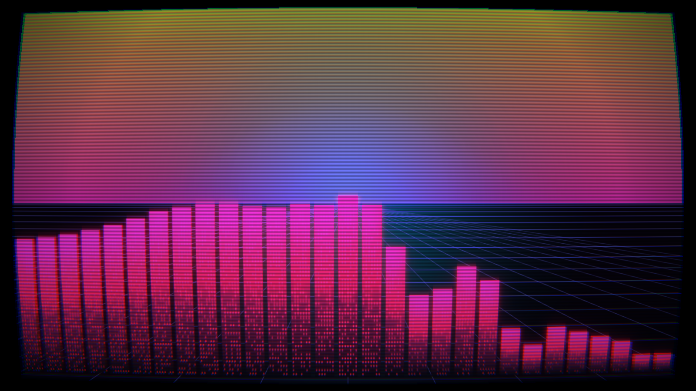 | 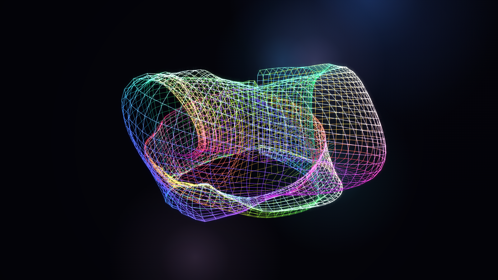 |
| 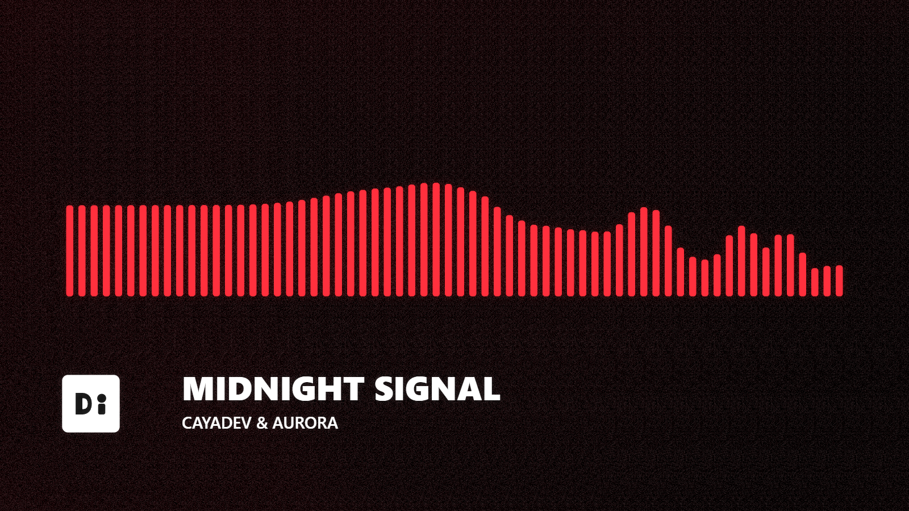 | 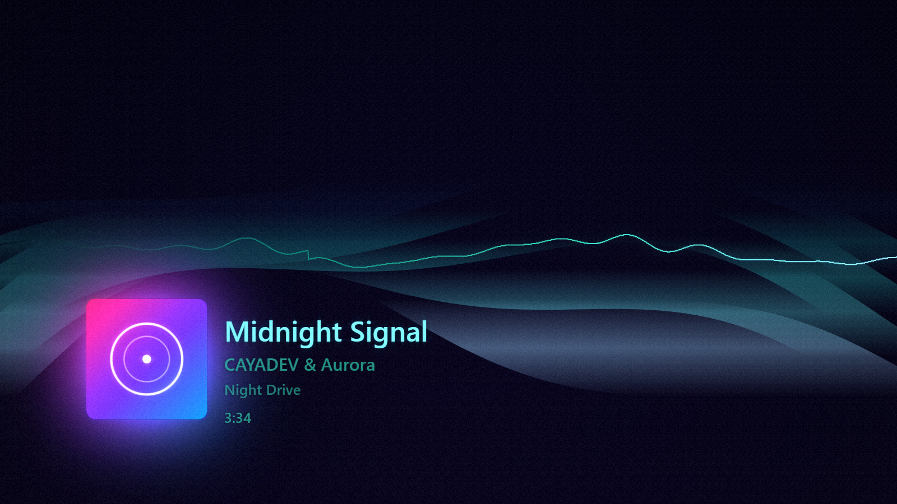 |

| Hyper Tunnel | 3B çekici |
|:---:|:---:|
| 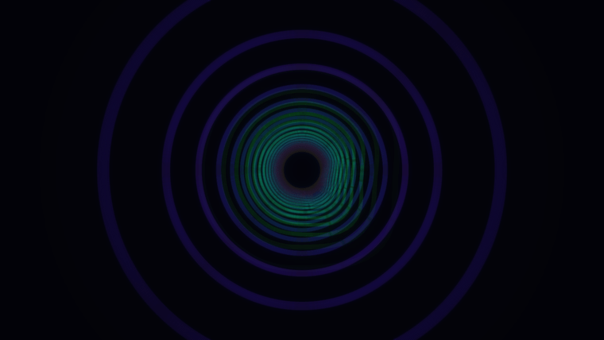 | 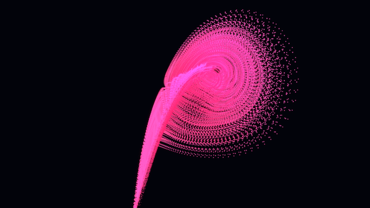 |
| **Drum & Bass** | **MilkDrop geri beslemesi** |
| 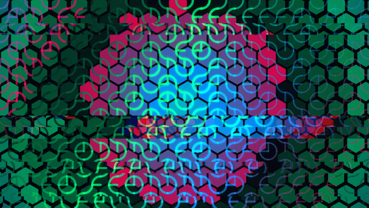 | 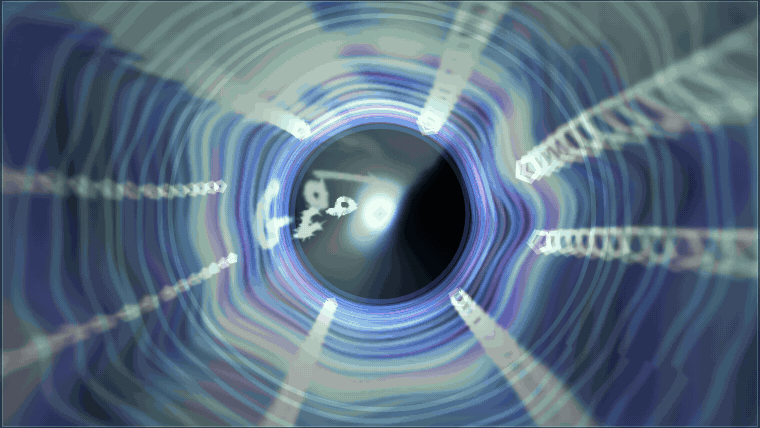 |

</div>

### Klasik görünüşler

Uygulamanın ilk günden beri sunduğu tayf barları, dalgalar ve halkalar — müzikle akan degrade
arkaplanlar üzerinde, hâlâ tek tıkla.

<div align="center">

| Katmanlı sahne | Frekans barları | Çember |
|:---:|:---:|:---:|
| 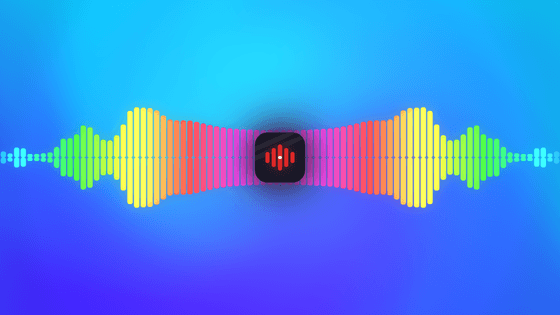 | 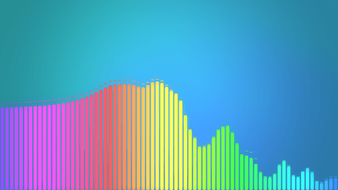 | 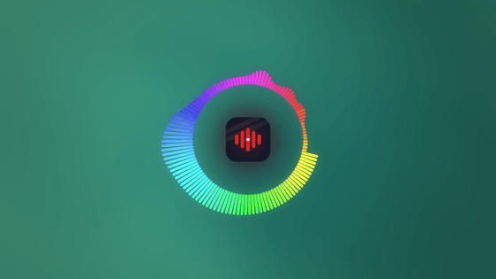 |
| **Aynalı barlar** | **Dalga** | **Gün batımı dalgası** |
| 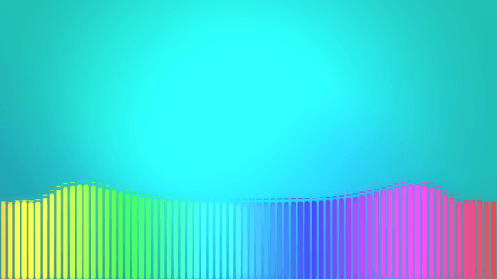 | 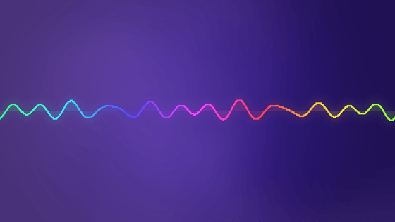 | 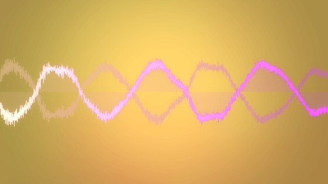 |

</div>

> Bu sayfadaki her görüntü ve klip uygulamanın kendisi tarafından `npm start -- --shots` ile, 120
> BPM'lik sentetik bir sinyalle çiziliyor. Gerçek seste görseller müziği izler.

---

## Hızlı başlangıç

### İndir

Son derlemeyi **[Sürümler](https://github.com/CaYatur/SoundVisualizer/releases/latest)** sayfasından alın.

| Platform | Dosya | Not |
|---|---|---|
| **Windows 10 / 11** | `…-windows-setup.exe` | Önerilen. Işıklar arka planda da çalışsın diye Dynamic Lighting kimliğini kaydeder ve kendini güncelleyebilir. |
| Windows, taşınabilir | `…-windows-portable.exe` | Kurulum yok. Dynamic Lighting yalnız uygulama odaktayken çalışır. |
| **macOS** (Apple Silicon) | `…-macos-arm64.dmg` / `.zip` | İmzasız — bkz. [macOS'ta ilk açılış](#macosta-ilk-açılış). Sistem sesi için BlackHole gibi sanal bir aygıt gerekir. |
| **Linux** (x64) | `…-linux-x86_64.AppImage` / `…-linux-amd64.deb` | PulseAudio ya da PipeWire gerekir. AppImage kendini güncelleyebilir <kbd>3.1.5</kbd>. |

Başka hiçbir şey kurmanız gerekmiyor: ses yardımcısı uygulamanın kendi ikili dosyasıyla çalışıyor.

### İlk çalıştırma

1. Üstteki **Ekranlar** menüsünden bir ya da **birkaç** ekran, sonra **Ses** altında bir ya da daha
   fazla **ses kaynağı** seçin.
2. **Görselleştirmeyi Aç**'a tıklayın. Görüntü seçili her ekranda tam ekran açılır.
3. Sağdaki her şeyi değiştirin — anında uygulanır ve kendini kaydeder.
4. Ya da hazır bir görünümden başlayın: **Kitaplık → Hazır Şablonlar**'da 81 tane var.
5. Yayın için **Çıkış → Yayın Çıkışı**'nı açın ve adresi bir OBS **Tarayıcı Kaynağı**na yapıştırın.
6. Tüm pencereleri kapatmak için herhangi bir görselleştirme penceresinde **ESC**'ye basın.

### Kaynaktan çalıştırma

**[Node.js](https://nodejs.org/) 20 ya da üstü** (CI 20 ve 22'yi sınıyor) ve Git gerekir.

```bash
git clone https://github.com/CaYatur/SoundVisualizer.git
cd SoundVisualizer
npm install
npm start
```

`npm install`, yerel `audify` ses modülünü Electron için kendiliğinden yeniden derler
(`postinstall`). Ses yardımcısı `INVALID_HELPER_OUTPUT` derse `npm run rebuild:audio`, ardından
`npm run check:runtime` çalıştırın. Sertifikaları bozan bir kurumsal vekil sunucunun arkasındaysanız
`npm install`'dan önce `NODE_OPTIONS=--use-system-ca` verin. DevTools açık geliştirici kipi:
`npm run dev`.

---

## Kimin için

| Siz… | Elde ettiğiniz |
|---|---|
| **Yayıncıysanız** | OBS'e tarayıcı kaynağı olarak saydam bir katman, albüm kapaklı Çalan Parça kartı, şarkı sözleri ve yayının ortasında sahne değiştirmek için bir telefon kumandası. OBS başka bir bilgisayardayken de çalışır. |
| **VJ ya da sahne sanatçısıysanız** | Zaman çizelgesi, vuruşa hizalı ateşlenen klip destesi, ölçüde Otomatik VJ, MIDI ve OSC kontrolü, karartma, Resolume ya da TouchDesigner'a Spout/Syphon, ve her projektörde tam ekran çıkış. |
| **Müzik yapımcısı ya da plak şirketiyseniz** | Parçanızdan kare kare video dışa aktarma, logonuz ve parça adıyla sekiz sade müzik videosu düzeni, ve canlı çıkış için bir kayıt aracı. |
| **Mekân, etkinlik ya da enstalasyonsanız** | Projeksiyon haritalama, kenar harmanlama, LED duvarlar için basıklık düzeltme, kaza koruması, çökme kurtarma ve gösterinin ortasında asla uyumayan bir ekran. |
| **RGB ya da ortam ışığı meraklısıysanız** | Müzikle sürülen Windows Dynamic Lighting, OpenRGB ve Art-Net/DMX; arka plan görselleri için ekran koruyucu tadında bir şablon grubu. |
| **MilkDrop hayranıysanız** | `.milk` ve `.milk2` yükleyen, bütün kütüphaneleri içe aktaran, küçük resim gösteren, favori, puan ve etiket tutan, presetleri düzenleyip üretmenizi sağlayan bir MilkDrop motoru. |
| **Geliştirici ya da yapay zekâ meraklısıysanız** | Shadertoy ve ISF içe aktarmalı bir GLSL düzenleyici, 96 araçlı bir MCP sunucusu, belgelenmiş bir yapılandırma ve satır değil cevap denetleyen 2.700'ü aşkın test. |

---

## Tüm özellikler, ayrıntısıyla

Yukarısı kısa sürümdü. Aşağısı, kategori kategori tam liste.

- [Ses yakalama ve çözümleme](#ses-yakalama-ve-çözümleme)
- [Görselleştirici modları ve arkaplanlar](#görselleştirici-modları-ve-arkaplanlar)
- [MilkDrop](#milkdrop)
- [Katmanlar, maskeler ve efektler](#katmanlar-maskeler-ve-efektler)
- [Modülasyon](#modülasyon)
- [3B geometri ve formüller](#3b-geometri-ve-formüller)
- [Studio — kendi shader'ınızı yazın](#studio--kendi-shaderınızı-yazın)
- [Sahneler, şablonlar, geçişler ve renk](#sahneler-şablonlar-geçişler-ve-renk)
- [Metin, şarkı sözü ve Çalan Parça](#metin-şarkı-sözü-ve-çalan-parça)
- [Logo, görseller ve medya katmanı](#logo-görseller-ve-medya-katmanı)
- [Gösteri kontrolü: zaman çizelgesi, klip destesi, Otomatik VJ, MIDI ve OSC](#gösteri-kontrolü-zaman-çizelgesi-klip-destesi-otomatik-vj-midi-ve-osc)
- [Çıkışlar: ekranlar, OBS, Spout ve Syphon](#çıkışlar-ekranlar-obs-spout-ve-syphon)
- [Sahne: projeksiyon haritalama ve basıklık düzeltme](#sahne-projeksiyon-haritalama-ve-basıklık-düzeltme)
- [RGB aydınlatma: Dynamic Lighting, OpenRGB ve Art-Net](#rgb-aydınlatma-dynamic-lighting-openrgb-ve-art-net)
- [Kayıt ve video dışa aktarma](#kayıt-ve-video-dışa-aktarma)
- [MCP — bir yapay zekâ ajanıyla kontrol](#mcp--bir-yapay-zekâ-ajanıyla-kontrol)
- [Yönetici paneli](#yönetici-paneli)
- [Güvenilirlik, güç ve güncellemeler](#güvenilirlik-güç-ve-güncellemeler)
- [Gizlilik ve güvenlik](#gizlilik-ve-güvenlik)

---

### Ses yakalama ve çözümleme

<div align="center">

| Canlı ölçerler | Kroma çemberi |
|:---:|:---:|
| 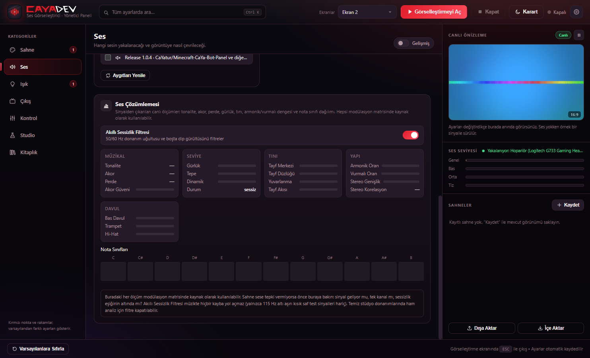 | 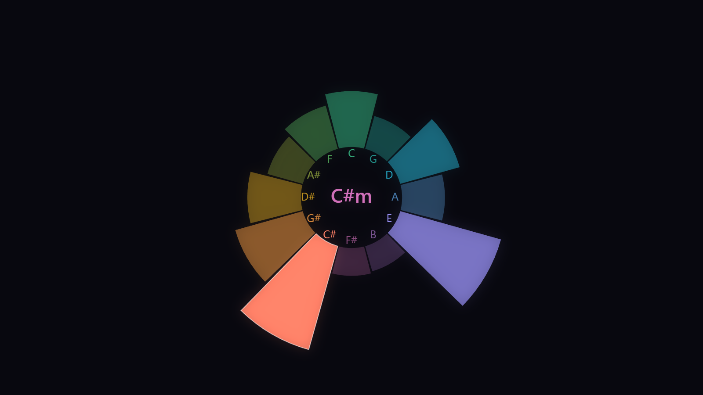 |

</div>

**Kaynaklar**

- **Sistem çıkışı** — hoparlör ya da kulaklık loopback'i. "Stereo Mix" gerekmez.
- **Mikrofonlar ve hat girişleri**, aynı yoldan yakalanır.
- **Tek tek uygulamalar** (Windows) — WASAPI süreç loopback'i. Yalnız seçilen uygulamaları ya da bir
  uygulama *dışındaki* her şeyi yakalayın. Hedefler çalıştırılabilir dosya adıyla saklanır: yeniden
  başlayan bir uygulama kendiliğinden yeniden bağlanır, henüz açılmamış bir uygulama açılınca
  yakalanır. Windows 20348 ya da üstü gerekir. macOS ve Linux burada neden henüz olmadığını söyler.
- **Aynı anda birkaç kaynak**, çözümlemeden önce karıştırılır — "Spotify + mikrofon" tek bir seçimdir.
- **İki kanal da görsellere ulaşıyor** <kbd>3.1.5</kbd>. Her kare tek kanallı karışımın yanında sol ve
  sağ kanalı da taşıyor; stereo genişlik, korelasyon ve Gonyometre gerçek stereo görüntüyü ölçüyor.
  v3.1.5'e kadar yakalama yardımcısı iki kanalın ortalamasını alıyordu: genişlik 0'da, korelasyon
  1'de kalıyor, Gonyometre her şarkıda dikey bir çizgi çiziyordu.
- **Kendini toparlıyor** <kbd>3.1.5</kbd>. Yakalama yardımcısı kapanırsa ya da kareleri durursa
  (uykudan dönüş, çıkarılan bir aygıt) yakalama giderek uzayan aralıklarla yeniden kurulur ve panel
  yakalıyormuş gibi yapmak yerine "yeniden bağlanıyor" der. Takılıp çıkan bir aygıt sıkı bir döngüde
  denenmez.
- **Hassasiyet, yumuşatma ve bas vurgusu**, 50/60 Hz şebeke uğultusu koruması, ve genel, bas, orta ve
  tiz için canlı ölçerler.

**Yakalama nasıl çalışıyor.** Yakalama tarayıcı penceresinde değil **ana süreçte** çalışıyor. Bir
yardımcı aygıtı okuyor — Windows'ta WASAPI loopback, macOS'ta CoreAudio, Linux'ta PulseAudio ya da
PipeWire — FFT'yi hesaplıyor ve kareleri her çiziciye gönderiyor.

- **macOS**'ta sistem sesi için **BlackHole** gibi sanal bir aygıt gerekir; mikrofonlar doğrudan
  çalışır. macOS'un kendi loopback'i yok, dolayısıyla başka yolu da yok.
- **Linux**'ta sistem sesi, çıkış aygıtınızın PulseAudio ya da PipeWire **monitor** kaynağıdır. Bu bir
  *giriş* aygıtıdır; uygulama onu loopback olarak işaretler ve varsayılan olarak tercih eder.

**Tayf ölçümü.** Barlar tahmin edilmiyor, ölçülüyor.

- **Frekans ölçeği** — logaritmik, doğrusal, mel ya da bark.
- **Genlik ölçeği** — doğrusal ya da desibel; taban −24 ile −96 dB arasında ayarlanabilir. Sessiz
  ayrıntıyı tabana yapışık değil görünür kılan dB'dir.
- **Balistik** — ayrı yükselme ve bırakma; barlar hızla çıkar, yumuşakça iner. Kare hızından bağımsız.
- **Komşu yayılması** (tepeleri düzleştirmeden genişletir) ve **profil yumuşatma** (simetrik komşu
  ortalaması).
- Oktav başına dB cinsinden **tayf eğimi**, 1 kHz'de nötr; üst uç hep ölü kalmasın diye.
- Bir FFT kutusundan dar bantlar bandın merkez frekansında ara değerlendiriliyor; komşu barlar tek bir
  kutuyu paylaşmak yerine kendi değerlerini okuyor. Motoru 27 test kapsıyor, bar profilinde basamak
  olmadığını doğrulayan bir test dahil.

**Derin çözümleme.** Her ölçümün canlı bir ölçeri var ve her biri modülasyon kaynağı olarak
kullanılabiliyor.

- Sabit-Q kroma vektöründen **müzikal ton ve akor** — FFT kutuları yerine bir Goertzel filtre
  bankası, çünkü 2048 örnekte bas bölgesi kutularla ayrıştırılamıyor — Krumhansl-Schmuckler ton
  profilleri ve akor şablonlarıyla.
- YIN ile **perde izleme**.
- **Harmonik / vurmalı ayrıştırma**, ve kick, snare ve hi-hat için bant başına vuruş algılayıcıları.
- **Tayf tanımlayıcıları** — ağırlık merkezi, rolloff, düzlük, crest.
- **Ses yüksekliği, dinamik, gerçek tepe, stereo genişlik, korelasyon ve orta/yan bantlar.**
- Sessizlik algılama, otomatik kazanç ve kayan bir tayf geçmişi tamponu.

**Tempo.** BPM bir periyot histogramından tahmin ediliyor (90, 120, 128, 140 ve 174 BPM'lik
sinyallere karşı ±0,5 BPM'e kadar sınandı); tap tempo ve Otomatik VJ, klip destesi ve MilkDrop'un
paylaştığı bir BPM kilidiyle.

---

### Görselleştirici modları ve arkaplanlar

<div align="center">

**59 görselleştirici modunun hepsi**

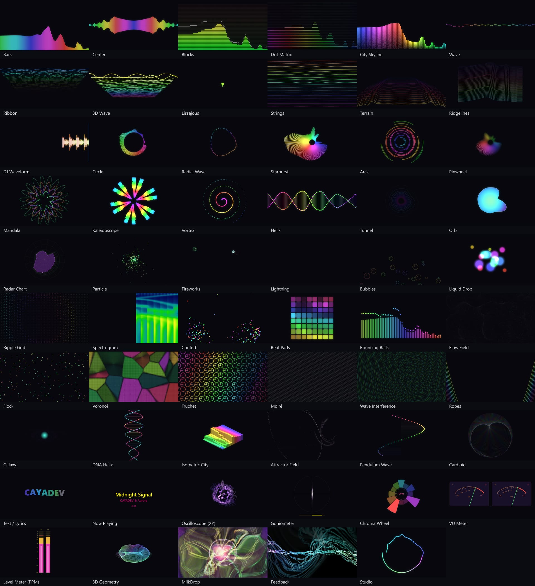

**43 arkaplanın hepsi**

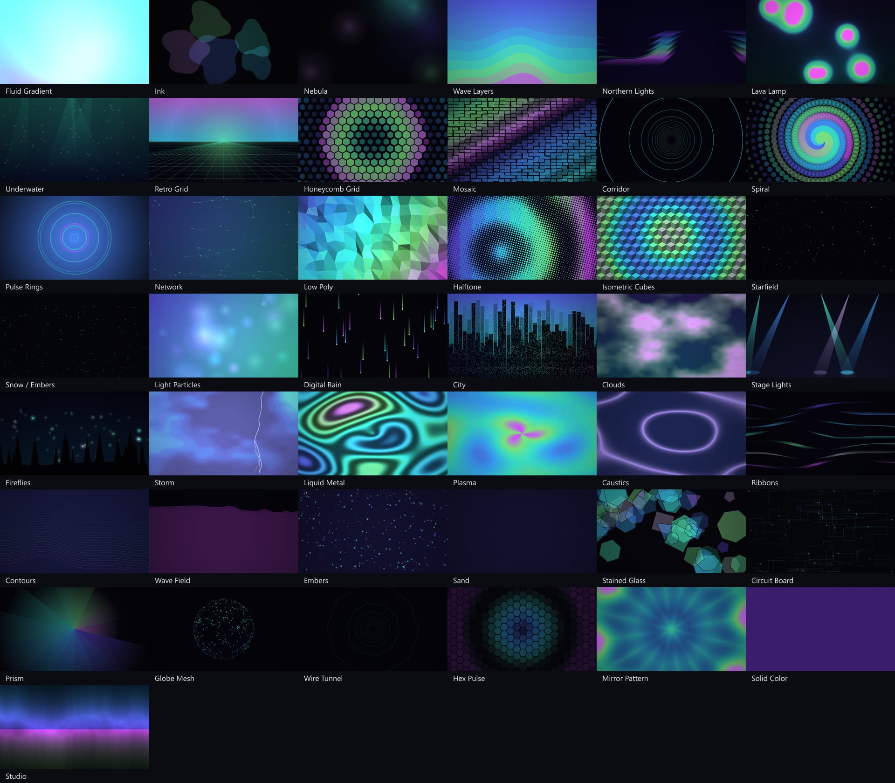

</div>

Bu iki pafta doğrudan mod kataloğundan üretiliyor; yeni bir mod, ekran görüntüleri bir sonraki
çizilişinde kendiliğinden içlerine giriyor. (Paftalar uluslararası okuyucu için İngilizce adlarla.)
Her görselleştirici her arkaplanın üzerinde durabilir; katmanlarla her birinden istediğiniz kadar
üst üste koyabilirsiniz. v3.1.4'ten sonra eklenen modlar <kbd>3.1.5</kbd>'in parçası.

**Görselleştirici modları — 59**

- **Temel** — Barlar · Merkez · Segment (LED ekolayzer) · Nokta Matris · Şehir Silüeti (pencereleri
  yanan binalar)
- **Dalga formu** — Dalga (osiloskop) · Şerit (dalga geçmişi) · 3B Dalga (perspektifte yığılmış geçmiş)
  · Lissajous (XY osiloskop) · Teller (her tel kendi bandıyla titrer) · Arazi (perspektif tel kafes
  manzara) · Sırt Çizgileri · DJ Dalga Formu
- **Dairesel** — Çember · Dairesel Dalga · Işın · Yaylar (bant başına bir yay) · Fırıldak · Mandala
  (kutupsal gül eğrisi) · Kaleydoskop · Girdap · Helis · Tünel · Küre · Radar Grafiği
- **Parçacık ve olay** — Parçacık · Havai Fişek (vuruşta patlamalar) · Şimşek (basta dallanan
  yıldırımlar) · Baloncuk · Sıvı Damla (metatoplar) · Dalgalı Izgara (vuruşta yayılan halkalar) ·
  Spektrogram · Konfeti · Vuruş Pedleri · Zıplayan Toplar
- **Üretken sistemler** — Akış Alanı (gürültü alanının yönlendirdiği parçacıklar) · Sürü (tayfın sürdüğü
  boid'ler) · Voronoi · Truchet · Moiré · Dalga Girişimi · İpler (vuruşlarla itilen verlet fiziği) ·
  Galaksi · DNA Sarmalı · İzometrik Şehir · Çekici Alanı (formül kitaplığından iki parametresi sese
  bağlı ayrık haritalar) · Sarkaç Dalgası · Kardioid
- **Metin** — Metin / Şarkı Sözü · Çalan Parça
- **Ölçüm** — Osiloskop (XY) · Gonyometre (stereo faz ölçer) · Kroma Çemberi (beşli çember sırasında
  perde sınıfları, algılanan akorun kökü vurgulu) · VU Metre · Seviye Ölçer (PPM)
- **Gelişmiş motorlar** — 3B Geometri · MilkDrop · Geri Besleme (klasik sonsuz tünel görünümü) · Studio
  (kendi GLSL shader'ınız)

Bar sayısı, en düşük ve en yüksek frekans, aralık, yerleşim (alt, orta ya da tam), ayna, çizgi
kalınlığı, genlik, hassasiyet ve parlama, seçili mod için anlamlı olduklarında görünüyor. Renk sahne
paletinden, özel bir renk çiftinden ya da **gökkuşağından** geliyor.

**Arkaplanlar — 43**

- **Akışkan** — Akışkan Gradyan (akış, dolanma, yörünge, girdap, bükülme, gren ve ses tonu kaymasıyla
  sese tepki veren bir ağ degradesi) · Mürekkep (aktıkça dönen sıvı lekeler) · Bulutsu (yumuşak gaz
  bulutları) · Dalga Katmanları (sesle kabaran dalga tepeleri) · Kutup Işıkları (dalgalanan perdeler)
  · Lav Lambası · Su Altı
- **Geometrik** — Retro Izgara (ufka uzanan perspektif ızgara) · Petek Izgara (merkezden yayılan bir
  dalga ve tayfla yanan hücreler) · Mozaik (frekans bandı başına bir hücre) · Koridor (size doğru
  gelen halkalar ya da çokgenler) · Sarmal · Nabız Halkaları (bas vuruşlarında ek halkalar) · Ağ
  (sürüklenen bağlı düğümler) · Alçak Poligon · Yarım Ton · İzometrik Küpler
- **Atmosfer** — Yıldız Alanı · Kar / Kor · Işık Parçacıkları (bokeh) · Dijital Yağmur · Şehir
  (pencereleri müzikle yanan paralaks silüet) · Bulutlar · Sahne Işıkları · Ateş Böcekleri · Fırtına
- **Üretken zeminler** — Sıvı Metal · Plazma · Su Yüzeyi · Şeritler · Eşyükselti · Dalga Alanı ·
  Kıvılcım · Kum · Vitray · Devre Kartı · Prizma · Küre Ağı · Tel Tüneli · Petek Nabzı · Ayna Deseni
- **Diğer** — Düz Renk · Studio (kendi yazdığınız GLSL shader)

**Şeffaf arkaplan.** **Arkaplan → Şeffaf Arkaplan**'ı açın; masaüstü görselleştirici penceresinin
arkasından görünür: düz renk boyanmaz, bir arkaplan efektinin karanlık kısımları **Saydamlık Eşiği**
altında saydamlaşır. Saydamlık efekt zincirinden de geçer: bloom ve bulanıklık, pencereyi siyah bir
dikdörtgene çevirmeden boş piksellerin üzerinde parlar.

---

### MilkDrop

<div align="center">

| Küçük resimli preset kitaplığı <kbd>3.1.5</kbd> | Canlı preset düzenleyici <kbd>3.1.5</kbd> |
|:---:|:---:|
| 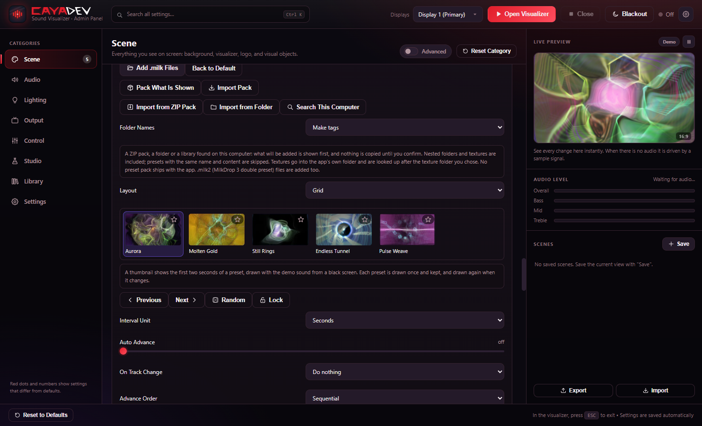 | 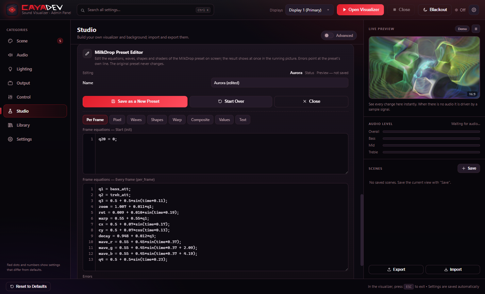 |

</div>

Bu uygulama için yazılmış bir MilkDrop motoru — projectM'in ya da MilkDrop'un kodunu içermiyor. Preset
dili gerçekten çalışıyor: bir sözcük çözümleyici, bir ayrıştırıcı ve JavaScript kapanışlarına
derleme; `per_frame` ve `per_pixel` denklemleri geri beslemeli bir warp ağını sürüyor; HLSL warp ve
composite shader'ları GLSL'e çevrilip GPU'da çalışıyor.

- **İddia değil, ölçüm.** projectM'in özgün ve cream-of-the-crop paketlerinden 10.347 presetlik bir
  derlemde her preset yükleniyor ve çalışıyor, 16.346 shader aşamasının hepsi derleniyor ve yaklaşık
  %98'i canlı bir görüntü veriyor. Uyum, BeatDrop'un MilkDrop 2 kaynaklarından kurulmuş bir başvuru
  çiziciye karşı kare kare denetleniyor. İki ölçüm aracı da `scripts/` altında; sayılar yeniden
  üretilebilir.
- **MilkDrop Uyumu anahtarı** MilkDrop 2'nin kendi kurallarını izliyor — derleyicisini, ses zincirini,
  ağ dönüşümünü, varsayılan değerlerini ve sabit işlevli boru hattını. Ayrıntılar bu sayfanın sonundaki
  [MilkDrop motoru notları](#milkdrop-motoru-notları) bölümünde.
- **Uygulama kendi beş presetiyle geliyor** — *Kutup Işığı*, *Erimiş Altın*, *Dingin Halkalar*,
  *Sonsuz Tünel* ve *Nabız Örgüsü* — böylece motor, siz hiçbir şey içe aktarmadan ne yaptığını
  gösteriyor. Üçüncü taraf preset paketi gelmiyor.
- **Bütün bir kütüphaneyi içe aktarın** <kbd>3.1.5</kbd> — bir ZIP paketinden, bir klasörden ya da bu
  bilgisayarı arayarak (Winamp, foobar2000 ve projectM klasörleri, İndirilenler, Masaüstü, Müzik,
  Belgeler). Bir şey kopyalanmadan önce ne ekleneceğini görüyorsunuz; aynıları atlanıyor; dokular da
  geliyor; klasör adları etikete dönüşebiliyor. 9.795 presetlik bir klasör yaklaşık altı saniyede içe
  aktarılıyor.
- **`.milk` ve `.milk2`** <kbd>3.1.5</kbd> — MilkDrop 3'ün çift presetleri iki presetlerinin donmuş bir
  karışımı olarak yükleniyor; *Preset Biçimi* ayarı dosyaları MilkDrop 2 ya da MilkDrop 3 kurallarıyla
  (16 özel dalga ve şekil, `q1`–`q64`) okuyor ya da kendisi seçiyor.
- **Küçük resimler** <kbd>3.1.5</kbd> — *Izgara* düzeninde her preset küçük bir resim olarak görünüyor;
  arka planda bir kez çiziliyor, yalnız preset ya da kullandığı bir doku değişince yeniden çiziliyor.
- **Favoriler, etiketler, puanlar ve yazara göre arama** <kbd>3.1.5</kbd> — `yazar:geiss` Geiss'in
  presetlerini, `#sakin` bir etiketi buluyor; rastgele sıra MilkDrop'un yaptığı gibi puana göre
  ağırlıklanıyor; Önceki ve Sonraki gerçekten gösterilenlerin 64 adımlık geçmişinde yürüyor.
- **Canlı düzenleyici** <kbd>3.1.5</kbd> — kare ve piksel denklemleri, dalgalar, şekiller, warp ve
  composite shader'ları ayrı sekmelerde; yazmayı bıraktıktan bir an sonra değişiklik çalışan görüntüde;
  hatalar presetin kendi satırını gösteriyor. Özgün dosya hiç değişmiyor.
- **Preset üretici ve karışımlar** <kbd>3.1.5</kbd> — dört sürgüden (enerji, sıcaklık, yoğunluk,
  hareket) ve aynı preseti geri getiren bir tohumdan özgün bir preset yazın, ya da elinizdeki
  presetlerin parçalarından bir tane kurun. Üretilen presetler asla çakmıyor.
- **Gösteri kontrolü** <kbd>3.1.5</kbd> — saniyeyle ya da **ölçüde** otomatik geçiş, yüksek anlarda sert
  geçiş, *parça değişince sıradaki preset*, bir kilit, ve MIDI ile OSC'de MilkDrop eylemleri. Her ekran
  aynı tohumla aynı preseti gösteriyor.
- **Kullanıcı dokuları ve sprite'lar** <kbd>3.1.5</kbd> — bir MilkDrop `textures` klasörünü gösterin;
  `milk_img.ini` sprite'larını MilkDrop'un kendi tuşlarıyla ya da bir denetleyiciden başlatın.
- **İzlemesi güvenli** <kbd>3.1.5</kbd> — WCAG 2.3.1'in genel flaş değerinde flaş sınırlama, saniye
  başına tutuluyor, yani 144 Hz bir ekran 30 fps'lik bir ekran kadar güvenli; sistemin *hareketi
  azalt* ayarına uyuluyor.
- **GPU sıfırlamasından sağ çıkıyor** <kbd>3.1.5</kbd> — kaybolan bir WebGL bağlamı aynı tuvalde
  yeniden kuruluyor ve çalışan preset aynı denklem durumu ve saatle kaldığı yerden devam ediyor.

**Geri Besleme** motoru, MilkDrop'un presetsiz akrabası: yakınlaşma, dönüş, bükülme ve sönme
sürgüleri, dört dalga biçimi, ve klasik sonsuz tünel için basla sürülen yakınlaşma ve dönüş.

---

### Katmanlar, maskeler ve efektler

<div align="center">

| Katmanlar | Efekt zinciri |
|:---:|:---:|
| 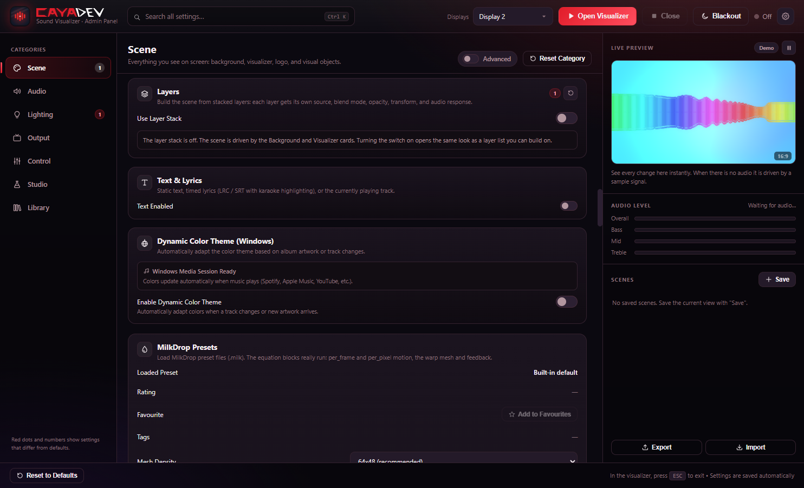 | 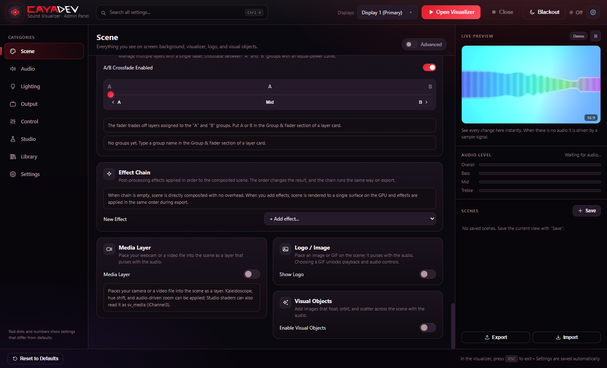 |

</div>

- **Sınırsız katman**; her birinin kendi kaynağı, karışım kipi, opaklığı, dönüşümü (ölçek, döndürme,
  X/Y, çevirme) ve ses tepkisi (bant, opaklık, ölçek, döndürme) var. Listenin en üstündeki katman
  çıkışta en üstte.
- **17 karışım kipi** — Normal, Ekle, Ekran, Çarp, Bindirme, Koyulaştır, Açıklaştır, Renk Soldurma,
  Renk Yakma, Sert Işık, Yumuşak Işık, Fark, Dışlama, Ton, Doygunluk, Renk, Parlaklık.
- **Maskeler** — başka bir katmandan alfa, artı dikdörtgen, elips, doğrusal ve dairesel degradeler;
  konum, boyut, açı, yumuşatma ve ters çevirmeyle.
- Tek sürgülü **gruplar**, ve eşit güç eğrisinde bir **A/B geçiş sürgüsü**.
- **Solo, sessiz ve kilit** — solo bir katmanı geri alınabilir biçimde yalnız bırakır, sessiz
  ayarlarını kaybetmeden gizler, kilit kazara düzenlemeyi önler.
- Katmanları sahneler arasında kopyalayın, yapıştırın, çoğaltın. Bütün yığın kapatılabilir; liste
  kaybolmadan düz Arkaplan + Görselleştirici kurulumuna dönülür.
- **Bozuk bir katman artık bütün kareyi götürmüyor** <kbd>3.1.5</kbd>, ve opak bir MilkDrop katmanının
  altında kalan katmanlar hiç çizilmiyor.

**Son işlem — 40 GPU efekti**; sıralanabilir, her birinin kendi opaklığı var, açılıp kapanabilir, hem
katman başına hem de birleştirilmiş görüntüde kullanılabilir. Tek bir katmandaki efekt o katmanın
saydamlığını koruyor; alttaki katmanlar görünür kalıyor.

- **Kompozisyon** — Bloom · Vinyet · İz / Yankı · Kenar Vurgusu · Renk Düzeltme
- **Bulanıklık ve odak** — Bulanıklık (Gauss) · Işınsal Bulanıklık · Yönlü Bulanıklık · Merkezden
  Bulanıklık · Tilt-Shift · Alan Derinliği (Bokeh) · Keskinleştirme · Kabartma
- **Yarım ton ve desen** — Dither (Bayer) · Yarım Ton · ASCII Mozaik · Tarama Çizgisi (Kalem) · Yağlı
  Boya (Kuwahara) · Pikselleştir · Posterize / Ters Çevir · Eşikleme · Solarizasyon
- **Analog ve hasar** — Film Greni · CRT / Tarama Çizgileri · VHS / Analog Bant · Glitch (Dilim Kayması)
  · Datamosh (Blok Kayması) · Bozuk Sinyal · Renk Sapması (Kromatik)
- **Bozulma** — Lens Bozunumu · Burgu · Kutupsal Dönüşüm · Dalga Bozulması · Yarık Tarama ·
  Kaleydoskop · Ayna
- **Renk ve ışık** — Gradyan Eşleme · Seviyeler ve Eğri · Işık Huzmeleri · Yıldız Süzgeci

Her efektin her parametresi modülasyon matrisiyle sürülebiliyor.

---

### Modülasyon

<div align="center">

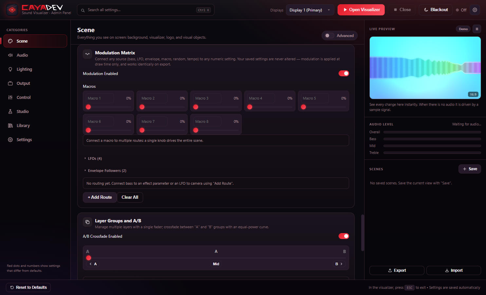

</div>

- **Her kaynaktan her ayara** — yönlendirmeler, güncel ayarların canlı bir ağacından seçilen herhangi
  bir noktalı yapılandırma yoluna gidiyor.
- **Kaynaklar** — bas, orta, tiz, seviye, vuruş zarfı ve vuruş tetiği · sekiz tayf bandı · LFO'lar ·
  zarf izleyiciler · örnekle-ve-tut · rastgele · vuruş saati · makro düğmeleri · ve her derin çözümleme
  ölçümü (ton, akor, perde, ses yüksekliği, davul bantları…).
- **Sekiz LFO biçimi** — sinüs, üçgen, yükselen testere, alçalan testere, kare, darbe, rastgele rampa ve
  gürültü — hızı Hz cinsinden ya da algılanan tempoya kilitli vuruş bölümleriyle (1/16'dan 8 ölçüye),
  artı faz kayması ve darbe genişliği.
- **Yönlendirme başına biçimlendirme** — en az, en çok, miktar, ata ya da ekle, bir eğri (doğrusal, üs,
  S-eğrisi, nicemleme, ters), yumuşatma ve değişim hızı sınırı.
- MIDI öğrenmeye açık **sekiz makro düğmesi**.
- Değerler yazınca-kopyala ile uygulanıyor, modülasyon kayıtlı ayarlarınızı hiç değiştirmiyor; LFO fazı
  çizim saatinden geliyor, çevrimdışı dışa aktarma kareye kadar tam.

---

### 3B geometri ve formüller

<div align="center">

| | |
|:---:|:---:|
|  | 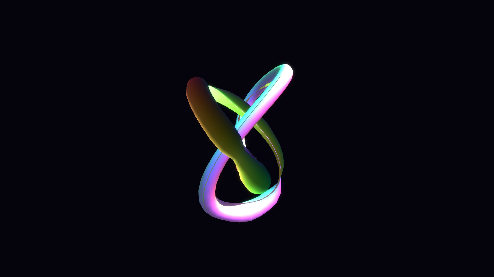 |
|  | 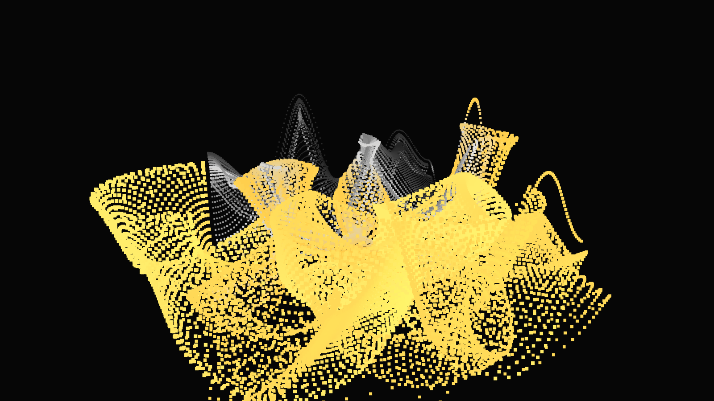 |

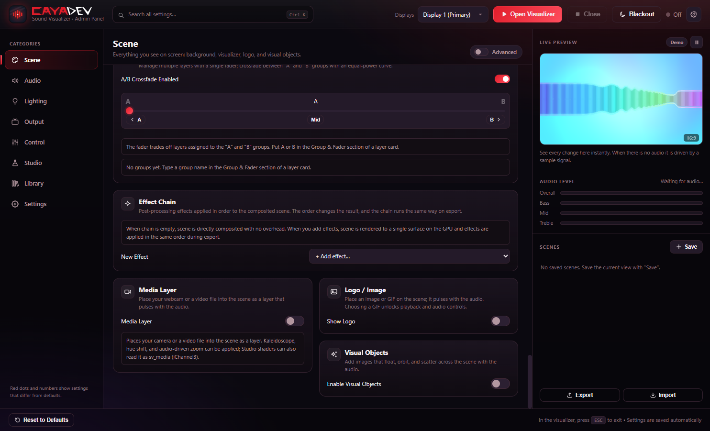

</div>

- **Düzlem eğrileri (30)** — gül eğrileri, lemniskatlar, kardioidler, episikloidler, hiposikloidler,
  spiraller, ruletler, Lissajous figürleri, kelebek ve süper formül eğrileri bunların arasında.
- **Uzay eğrileri (12)** — yonca ve simit düğümleri, Viviani eğrisi, helisler, konik spiraller ve
  benzerleri.
- **Yüzeyler (29)** — simit, Klein şişesi, Möbius şeridi, Boy yüzeyi, Dini yüzeyi, breather, süper
  elipsoid, Gielis süper şekilleri, Chladni figürleri, yonca tüp ve daha fazlası.
- **Garip çekiciler (27)** — Lorenz, Rössler, Chen, Halvorsen, Thomas, Aizawa, Chua, Dadras, Sprott,
  Clifford, de Jong, Hénon ve diğerleri; sürekli ve ayrık.
- **Katı cisimler (13)** — dörtyüzlü, küp, sekizyüzlü, onikiyüzlü, yirmiyüzlü, alt bölme denetimli bir
  jeodezik küre, dört L-sistemi (ağaç, eğrelti, ejderha eğrisi, 3B Hilbert eğrisi) ve üç yinelemeli
  işlev sistemi (Barnsley eğreltisi, Sierpinski dörtyüzlüsü, spiral).
- Tel kafes, nokta ya da gölgeli çizim; çözünürlük, deformasyon, dönme, renk kipi ve her parametrede ses
  bağlama.
- **Kendi matris matematiği** — üçüncü taraf 3B kitaplığı yok. **Çerçeveleme bildirilmiyor,
  ölçülüyor**: bir çekicinin ilk yinelemeleri sınır kutusu için yoklanıyor ve bir test her sistemin
  görüş hacminin içine düştüğünü doğruluyor.

---

### Studio — kendi shader'ınızı yazın

<div align="center">

| Studio | Yerleşik shader'lar |
|:---:|:---:|
|  | 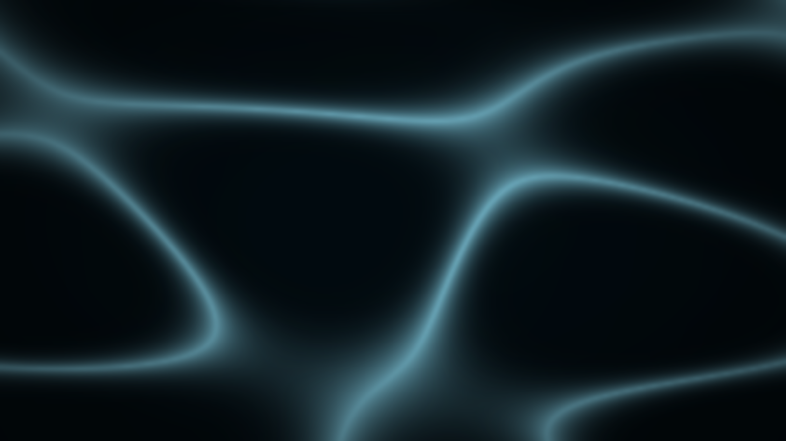 |

</div>

- Canlı önizlemeli, hata satırını bildiren ve sürgülerini sizin tanımladığınız bir **GLSL düzenleyici**.
- Yerel çeviricilerle **Shadertoy ve ISF içe aktarma**. Hiçbir hizmete bağlanılmıyor.
- Shader'lar `sv_resolution`, `sv_time`, `sv_level`, `sv_bass`, `sv_mid`, `sv_treble`, `sv_beat`,
  `sv_spec(x)`, `sv_waveAt(x)`, sahne paleti için `sv_col(x)`, kamera ya da video katmanı için
  `sv_media` alıyor.
- **42 yerleşik shader**, hepsi öz testte gerçek GPU'da derleniyor:
  - **Arkaplanlar (25)** — Bulut Katmanları · Kıvrım Akışı · Lav Lambası · Mürekkep Yayılması · Duman
    Halkaları · Petek Akışı · Bükülmüş Izgara · Truchet Örgü · Moiré Girişimi · Kristal Mağara ·
    Mandelbrot Yakınlaşması · Julia Kümesi · Yanan Gemi · Apollonius Çemberleri · Kaleydoskopik IFS ·
    Menger Süngeri · Mandelbulb · Işık Tüneli · Yıldız Sıçraması · Kutup Perdesi · Sıvı Metal · Neon
    Yağmur · Reaksiyon Deseni · Su Kostikleri · Prizma Işıması
  - **Görselleştiriciler (11)** — Işıyan Barlar · Spektrum Halkası · Dalga Alanı · Vuruş Patlaması ·
    Parlayan Osiloskop · Frekans Ağı · Nota Çemberi · Parçacık Akışı · Kaleydoskop Spektrum · Nabız
    Izgarası · Sıvı Barlar
  - **Altı eski preset** — Plazma Deniz, Frekans Halkaları, Sıvı Metal, Yıldız Geçidi, Dalga Perdesi,
    Bas Küresi
- **MilkDrop Preset Üretici ve Düzenleyici** de burada — bkz. [MilkDrop](#milkdrop).

---

### Sahneler, şablonlar, geçişler ve renk

<div align="center">

| Hazır şablonlar | Sahne geçişleri |
|:---:|:---:|
| 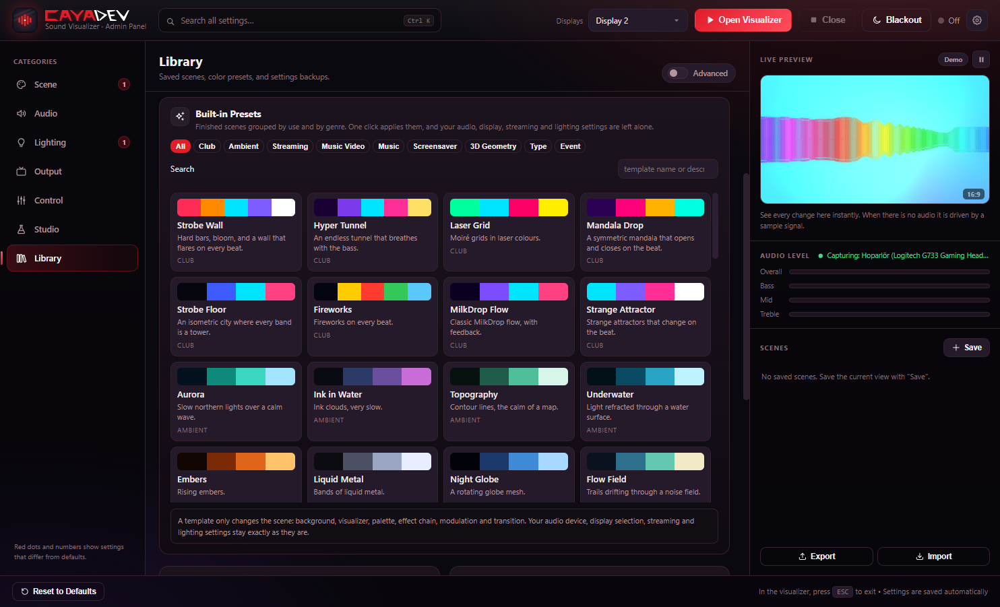 | 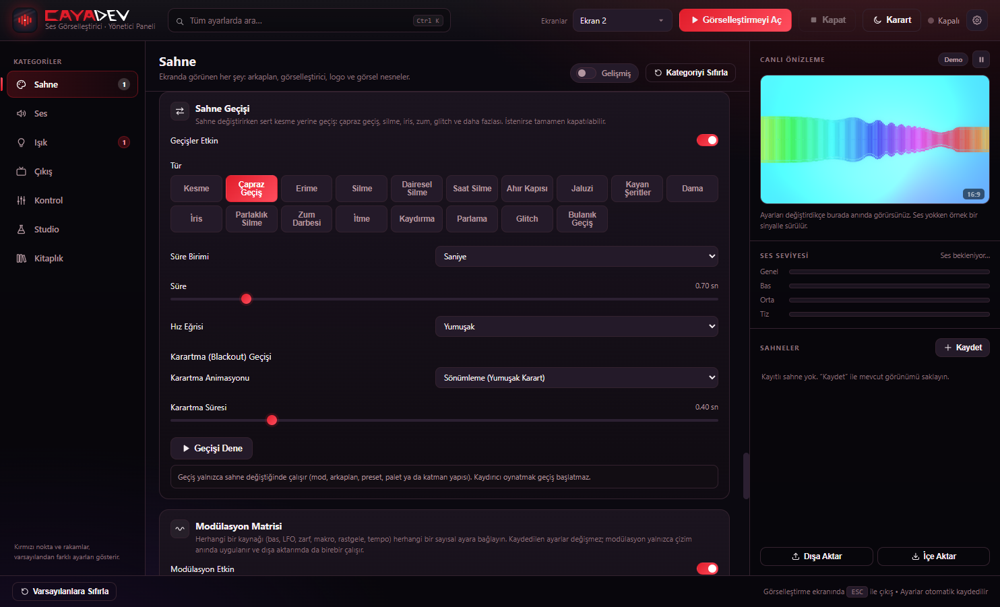 |

| | |
|:---:|:---:|
| 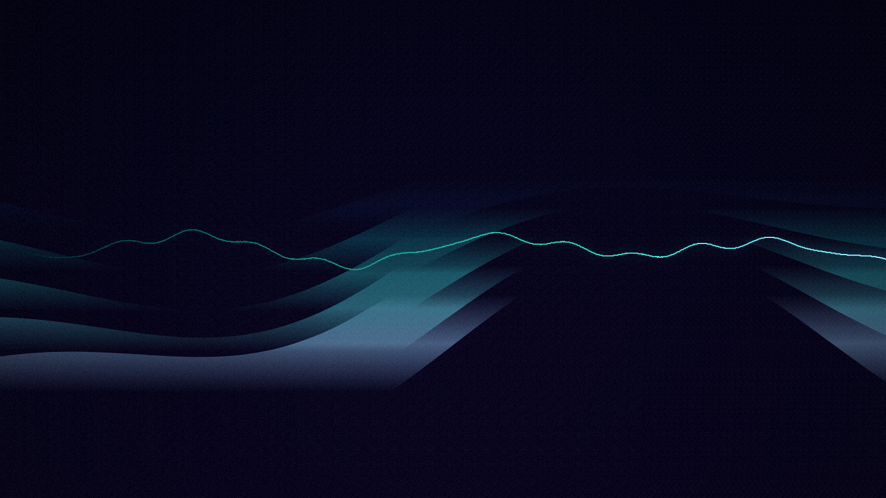 | 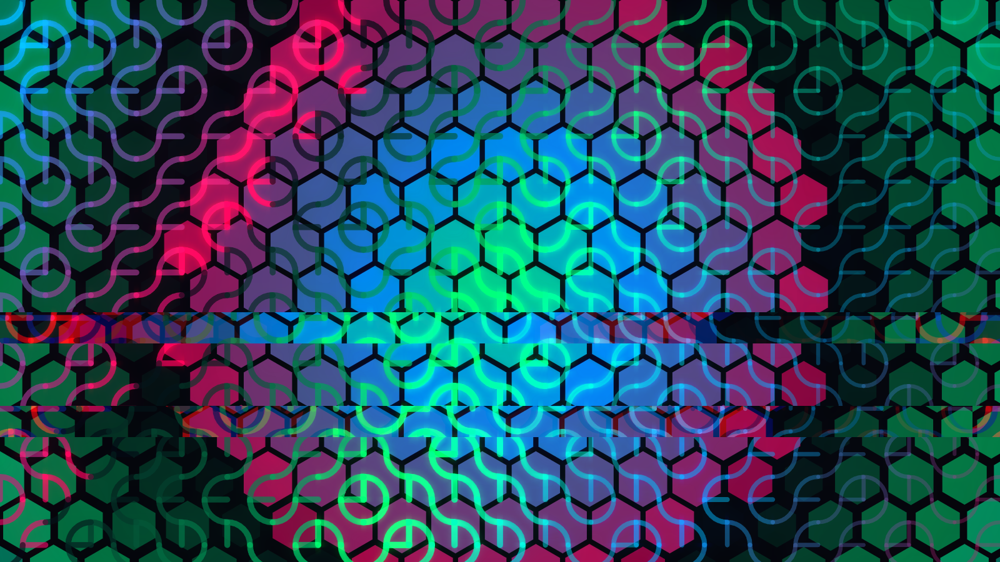 |
| 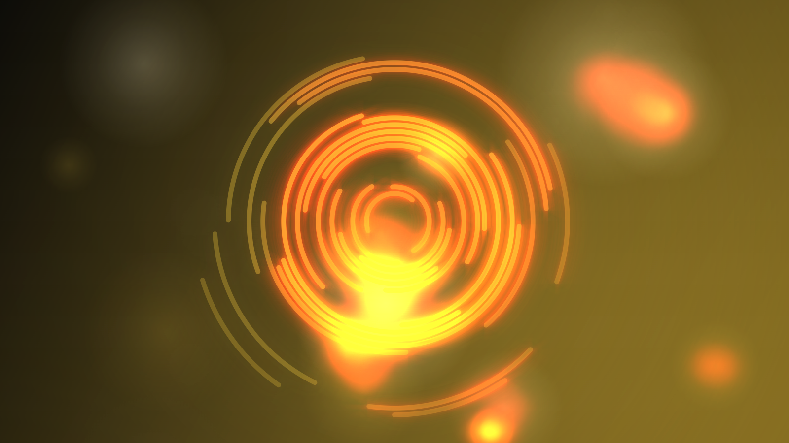 | 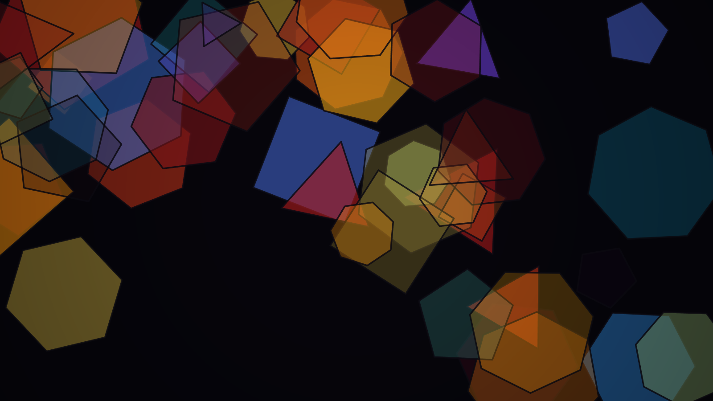 |

</div>

**Sahneler** bütün görünümü — arkaplan, görselleştirici, katmanlar, efektler, logo, metin,
modülasyon, MilkDrop ve görsel nesneler — bir ad altında saklıyor. Tek tıkla geri yükleyin, güncel
görünümden güncelleyin, JSON olarak dışa ve içe aktarın.

**On grupta 81 hazır şablon.** Tek tık; ses aygıtınız, ekran seçiminiz, yayın ve aydınlatma
ayarlarınız olduğu gibi kalıyor — bir şablonu denemek çalışan bir kurulumu bozmamalı, bunu bir test
doğruluyor.

- *Kulüp (8)* — Strobe Wall, Hyper Tunnel, Laser Grid, Mandala Drop, Strobe Floor, Fireworks, MilkDrop
  Flow, Strange Attractor
- *Ambiyans (9)* — Aurora, Ink in Water, Topography, Underwater, Embers, Liquid Metal, Night Globe,
  Flow Field, Interference
- *Yayın (6)* — Corner Bars, Clean Wave, Ring Meter, Scope Overlay, Lower Third, Studio Meters
- *Müzik Videosu (11)* — Label Card, Artwork Card, Baseline Bars, Amber Room, Minimal White, Quiet
  Frame, Corner Meter, Centre Strip, Wave Card, Cover Ring, Stage Card. Kapak, parça adı ve sanatçı
  tek bir Çalan Parça katmanından geliyor; kapak her en-boy oranında yazının yanında aynı boşlukla
  duruyor. Panel önizlemesinde parça çalmıyorken kartta yer tutucu yazı görünür.
- *Müzik Arka Planı (6)* — Aurora Backdrop, Flow Backdrop, Nebula Backdrop, MilkDrop Backdrop, Galaxy
  Backdrop, Soft Glow: müzik çalarken arkada sade, kısık bir görselleştirici, önde parça kartı
- *Müzik (6)* — Chroma Wheel, Helix, Silk Ribbons, Strings, Spectrogram, Galaxy
- *Ekran Koruyucu (6)* — Plasma, Stained Glass, Circuit, Wire Tunnel, Dunes, Prism
- *3B Geometri (8)* — Klein Bottle, Lorenz, Supershape, Trefoil Tube, Chladni, Rose Curve, Chua
  Circuit, Möbius
- *Tür (16)* — Techno, House, Drum & Bass, Hip-Hop, Lo-Fi, Synthwave, Rock, Metal, Jazz, Classical,
  Ambient, Pop, Trance, Dubstep, Chiptune, Experimental
- *Etkinlik (5)* — Minimal Line, Corporate, Gala, Festival, Projection Test

**Müzik videosu düzenleri.** Yayın videoları ve resmî kanallar için sade düzenler, kulüp
malzemesinden bilerek ayrı: karenin oranı olarak bar yerleşimi, grensiz düz bir zemin, ve kapak,
parça adı ile sanatçı tek bir kart olarak. Kapak her en-boy oranında yazının yanında aynı boşlukla
duruyor; barlar kartla aynı kenar boşluğunda.

<div align="center">

| | |
|:---:|:---:|
|  | 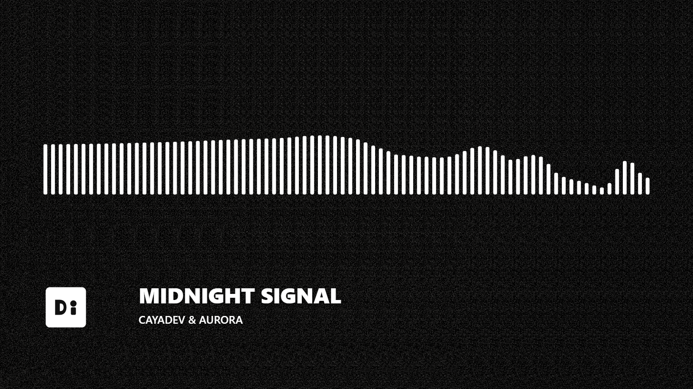 |
| 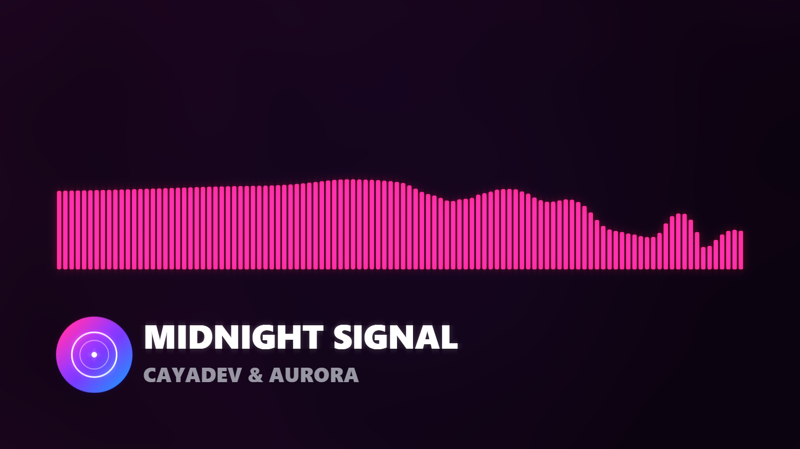 | 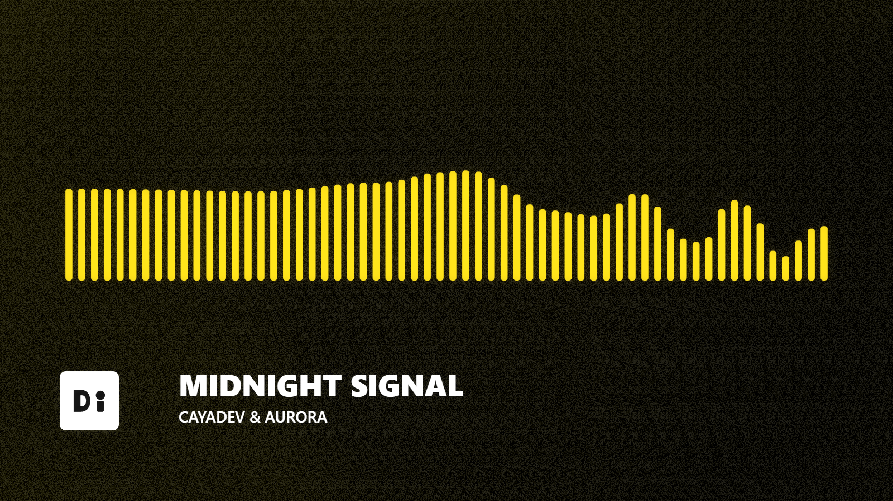 |
| 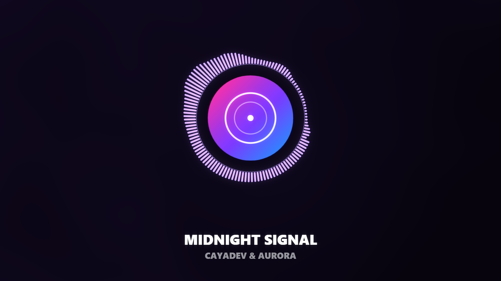 | 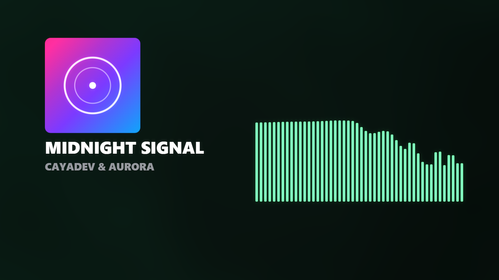 |

</div>

**Sahne Üretici.** Bir tariften sahne kuruyor. Bir sinir ağı **değil** ve öyle sunulmuyor: metni
ağırlıklı bir anahtar sözcük sözlüğüyle dört eksene indiriyor ve onlardan deterministik bir üreticiye
tohum veriyor. Tamamen çevrimdışı çalışıyor.

**18 sahne geçişi** — Kesme · Çapraz Geçiş · Erime · Silme · Dairesel Silme · Saat Silme · Ahır Kapısı ·
Jaluzi · Kayan Şeritler · Dama · İris · Parlaklık Silme (giden karenin kendi parlaklığına göre) · Zum
Darbesi · İtme · Kaydırma · Parlama · Glitch · Bulanık Geçiş. Altı yumuşatma eğrisi, saniye ya da
vuruş cinsinden süre, ve kapatma anahtarı. Bir *sahne* değişiminde tetikleniyorlar, sürgüde asla;
bir denetimi sürüklemek geçiş başlatmıyor.

**Renk.** Beş renk noktası, yedi grupta **58 yerleşik palet** (Klasikler, Sıcak, Soğuk, Neon ve Siber,
Karanlık, Aydınlık, Tek Renk Aileleri) ve kendi kayıtlı paletleriniz her arkaplana, Studio'ya ve 3B
motora uygulanıyor. Her görselleştirici paleti izleyebiliyor (*tema* renk kipi).

**Dinamik renk teması (Windows).** Palet çalan parçayı izleyebiliyor: albüm kapağından çıkarılan
renkler, bir uyum biçimi (analog, tümler, üçlü, siberpunk, synthwave, kutup ışığı…), parça adının
havası ya da presetler arasında bir döngü — arkaplana, görselleştiriciye ya da ikisine birden.

---

### Metin, şarkı sözü ve Çalan Parça

<div align="center">

| Çalan Parça | Metin |
|:---:|:---:|
|  | 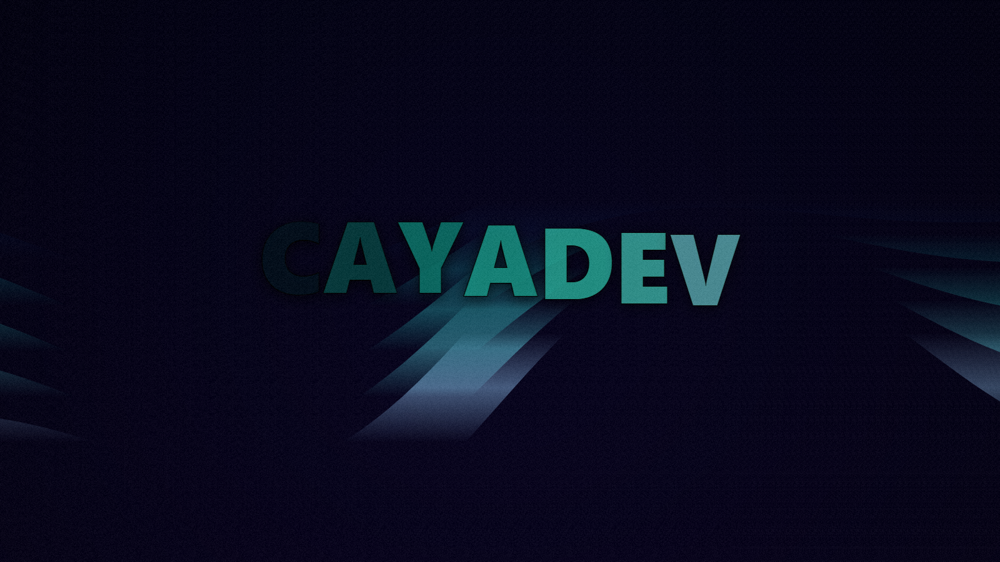 |

</div>

**Çalan Parça.** Windows'ta uygulama sistem medya oturumunu (SMTC) okuyor; Spotify'dan, YouTube
Music'ten, bir tarayıcıdan ya da çoğu oynatıcıdan gelen parça ekrana kendiliğinden geliyor: ad,
sanatçı, albüm, geçen ve kalan süre, ilerleme çubuğu ve albüm kapağı. Sürekli görünebiliyor ya da
yalnız parça değişince beliriyor; yedi canlandırma ve *Modern* ile *OG* biçimleriyle. macOS ve
Linux'ta ad, sanatçı ve kapak elle giriliyor. Çalan Parça panel önizlemesinde ve dışa aktarılan
videolarda da görünüyor <kbd>3.1.5</kbd>.

**Metin.** Karakter başına tepkili (ölçek, titreme, yükselme) sese duyarlı tipografi · yazı tipi,
kalınlık, boyut, hizalama, konum, opaklık, dış çizgi ve gölge · canlandırma kalıpları · kayan yazı ve
haber bandı · karaoke vurgusu.

**Şarkı sözleri.**

- İçerikten biçimi algılanan **LRC ve SRT içe aktarma**, gelişmiş LRC sözcük zamanları dahil.
- LRC'ye geri yazan senkron kaymalı bir **zamanlama düzenleyici**.
- Ekranlar açıkken yüklü bir söz dosyası için **oynat, duraklat ve durdur**; bütün ekranlar ve OBS
  katmanı, uygulamanın çalıştığı makineye göre düzeltilen tek bir saati paylaşıyor.
- **Söz Kütüphanesi (Windows)** <kbd>3.1.5</kbd> — her biri sanatçı ve parça adı taşıyan birçok LRC ya
  da SRT dosyası tutun. **Çalan Parçayı İzle**, sistem medya oturumundan şarkıya uyan dosyayı buluyor
  ve sarma ile duraklatmayla birlikte ilerliyor. **Tam Eşleme** ya da küçük yazım farklarına izin veren
  **Kısmen Eşleme**; kütüphanede eşleşme yoksa oynatıcının zamanlı sözleri kullanılıyor. Dosyalar zaman
  damgalarını, sözcük zamanlarını ve etiketleri renklendiren uzun bir düzenleyicide açılıyor;
  kaldırmadan önce soruluyor. Ağdan hiçbir şey çekilmiyor.

---

### Logo, görseller ve medya katmanı

- **Logo** — karenin herhangi bir yerine konan, kendiliğinden boyutlanan bir görsel; boyut, opaklık,
  parlama, konum ve ses nabzıyla; hareketli GIF'ler oynuyor. Logo **çalan parçanın albüm kapağını** da
  gösterebiliyor. Şablon uygulamak logonuzu koruyor, yalnız yerleşimini değiştiriyor.
- **Logo ve video kitaplıkları** <kbd>3.1.5</kbd> — içe aktarılan dosyalar uygulamanın kendi klasörüne
  kopyalanıp kimlikle anılıyor; ayar dosyası küçük kalıyor ve taşınan bir özgün dosya sahneyi bozmuyor.
- **Görsel nesneler** — görselleştiricinin önünde ya da arkasında görsel sprite'lar; sayı, boyut,
  sürüklenme, dönme ve ses tepkisiyle.
- **Medya katmanı** — bir web kamerası ya da video dosyası, görselleştiricinin önünde ya da arkasında;
  sığdırma (kapla, sığdır, uzat), ayna, 3–12 dilimli kaleydoskop, ton kayması, doygunluk, karışım kipi,
  opaklık ve sesle sürülen yakınlaşma ve opaklık. Aynı kare Studio shader'larında `sv_media` olarak
  okunabiliyor.
- **Her çıkışta akıcı** <kbd>3.1.5</kbd> — videolar varsayılan olarak işlemciyle çözülüyor; tam
  ekran pencerelerde ve Spout/Syphon akışında tam kare hızında oynuyor. Donanım çözmede Chromium
  orada neredeyse hiç kare üretmiyordu (ölçüldü: saniyede 0,3) ve klip döngü noktasında donuyordu.
  HEVC/H.265 videolar için **Ayarlar → Uygulama → Donanım Video Çözme** gerekiyor (yeniden
  başlatınca geçerli); böyle bir dosya açılmazsa panel bunu söylüyor.

---

### Gösteri kontrolü: zaman çizelgesi, klip destesi, Otomatik VJ, MIDI ve OSC

<div align="center">

| Zaman çizelgesi | Klip destesi |
|:---:|:---:|
| 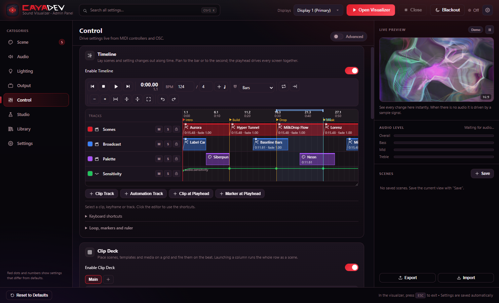 | 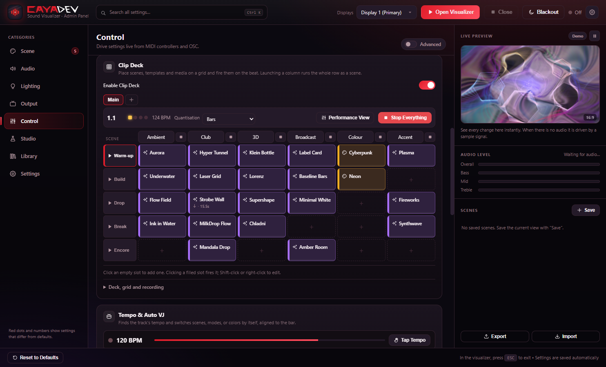 |

</div>

**Zaman çizelgesi.** Sahneleri ve ayar değişimlerini ölçüye ya da saniyeye hizalı biçimde zamana
yayın; tek bir oynatma kafası bütün ekranları birlikte sürüyor, çevrimdışı dışa aktarma da aynı
gösteriyi oynatıyor.

- Sahne, şablon, palet, video, görsel, shader ve eylem için klip parçaları; herhangi bir ayar için
  eğrili **otomasyon şeritleri**; işaretler ve döngü.
- **Tam bir düzenleyici** <kbd>3.1.5</kbd>, Ableton'ın Arrangement View'ı örnek alınarak: aktarım,
  saat (zaman ve ölçü.vuruş), tempo, yakalama, döngü, izleme ve yakınlaştırmalı bir araç çubuğu; renk,
  sessiz, solo ve kilitli parça başlıkları; oynatma kafasında bölme, çoğaltma, kopyala-yapıştır, dürtme,
  100 adımlık geri alma; kutuyla çoklu seçim; sürüklenebilir döngü ayracı ve işaret bayrakları; klip
  başına geçiş tutamakları; **cetvelde tempo değişimleri**; ayarlanabilir şerit yüksekliği ve tam
  pencere kipi; yalnız düzenleyici odaktayken çalışan klavye kısayolları.

**Klip destesi.** Sahneleri, şablonları, paletleri ve medyayı bir ızgaraya yerleştirip vuruşta ateşleyin.

- Genel bir nicemleme ayarıyla **vuruşa hizalı ateşleme**, **takip eylemleri** (sonraki, rastgele,
  git, döngü, dur) ve süreler.
- **Ateşleme kipleri** <kbd>3.1.5</kbd> — tetik, aç/kapa ve **basılı tut** (basılıyken çalar).
- Sekmeli **birden çok deste**, adlandırılmış satır ve sütunlar, renkler, ilerleme çubukları, sıradaki
  hücrelerde yanıp sönen geri sayım, taşımak ya da kopyalamak için sürükle-bırak, ve ikinci bir ekran
  için **Performans Görünümü**.
- **Klavyeyle çalma** <kbd>3.1.5</kbd> — 1-9 ya da oklar satırı seçer, A-P bir yuvayı ateşler, Enter
  satırı başlatır.
- **Medya ve eylem yuvaları** <kbd>3.1.5</kbd> — video, görsel ve shader yuvaları seçilen bir katmana
  uygulanıyor; eylem yuvaları MIDI ve OSC eşlemeleriyle aynı eylemleri çalıştırıyor.
- Ateşlenen yuvalar **zaman çizelgesine kaydedilebiliyor**; doğaçlanan bir set düzenlenebilir bir
  gösteriye dönüşüyor.

**Tempo ve Otomatik VJ.** Parçanın temposu bulunuyor ve **Otomatik VJ** sahneleri, görselleştirici
modlarını ya da renkleri ölçüye hizalı olarak kendiliğinden değiştiriyor. Hangi sahnelerin, modların
ya da paletlerin döneceğini tam olarak seçin (ya da hepsi için boş bırakın), her görselleştirici
katmanına kendi modunu verin, ve neyin değiştiğini, sıradakini ve bir kaynak boşsa neden hiçbir şey
olamayacağını söyleyen bir durum satırını okuyun.

**MIDI.** Bir denetimi öğretin, sonra herhangi bir CC'yi ya da notayı herhangi bir ayara ya da eyleme
eşleyin — MilkDrop'un sonraki, önceki, rastgele, kes, kilit ve puan eylemleri dahil.

**OSC.** Elle yazılmış bir OSC 1.0 ayrıştırıcılı UDP dinleyici; TouchOSC, Resolume, Ableton ya da QLab
için.

<div align="center">

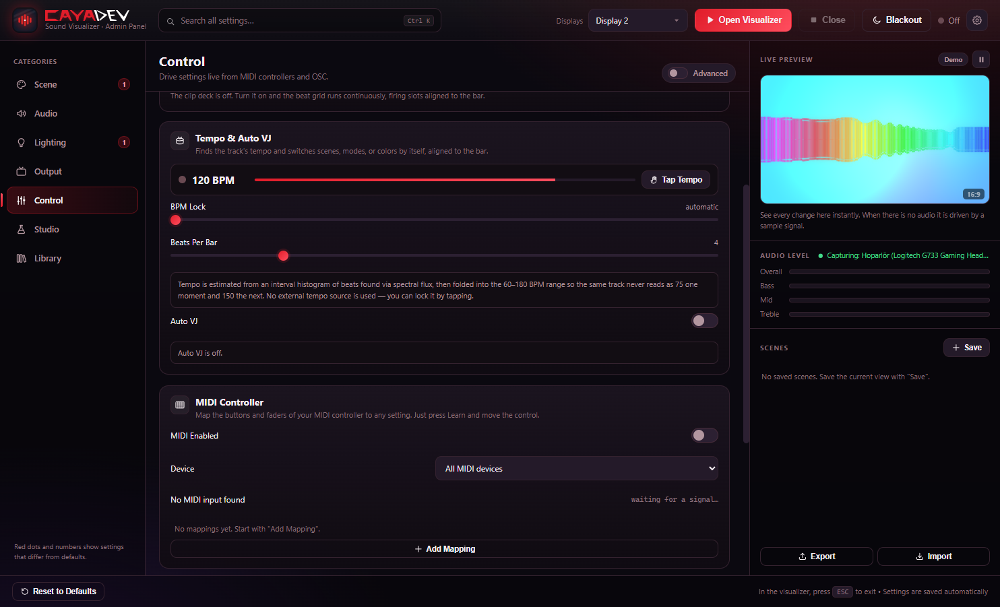

</div>

**Telefon kumandası.** Sahneler, renk paletleri, Studio presetleri, görselleştirici ve arkaplan
modları, ses hassasiyeti, karartma ve çalan parça kartı için telefon boyutunda bir sayfa; OBS
katmanıyla aynı sunucudan. Telefondan gelen değerler uygulanmadan önce aralık denetiminden geçiyor
<kbd>3.1.5</kbd>.

**Karartma** <kbd>Space</kbd> ile ya da herhangi bir denetleyiciden; kendi geçişiyle, kayıtlı sahneye
dokunmadan.

---

### Çıkışlar: ekranlar, OBS, Spout ve Syphon

<div align="center">

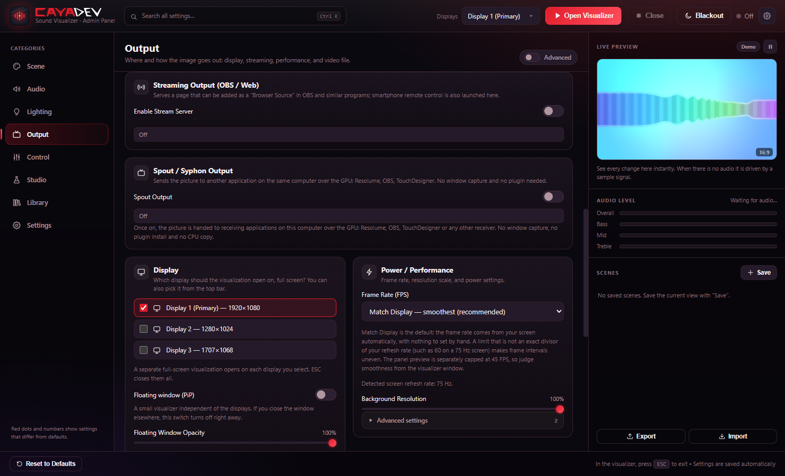

</div>

**Çoklu ekran.** Seçtiğiniz her ekranda ayrı bir tam ekran pencere. Seçilen ekranlar konum ve boyutla
hatırlanıyor; Windows'un yeniden bağlanınca numarasını değiştirdiği bir monitör yeniden bulunuyor
<kbd>3.1.5</kbd>.

**Yüzen pencere** <kbd>3.1.5</kbd>. Opaklık, 16:9 en-boy kilidi, konum kilidi ve **tıklamayı alttaki
pencereye geçirme** seçenekli resim-içinde-resim bir pencere; çalışırken görselleri masaüstünüzün
üstünde tutmak için.

**Yayın çıkışı — OBS ve tarayıcı.** **Çıkış → Yayın Çıkışı**'nı açın; uygulama bir katman sayfası
sunar.

- OBS'e **Tarayıcı Kaynağı** olarak ekleyin. Eklenti yok, gerçek saydamlık.
- Katman masaüstü penceresiyle **aynı motoru** çalıştırıyor; ne görüyorsanız o yayınlanıyor — MilkDrop
  presetleri ve dokuları dahil.
- Ağ üzerinden çalışıyor: görselleştirici bir makinede, OBS başka bir makinede olabilir.
- **Saydamlık uygulamanın kendi anahtarı**; tek bir kaynağı zorlamak için adresine `?transparent=0` ya
  da `?transparent=1` ekleyin.
- **Şarkı sözleri uygulamayı izliyor**; tarayıcı saatini uygulamanın çalıştığı makineye göre düzeltiyor.
- **Bir tanı kartı** <kbd>3.1.5</kbd> — bağlantıyı, yapılandırmayı, ses kare hızını, tuval boyutunu,
  saydamlığı, uygulama sürümünü ve son hatayı görmek için adrese `?debug=1` ekleyin.
- Erişim jetonlarla korunuyor; katmanın ve telefon kumandasının ayrı jetonları var.

**GPU çıkışı — Spout ve Syphon.** Görüntü aynı makinedeki başka bir uygulamaya GPU üzerinden
verilebiliyor: pencere yakalama yok, CPU kopyası yok.

- Windows'ta **Spout**, macOS'ta **Syphon**. Alıcılar arasında Resolume, OBS, TouchDesigner ve
  MadMapper var — iki protokolden birini konuşan her şey.
- **Kaynak adını**, çözünürlüğü ve kare hızını seçin.
- Kendi gizli penceresinde çiziliyor; hiçbir görselleştirme penceresi açık değilken de akış sürüyor.
- Spout ve Syphon opak kalıyor: paylaşılan bir GPU dokusu göndereni düşürmeden alfa taşıyamıyor.
- **Linux'ta yok**; orada yerleşik bir karşılığı yok. Panel bunu söylüyor ve her yerde çalışan OBS
  tarayıcı kaynağını gösteriyor.

---

### Sahne: projeksiyon haritalama ve basıklık düzeltme

<div align="center">

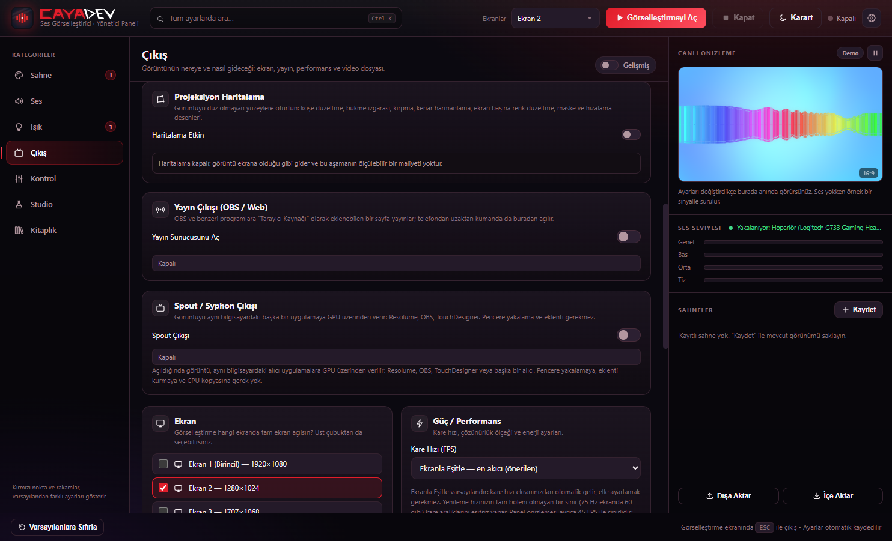

</div>

**Projeksiyon haritalama**

- Gerçek bir homografi olarak **köşe sabitleme**; doku perspektif doğru kalsın diye payda
  `gl_Position.w`'ye yazılıyor.
- Kontrol noktalarından geçen bir Catmull-Rom ızgarasında **ağ bükme**.
- Çok projektörlü kurulumlar için **yumuşak kenar harmanlama**; eğrilerin örtüşmede tam 1'e toplandığı
  sınanıyor.
- **Çıkış başına kırpma, renk düzeltme ve Bézier çokgen maskeleri**; artı hizalama ızgaraları,
  artılar, renk çubukları ve odak halkaları; sürükleme, ok tuşuyla dürtme ve tam sayısal giriş.

**Basıklık düzeltme.** Bir ekranın bildirdiği çözünürlük her zaman fiziksel şekliyle uyuşmuyor.
1920×1080 sürülen ama gerçekte yaklaşık 3:1 olan bir panel — bir sahne LED duvarı, bir bar ekranı,
anamorfik bir projektör, uzatma kipine zorlanmış bir TV — her çemberi elips çiziyor.

- **Kare asla uzatılmıyor.** Sahne, panelin gerçek şekline uyan kare pikselli bir tuvale çiziliyor ve
  çerçeve tamponuna doğrusal olarak sıkıştırılıyor; panelin kendi bozulması sıkıştırmayı geri alıyor.
  Hiçbir şey kırpılmıyor, hiçbir şey kenardan taşmıyor.
- **Tek ayar her şeyi düzeltiyor** — arkaplan, görselleştirici, logo, metin ve sprite'lar birlikte.
- Bir çember, kare ya da ızgarayla **gözle ayarlanıyor**; ya da panel boyutundan, gerçek en-boy
  oranından ya da önceden uzatılmış bir görselin ölçülerinden.
- **Ekran başına ya da tüm ekranlar**; projeksiyon haritalamayla mevcut köşe ayarını kaydırmadan
  birleşiyor; dışa aktarılan videoya, yayına ve web katmanına dokunmuyor.

---

### RGB aydınlatma: Dynamic Lighting, OpenRGB ve Art-Net

**Windows Dynamic Lighting**

- Varsayılan olarak kapalı; yalnız uyumlu aygıtlar algılanınca kullanılabilir.
- Dinamik kipler: görselleştirici renk akışı, bar-tayf eşlemesi, bas/orta/tiz bölgeleri, arkaplan ışık
  eşitlemesi, eşzamanlı vuruş flaşları, frekans dalgacıkları, bar ve arkaplan birleşimi, aygıtlar
  arası renk akışı, gökkuşağı akışı ve eşikle tetiklenen patlamalar.
- Elle kipler: tek renk, aygıt başına renkler, ve donanımın sunduğu yerde LED ya da bölge başına renkler.
- Parlaklık, ses tepkisi, yumuşatma, güncelleme hızı, LED yerleşimi, palet kaynağı, bant başına renk ve
  hassasiyet, flaş eşiği, gücü ve sönümü, dalgacık hızı, yönü ve genişliği, ve renk yayılımı
  ayarlanabiliyor.
- Kurulum programı Windows arka plan aydınlatma kimliğini kaydediyor; uygulama odakta değilken de
  ışıklar çalışıyor. Uygulamayı **Dynamic Lighting → Arka plan ışık denetimi**'nde üst sıralara koyun.

**OpenRGB — her yerde RGB.** Çalışan bir **OpenRGB** sunucusuyla kendi protokolü üzerinden (TCP,
varsayılan 6742 portu) Windows, macOS ve Linux'ta konuşuyor — üretici yazılımı yok, sunucu başka bir
makinede olabilir. OpenRGB'nin sunduğu her aygıt, donanımın izin verdiği yerde LED başına, Dynamic
Lighting ile **aynı kipler ve aynı renk matematiğiyle**.

**Art-Net / DMX.** Armatürlere ve ışık masalarına ArtDMX çıkışı; paket düzeni bayt bayt sınanıyor.

**Renk kaynakları.** Işıklar arkaplanı, temayı ya da **canlı MilkDrop görüntüsünü** <kbd>3.1.5</kbd>
izleyebiliyor — saniyede yaklaşık 30 kez soldan sağa sekiz dilime örnekleniyor; soldaki armatürler
ekranın solundaki renkleri alıyor.

---

### Kayıt ve video dışa aktarma

<div align="center">

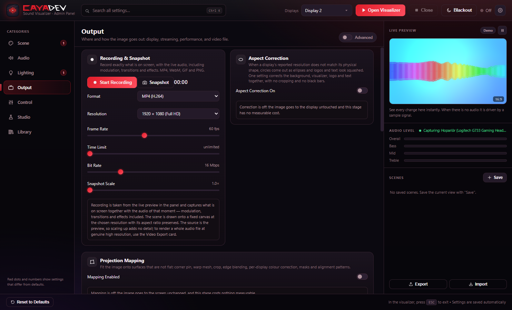

</div>

- **Çevrimdışı video dışa aktarma (ses dosyası → MP4).** Bir parçayı kare kare çiziyor — ekran kaydı
  değil — 720p, 1080p, 1440p ya da 4K, 30 ya da 60 fps; kalite, CPU ya da GPU kodlayıcı, ilerleme,
  iptal ve GPU'dan CPU'ya geri düşmeyle. Deterministik: aynı iş aynı videoyu veriyor; görsel gerileme
  testlerinin dayandığı özellik bu. Ad, sanatçı, albüm ve kapak dosyadan okunup Çalan Parça'ya ve metin
  katmanlarına veriliyor.
- Çıkışın göründüğü gibi **canlı kaydı** — canlı ses, modülasyon, geçişler ve efektlerle — MP4 ya da
  WebM'e, tek tuşla.
- Tek geçiş gözle görülür bantlandığı için iki geçişli palet üretimli **GIF dışa aktarma**.
- Bir kısayolla 4×'e kadar **PNG anlık görüntü**.
- Yaygın en-boy oranları için **dışa aktarma kalıpları**.

---

### MCP — bir yapay zekâ ajanıyla kontrol

<kbd>3.1.5</kbd>

Bir ajan, çalışan uygulamayı **Model Context Protocol** üzerinden sürer. Anahtar **Kontrol**
kartındadır ve varsayılan olarak kapalıdır. Anahtar açıkken uygulama açık kalır. Kurulum
penceresi Claude Desktop, Codex, Cursor, Grok ve Grok Bot için bir stdio komutu verir. Ollama
ayrı bir protokol değildir; MCP konuşan bir istemcinin arkasındaki yerel modeldir ve aynı komutu
kullanır.

> **Node.js gerekir.** stdio komutu `node` çalıştırır; bilgisayarda [Node.js](https://nodejs.org/)
> LTS kurulu ve `PATH` üzerinde olmalıdır. Uygulamanın kendisinin Node.js'e ihtiyacı yoktur. Node.js
> yoksa MCP istemcisi `node`'u başlatamadığını bildirir.

Sunucu JSON-RPC `initialize`, `ping`, `tools/list` ve `tools/call` konuşur. `2024-11-05`,
`2025-03-26` ve `2025-06-18` sürümlerini kabul eder; başka bir sürüm isteğine `2024-11-05` ile
yanıt verir. Sunucu adı `soundvisualizer`. **96 araç** vardır.

İstemci stdio köprüsünü başlatır. Köprü, taşıyıcı jetonla `http://127.0.0.1:<port>/mcp` adresine
yazar. Soket yalnız `127.0.0.1` adresine bağlanır. Port, siz başkasını seçmedikçe **38471**'dir.
**8722** reddedilir; o port yayına aittir. Meşgul port meşgul kalır: sunucu başka porta geçmez,
kart başarısızlığı yazar. Her açılış, uygulama veri klasöründeki `mcp-endpoint.json` dosyasına
yeni bir jeton yazar; yanında köprünün bir kopyası durur. Linux ve macOS'ta bu iki dosyayı yalnız
bu kullanıcı okur. Başka bir makineden gelen bağlantı reddedilir; eksik ya da yanlış jeton da
reddedilir.

`sv_get_config`, çıkış durumu okuması ve `sv_export_json` yayın jetonlarını karartır.
`sv_set_stream`, `token` ve `remoteToken` alanlarını atar.

Her araç parametrelerini türleri, aralıkları ve izin verilen değerleriyle `tools/list` içinde
bildirir. Panelin üretemeyeceği değerler reddedilir ya da panelin aralığına çekilir: -1..1
dışındaki katman konumu, `#rrggbb` olmayan renk, bilinmeyen efekt türü, var olmayan bir ayara
giden modülasyon rotası. `sv_patch_config` bir listeye yalnız var olan bir sıradan yazar
(`layers.0.opacity`) ve yeni üst anahtar oluşturmaz. Yazılan değer yerine geçtiği değerin türünde
olmalı; `layers` altındaki yazım `sv_update_layer` ile aynı denetimden geçer. Aracın tanımadığı
argümanlar yanıtta `ignored` olarak geri söylenir.

Beş kip birikir. Anahtar **Okuma** kipinde açılır. Üst kip altındakileri de kapsar. Ajan kendi
iznini yükseltemez: `sv_patch_config` her `mcp.*` yolunu reddeder. Engellenen çağrı gereken kipin
adını söyler ve ajana kipi değiştirmemesini, panele tıklamamasını bildirir.
`sv_list_permissions` ve `mcp_permissions` etkin kipi, araç adı verirseniz o aracın en alt kipini
bildirir.

İzin verilen değişiklik, tıklamayla aynı yoldan kaydolur ve gider. Yönetici paneli, açık
görselleştirici pencereleri ve yayın hepsini alır. Her çağrıdan sonra, başarılı ya da hatalı,
preset klasörü yeniden okunur ve açık pencereler farkı alır.

#### Okuma

Ana anahtar yeter. Bu çağrılar yalnız okur.

- `sv_get_state` gösteriyi döner: etkin preset, sahneler, katmanlar, açık efektler, ekranlar, BPM
  ve seviyeler, çalan parça, katman yığını, yayın durumu, Spout/Syphon durumu ve panel
  önizlemesinin canlı çözümlemesi (önizlemede ses yokken boş).
- `sv_get_visual_state`, `sv_list_layers`, `sv_get_layer` ve `sv_get_layer_stack` katman konumu,
  ayarları ve katman efektlerini döner.
- `sv_get_preview` ekrandaki görüntünün JPEG'ini ekler; genişlik en çok 480 pikseldir. Sırayla
  açık bir görselleştirici penceresine, yüzen pencereye, sonra yönetici panelindeki önizleme
  dikdörtgenine bakar.
- `sv_get_audio` panelin çizdiği aynı sayaçtan seviye, bas, orta, tiz, BPM ve güven döner.
  `sv_get_now_playing` çalan parçayı döner. `sv_list_audio_sources` ayarlı girişleri listeler.
- `sv_list_scenes` ve `sv_get_scene` kayıtlı sahneleri okur. `sv_list_modes` bütün görselleştirici ve
  arkaplan kimliklerini, katman türlerini ve karışım kiplerini listeler; mod ve katman araçları
  listede olmayan kimliği reddeder. `sv_list_effects` genel zinciri, her
  katmanın zincirini ve 40 hazır efekt türünü listeler. `sv_list_presets` kütüphane presetlerini
  ve kullanıcı renk paletlerini listeler. `sv_list_displays` ekranları listeler.
- `sv_get_output_status` hangi görselleştirici pencerelerin açık olduğunu, yayın anahtarını,
  portunu ve LAN bayrağını, Spout/Syphon adını okur. `sv_get_timeline`, `sv_get_clipdeck` ve
  `sv_get_autovj` o panelleri okur. `sv_get_config` bütün yapılandırmayı ya da tek bir noktalı
  yolu okur.

#### Uygula

Kayıtlı olanı kullanır.

- `sv_apply_scene` kayıtlı bir sahneyi kimlikle, ad tekilse adla yükler. Anlık görüntü arkaplan,
  görselleştirici, katmanlar, gruplar, çapraz geçiş, geometri, efektler, logo, resimler, ortam,
  yazı, modülasyon, geçiş, Studio, MilkDrop ve geri beslemeyi kapsar. Pencere saydamlığı ve görev
  çubuğunu kaplama olduğu gibi kalır.
- `sv_apply_template` hazır bir şablonu kimlik ya da adla uygular. `sv_set_visualizer_type` ve
  `sv_set_background_type` var olan bir mod kimliğine geçer. Bir Studio shader'ı `custom` türü ve
  `presetId` ile gösterilir. `sv_set_layer_enabled` bir katmanı gösterir ya da gizler ve yığını
  açar. `sv_set_crossfade` A/B sürgüsünü 0 ile 1 arasına alır.
- `sv_trigger_clip` klip destesinde bir yuvayı satır ve sütunla ateşler. `sv_stop_clips` çalan her
  yuvayı durdurur. Izgara kayıtlı halinde kalır. İkisi de yönetici penceresinin açık olmasını
  ister.
- `sv_set_effect_enabled` ve `sv_set_effect_param` genel zincirde duran bir efekti değiştirir.
  Katman çifti aynı işi tek katmanda yapar. `sv_set_modulation_enabled` modülasyon matrisini açar
  ya da kapatır. `sv_set_macro` var olan bir makro sürgüsünü ayarlar.
- `sv_load_preset` kütüphanedeki bir preseti canlı MilkDrop kaynağına kopyalar.
  `sv_apply_color_preset` var olan bir kullanıcı ya da hazır paleti arkaplan gradyanına boyar.
  `sv_set_milkdrop_cycle` kütüphanenin ilerleyişini ayarlar: otomatik sonraki, sıra, kaynak,
  etiket, birim, ölçü sayısı, parça ilerleyişi ve sert kesme.

#### Yazma

Oluşturur ve düzenler.

- Sahneler: `sv_create_scene` o anki görünümü yeni bir adla saklar, `sv_update_scene` birinin
  üstüne yazar, `sv_rename_scene` kimliği ya da şimdiki adıyla bulduğu sahneye `newName` adını verir,
  `sv_delete_scene` siler.
- Katmanlar: `sv_add_layer`, `sv_update_layer`, `sv_set_layer_position`, `sv_set_layer_settings`,
  `sv_remove_layer`, `sv_reorder_layers`. Bir katman tür, görselleştirici tipi, preset, opaklık,
  harman, dönüşüm (x, y, ölçek, döndürme, çevirme), ses tepkisi, maske, solo, sessiz, kilit ve
  grup taşır. Katman efektleri efekt araçlarından gider. Katman eklemek ya da göstermek yığını
  açar.
- `sv_set_text` yazı katmanını düzenler; şarkı sözü ya da çalan parça kaynağı buna dahildir.
  `sv_set_logo`, `sv_set_media` ve `sv_set_geometry` o blokları düzenler.
- Efektler: genel zincirde `sv_add_effect` ve `sv_remove_effect`, tek katmanda
  `sv_add_layer_effect` ve `sv_remove_layer_effect`. Hazır türler bloom, chroma, glitch, grain,
  crt, pixelate, kaleido, mirror, grade, vignette, trails, edge, zoomblur, ripple, posterize,
  blur, radialblur, motionblur, tiltshift, dof, sharpen, emboss, dither, halftone, ascii, hatch,
  paint, vhs, datamosh, slitscan, lens, twirl, polar, gradientmap, levels, threshold, solarize,
  godrays, badtv ve starfilter. `sv_add_modulation_route` ve `sv_remove_modulation_route`
  rotaları düzenler.
- Presetler: `sv_save_preset` preset deposuna bir dosya yazar. Türü verilmemiş shader metni Studio
  görselleştiricisi olarak kaydolur (`kind` `visualizer`, `engine` `shader`). Türü verilmemiş
  diğer kayıt MilkDrop'dur. `engine` `shader` ya da `variation` olur; `glsl`, `shadertoy`, `isf`
  ve `frag` `shader` sayılır. `sv_delete_preset` dosyayı siler, olmayan kimliği bildirir. `sv_set_milkdrop_source` MilkDrop
  kaynağını canlı gösteriye yazar. `sv_create_color_preset` iki ile beş `#rrggbb` renkli bir
  kullanıcı paleti saklar; panel gibi beş renk tutar, eksikte son rengi tekrarlar. `sv_delete_color_preset` bir kullanıcı paletini siler.
- Otomatik VJ: `sv_set_autovj` açık, kaynak, aralık, birim, sıra, BPM kilidi, palet kaynağı ve
  katman başına görselleştirici hedeflerini ayarlar.
- Dışa aktarma ve kayıt: `sv_start_export` diskte duran bir ses dosyasını sizin verdiğiniz video
  yoluna çizer. Çözünürlük, saniyede 30 ya da 60 kare, CPU ya da GPU kodlayıcı, hız ve kalite
  dışa aktarma panelindeki seçeneklerdir. `sv_cancel_export` süren aktarmayı durdurur.
  `sv_export_json` sahne listesini ya da bütün ayarları, pencere açmadan, bir yola yazar.
  `sv_save_snapshot` canlı görüntüyü bir yola JPEG olarak yazar. Bu üç araç yalnız uzantısı
  uyan, mutlak ve yerel bir yol kabul eder: video için `.mp4`, ayarlar için `.json`, görüntü için
  `.jpg` ya da `.jpeg`. Ağ yolları, `tcp://` gibi adresler ve uygulamanın kendi klasörleri
  reddedilir. Var olan bir dosyanın üstüne yalnız `overwrite: true` ile yazılır. `sv_record_start` ve `sv_record_stop`
  yönetici kaydedicisini sürer. Durdurmak, Kayıt kartındakiyle aynı kaydetme penceresini açar.
  Kaydedici, yönetici penceresinin açık olmasını ister.

#### Tam

Canlı yüzeyleri açar.

- `sv_open_output` görselleştiriciyi seçilen ekranlarda açar. Bir ekran kimliği vermek seçili
  kümeyi değiştirir. `sv_close_output` görselleştirici pencerelerini kapatır. `sv_set_displays`
  ekranları seçer, pencereleri olduğu gibi bırakır.
- `sv_set_stream` OBS ve tarayıcı yayınını değiştirir. `sv_set_texture_share` Spout ve Syphon'u
  değiştirir. `sv_set_aspect` basıklık düzeltmesini değiştirir. `sv_set_power` kare hızı tavanını,
  çizim ölçeğini ve görselleştirme penceresi açıkken ekranı uyanık tutan `keepAwake` ayarını değiştirir.
- `sv_set_floating` yüzen pencere tercihlerini değiştirir; opaklık ve tıklamayı geçirme buna
  dahildir. `sv_set_floating_open` aynı resim-içinde-resim penceresini açar ya da kapatır.
- `sv_set_window_mode` saydam arkaplanı, saydamlık eşiğini ve görev çubuğunu kaplamayı ayarlar.
- `sv_set_lighting` Windows Dynamic Lighting ayarlarını değiştirir. `sv_set_openrgb` OpenRGB'yi
  değiştirir. `sv_set_artnet` Art-Net'i değiştirir. `sv_set_audio_sources` giriş karışımını
  değiştirir.
- `sv_set_mapping` bir ekranın projeksiyon haritasını yazar: açık, köşeler, kırpma, kenar
  harmanlama, maskeler, ağ, renk ve test deseni; haritalamayı da açar. Yeni bir ağ portu açmaz.
- `sv_timeline_transport` zaman çizelgesini yönetici taşıması üzerinden oynatır, duraklatır,
  durdurur ya da sarar. Yönetici penceresi açık olmalıdır.
- `sv_set_blackout` `on`, `off` ya da `toggle` alır ve kayıtlı sahneyi yerinde bırakır.
  `sv_set_blackout_transition` karartma geçişinin türünü ve süresini ayarlar.

#### Her şey, ve genel yama

`sv_patch_config` başka herhangi bir noktalı yolu yazar. Kip yola bağlıdır: sahne içeriği,
efektler ve presetler **Yazma** ister; dışa aktarma yolları **Yazma** ister; ekranlar, yayın,
ışık, eşleme, pencereler ve zaman çizelgesi **Tam** ister; `control.*` (MIDI ve OSC bağlamaları)
**Her şey** ister. Daha sıkı bir yolu içeren yol da o kipi ister: anahtarları taşıdığı için
`stream` nesnesinin tamamı **Her şey**, `power`, `audio`, `background` ve `transition`
nesnelerinin tamamı **Tam** ister. Tabloda olmayan bir yol **Her şey** ister. `mcp.*`, `version`,
`__proto__`, `prototype` ve `constructor` yolları reddedilir.

`sv_updates_download` ve `sv_updates_install` uygulamanın bulduğu güncellemeyi indirir ve kurar.
`sv_rotate_stream_token` OBS ya da kumanda anahtarını yeniler. `sv_repair_audio` ses bileşeni
sağlamsa yakalamayı baştan kurar; eksikse bunu söyler, çünkü kurulum kullanıcının onayını ister.
Dördü de **Her şey** ister. Okuma araçları `sv_diagnose_audio` ve `sv_get_analysis` yakalama
tanısını ve canlı çözümlemeyi (ton, akor, perde, gürlük, davul bantları) döner.

---

### Yönetici paneli

<div align="center">

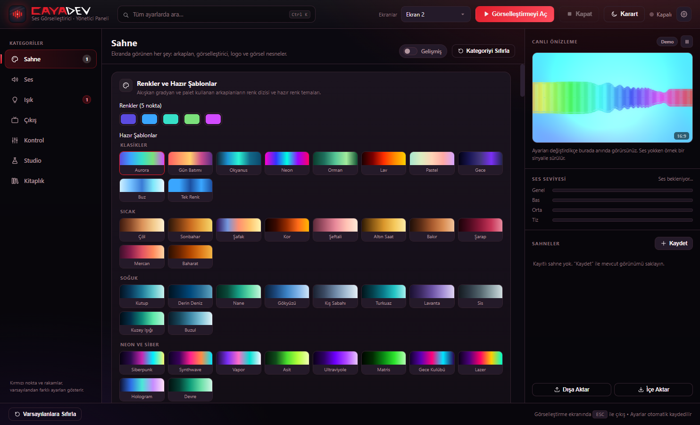

</div>

- **Sekiz kategori** — Sahne, Ses, Işık, Çıkış, Kontrol, Studio, Kitaplık ve Ayarlar.
- **Her yerde canlı** — her değişiklik anında çıkış pencerelerine ulaşıyor ve kendini kaydediyor.
- Her sayfanın yanında kendi demo sinyaliyle bir **canlı önizleme**, ses ölçerleri ve kayıtlı sahneler.
- Her kartta ve kategoride **değişti işaretleri**; bölümü ya da bütün kategoriyi sıfırlama.
- Her kategorideki her ayarda **arama** (<kbd>Ctrl</kbd> + <kbd>K</kbd>).
- **Gelişmiş** anahtarları seyrek kullanılan denetimleri siz isteyene kadar gizliyor; **genişletilmiş
  aralıklar** sürgü sınırlarını 5 katına çıkarıyor.
- Çalışırken değiştirilebilen **Türkçe ve İngilizce**; çevrilmemiş tek bir arayüz metni kalırsa öz test
  başarısız oluyor.

---

### Güvenilirlik, güç ve güncellemeler

- **Kaza koruması** — beklenmedik biçimde kapanan bir görselleştirici penceresi (çökme, Alt+F4) anında
  yeniden açılıyor; *Yanlışlıkla Kapatmayı Önle* gösteri sırasında uygulama kapanmadan önce soruyor;
  isteğe bağlı bir ESC kilidi ve çıkış yolu olarak <kbd>Ctrl</kbd> + <kbd>Shift</kbd> + <kbd>Q</kbd>.
- **Ekranı uyanık tutuyor** <kbd>3.1.5</kbd> — bir görselleştirici penceresi açık ve simge durumunda
  değilken varsayılan olarak açık; Windows, macOS ve Linux'ta. Küçültmek ya da kapatmak denetimi güç
  ayarlarınıza geri veriyor.
- **Her GPU yüzeyi kaybolan bağlamdan dönüyor** <kbd>3.1.5</kbd> — bir sürücü sıfırlaması artık yeniden
  başlatmaya kadar siyah katmanlar bırakmıyor.
- **Ana süreç hataları kapsanıyor** <kbd>3.1.5</kbd> — beklenmedik bir hata, uygulamayı bir hata
  kutusunun ardında dondurmak yerine kaydediliyor ve panelde gösteriliyor.
- **Aynı anda iki kopya** <kbd>3.1.5</kbd> — ikinci kopya zaten çalışanı adıyla söylüyor ve ona geçmeyi
  öneriyor; bir kopya başkasının değiştirdiği ayarların üstüne sessizce asla yazmıyor.
- **Güncellemeler** <kbd>3.1.5</kbd> — *Kitaplık → Güncellemeler* GitHub Sürümlerini denetliyor, notları
  gösteriyor ve bir sürümü atlamanıza izin veriyor. Windows kurulumu ve AppImage yerinde indirip
  kuruyor; boyut ve SHA-256 tam uyuşmadıkça hiçbir şey çalışmıyor. Kapalı, haber ver (varsayılan) ya da
  otomatik.
- **Ayar yedeği ve geri yükleme** — her ayar tek bir JSON dosyasında; paletlerin ve sahnelerin kendi
  dışa aktarımı var ve içe aktarmadan sağ çıkıyorlar. 1.3 ve 2.0 sürümlerinin yazdığı dosyalar tek bir
  değer kaybetmeden açılıyor.
- **Güç ve performans** — *Ekranla Eşitle* kare hızı ya da 120, 60 veya 30 FPS sınırı, arkaplan
  çözünürlük ölçeği, sessizlikte duraklatma, imleci gizleme, her zaman üstte, ve görev çubuğunu örtme.

---

### Gizlilik ve güvenlik

- **Hesap yok, telemetri yok, analiz yok.** Ayarlar kullanıcı klasörünüzde duruyor.
- **Kendiliğinden yaptığı tek ağ çağrısı**: güncelleme denetimi için GitHub'ın son sürüm API'si,
  hiçbir kimlik bilgisi olmadan. Güncellemeleri *Kapalı* yapın, hiç kalmaz.
- **Geri kalan her şey isteğe bağlı ve yerel**: yayın sunucusu (yerel ağ, jetonla korunuyor; başka
  kökenlerden gelen sayfaları ve tanımadığı ana bilgisayar adlarını reddediyor <kbd>3.1.5</kbd>), OSC,
  OpenRGB, Art-Net ve MCP (yalnız `127.0.0.1`'e bağlı, bir taşıyıcı jetonla).
- **Çeviriciler ve üreticiler çevrimdışı çalışıyor** — Shadertoy ve ISF içe aktarma, sahne üretici,
  MilkDrop preset üretici, şarkı sözleri.
- **Otomasyon kamerayı asla açmıyor**, ve bir fuzz testi hiçbir MilkDrop presetinin motora JavaScript
  kaçıramayacağını doğruluyor.

---

## SSS

**Ücretsiz mi?**
Evet. CAYADEV Visualizer MIT lisansıyla açık kaynak. Ücretli katman, hesap ya da filigran yok.

**Stereo Mix ya da sanal ses kablosu gerekiyor mu?**
Windows'ta hayır: sistem sesi doğrudan çıkış aygıtından yakalanıyor. macOS'ta sistem sesi için
BlackHole gibi sanal bir aygıt gerekiyor (mikrofonlar doğrudan çalışıyor). Linux'ta PulseAudio ya da
PipeWire monitor kaynağı kendiliğinden kullanılıyor.

**Spotify, YouTube, Apple Music ya da bir DAW ile çalışır mı?**
Evet — bilgisayarınız ne çalıyorsa onu görselleştiriyor. Windows'ta yalnız tek bir uygulamayı (örneğin
Spotify'ı) yakalayıp gerisini yok sayabilirsiniz; Çalan Parça parça adını ve kapağı sistem medya
oturumundan okuyor.

**OBS katmanı olarak kullanabilir miyim?**
Evet. Yayın Çıkışı'nı açın ve adresi bir Tarayıcı Kaynağı olarak ekleyin. Saydamlık çalışıyor ve OBS
aynı ağdaki başka bir bilgisayarda olabilir. GPU paylaşımı için Spout (Windows) ve Syphon (macOS) da var.

**MilkDrop presetlerimi yükleyebilir mi?**
Evet: tek `.milk` dosyaları, MilkDrop 3 `.milk2` çift presetleri <kbd>3.1.5</kbd>, ZIP paketleri,
klasörler ya da bilgisayarınızda bir arama. Görsel kullanan presetler için uygulamayı bir MilkDrop
`textures` klasörüne yönlendirin. Üçüncü taraf preset paketi gelmiyor; beş özgün preset geliyor.

**Bir Winamp ya da projectM eklentisi mi?**
Hayır. WebGL2'de kendi MilkDrop uyumlu motoru olan bağımsız bir uygulama. projectM'i ya da MilkDrop'u
içermiyor.

**Birkaç monitörü ve projektörü destekliyor mu?**
Evet — seçilen her ekranda tam ekran bir pencere, artı projektörler ve LED duvarlar için projeksiyon
haritalama, kenar harmanlama ve basıklık düzeltme.

**Bir parçadan müzik videosu yapabilir miyim?**
Evet. Video Dışa Aktar, güncel sahneyle bir ses dosyasını kare kare MP4'e, 60 fps'de 4K'ya kadar
çiziyor. Ekran kaydı değil; sonuç bilgisayarınızın hızına bağlı değil.

**Yapay zekâ ajanları kontrol edebilir mi?**
Evet <kbd>3.1.5</kbd>. Kontrol sayfasında MCP'yi açın ve kurulum penceresinin verdiği komutla Claude
Desktop, Codex, Cursor ya da herhangi bir MCP istemcisini bağlayın. Erişim salt okumadan başlıyor.
Komut için bilgisayarda [Node.js](https://nodejs.org/) LTS kurulu olmalı.

**Bilgisayarımı yavaşlatır mı?**
WebGL2 destekli bir GPU gerekiyor. Dizüstü bilgisayarlarda kare hızı sınırını, arkaplan çözünürlük
ölçeğini ve sessizlikte duraklatmayı kullanın; MilkDrop paneli ağ yoğunluğunu ve iç çözünürlüğü
gösteriyor.

**Ekran koruyucu olabilir mi?**
Bir Ekran Koruyucu şablon grubu var ve görseller çalışırken ekran uyanık tutuluyor, ama uygulama
kendini işletim sistemi ekran koruyucusu olarak kaydetmiyor.

**macOS ve Linux ne kadar destekleniyor?**
İkisi de CI makinelerinde derleniyor ve ses motoru orada yükleniyor, ama ikisi de henüz proje
tarafından gerçek donanımda çalıştırılmadı. Her şey Windows'ta ölçülüyor. Mac ve Linux
kullanıcılarından gelecek raporlar çok değerli.

**Videom tam ekranda ya da Spout'ta donuyor, ya da iPhone videosu oynamıyor.**
Videolar varsayılan olarak işlemciyle çözülüyor; bu, tam ekranda ve Spout/Syphon akışında akıcı
kalmalarını sağlıyor <kbd>3.1.5</kbd>. HEVC/H.265 dosyalar (telefonlarda yaygın) yalnız donanımla
çözülebiliyor: Ayarlar → Uygulama → Donanım Video Çözme'yi açıp uygulamayı yeniden başlatın.

**Verilerim bir yere gönderiliyor mu?**
Hayır. Bkz. [Gizlilik ve güvenlik](#gizlilik-ve-güvenlik).

---

## MilkDrop motoru notları

Motorun uyum çalışması, preset preset ölçülmüş hâliyle. MilkDrop Uyumu varsayılan olarak açık;
kapatmak motorun önceki görünümünü geri getiriyor.

- **Preset dili gerçekten çalışıyor** — sözcük çözümleyici, ayrıştırıcı ve JavaScript kapanışlarına
  derleme. `per_frame` ve `per_pixel` denklemleri gerçek bir warp ağını geri beslemeyle sürüyor.
- **10.347 gerçek preset üzerinde ölçüldü**, projectM'in özgün ve cream-of-the-crop paketlerinden:
  hepsi yükleniyor ve çalışıyor, 10.344'ünde tek bir deyim bile atlanmıyor.
- **`.milk` içe aktarma**, çok dosyalı paketler dahil; derleme hataları dosya dosya bildiriliyor.
- **Uygulama kendi beş presetiyle geliyor.** *Kutup Işığı* (akışkan bir bulutsu), *Erimiş Altın*
  (abartılı olan), *Dingin Halkalar* (yavaş ve neredeyse siyah), *Sonsuz Tünel* (klasik tünel) ve
  *Nabız Örgüsü* (hareket vektörlerinin dokuduğu örgünün üstünde vuruşla zıplayan kareler) — hepsi
  burada yazıldı, yani kendi paketinizi eklemeden de motorun ne yaptığı görünüyor. Otomatik geçişe
  de öteki presetler gibi giriyorlar. Bu sayfadaki iki görsel onlardan alındı.
- **Preset metninden üretilen koda hiçbir şey kopyalanmıyor.** Tanımlayıcılar havuz indekslerine
  dönüşüyor, yani bir preset JavaScript kaçıramaz. Bir fuzz testi bunu doğruluyor.
- **HLSL warp ve composite shader'ları GLSL'e çevrilip GPU'da koşuyor.** Gerçek bir WebGL2
  bağlamında, 10.332 presetlik korpusta ölçüldü: **16.346 shader aşamasının tamamı derleniyor**,
  shader taşıyan 8.485 presetin hepsinde her aşama temiz. Ayrı bir düzenek her preseti gerçekten render edip
  pikselleri okuyor — derlenen bir shader siyah da çizebilir: **yaklaşık %98'i canlı görüntü üretiyor.** Tohumlu kesit bir preset kadar oynayabiliyor: harness geri besleme tamponunu presetler arasında bilerek temizlemiyor, dolayısıyla sınıf eşiğine oturmuş tek bir preset motorda hiçbir şey değişmeden son basamağı kaydırabiliyor.
  İki düzenek de `scripts/` altında, yani sayılar inanılacak değil tekrar üretilecek şey.
- **Görüntü MilkDrop'un kendi değerlerini kullanıyor, yaklaşığını değil.** Her biri korpusu motorun
  gerçekten okuduğu adlarla karşılaştırarak bulundu ve her biri ölçüldü: iki başlık ayarı
  denklemlere hiç ulaşmıyordu (`fZoomExponent` ve `fWaveParam` — presetlerin %66,6'sı ikisinden
  birine dayanıyor); warp ağı dikeyde aynalanmış bir uzayda koşuyordu, yani `dy`, `cy` ve dönme
  yönü tersti (%48,8'i `dy` ya da `cy` kullanıyor); warp titreşimi uydurma sabitlerle çalışıyor,
  `fWarpScale` ve `fWarpAnimSpeed` okunmuyordu (%79,9 ve %44,0); dalga `fWaveSmoothing`'i (%79,0),
  özel dalganın kendi `smoothing`'ini ve `bModWaveAlphaByVolume`'u (%38,9) yok sayıyordu; dış/iç
  kenarlıklar (%37,8) ile merkez karartma (%6,9) ise hiç çizilmiyordu. **MilkDrop Uyumu** anahtarı
  motorun eski görüntüsünü geri veriyor.
- **Ağın dönüşümü MilkDrop'un kendi dönüşümü — MilkDrop 2 kaynağından okundu.** `rad` MilkDrop'ta
  olduğu gibi ölçeklenmemiş, `ang` `(-π, π]` aralığında ve merkez düğümü sabit, en-boy dönüşümün
  başında uygulanıp sonunda geri alınıyor (geniş ekranda daire daire kalıyor), adımlar da MilkDrop
  sırasıyla: ekran ortasında zum, sonra gerdirme, warp, dönme, öteleme. `aspectx` ile `aspecty` yer
  değiştirmişti, yani geniş ekran düzeltmesi yanlış eksene uygulanıyordu. Bulanık kopya kenarında
  karartılıyor (`b1ed`, %68,6'sı istiyor), özel dalgalar MilkDrop genliğinde çiziliyor ve tayf
  isteyen dalga tayfı okuyor (%23,2).
- **Kendi shader'ı olmayan presetler MilkDrop 2'deki gibi görünüyor.** MilkDrop bir presetin warp
  ve birleştirme shader'ını shader metninin varlığından değil dosyanın sürümünden seçiyor, gerisini
  harmanlama geçişlerinden kurulu sabit bir yolla çiziyor. MilkDrop 2'nin kaynağına ve özgün D3D9
  koduna göre denetlendi: orada parlatma `1−(1−c)²`, solarize `2c(1−c)` — motorun kullandığı
  `sqrt(c)` ve `4c(1−c)` değil (10.332 presetlik bir korpusta 410 preset parlatmayı, 83'ü
  solarize'ı açıyor); yankı yönü `(int)x % 4`; yankı açıkken 1'in altındaki gama uygulanmıyor;
  yankıları farklı yöne bakan iki preset geçişte karışırken yankı bir anda dönmüyor, sönüp
  yeniden beliriyor. Sönmesini ya da gamasını yazmayan bir preset 0 yerine MilkDrop'un 0,98 ve
  2,0'ını alıyor, yazmadığı öteki değerler de öyle — MilkDrop'un eksik dalga rengini 0 okuyan
  tuhaflığına kadar; dönme merkezi 0 ise köşede kalıyor. MilkDrop'un denklemlere açmadığı değerler
  (dalga ölçeği ve yumuşatması, sesle sönme, warp hızı ve ölçeği) oradaki gibi dosyadan geliyor, yani
  0 dalga ölçeği dalgayı düzleştiriyor (korpusta 102 preset). Motordan geçirilerek çizildi: her
  durum MilkDrop'un formülüyle 2/255 içinde aynı.
- **Preset dosyaları MilkDrop'un okuduğu gibi okunuyor.** Uyum açıkken anahtarlar büyük/küçük harfe
  duyarlı, iki kez yazılmış bir anahtar MilkDrop'un bulduğu değeri (çoğunlukla ilkini) alıyor,
  numaralı kod ilk eksik numarada bitiyor, tam sayı ayarları kesirlerini atıyor ve denklem satırları
  MilkDrop'un yapıştırdığı gibi, `\\` yorumları dahil, yapışıyor. Korpusta 32 preset farklı
  okunuyor; uyum kapalıyken eski ayrıştırıcı duruyor.
- **Denklemler MilkDrop 2 derleyicisinin kurallarıyla çalışıyor.** Uyum açıkken doğruluk ve eşitlik
  sınamaları onun 0.00001 toleransını kullanıyor, `%` işaretsiz tam sayılarla, `&` ve `|` 64 bit
  tam sayılarla çalışıyor, `megabuf` ve `gmegabuf` indisleri onun yuvarladığı ve sınırladığı gibi
  hesaplanıyor, `rand(n)` gerçel sayı döndürüyor (korpusta 5.361 preset çağırıyor) ve derleyicinin
  `_aboeq` gibi iç adları çalışıyor. Uyum kapalıyken hiçbir şey değişmiyor.
- **Her blok MilkDrop'taki kendi değişkenleriyle çalışıyor.** Uyum açıkken per-pixel kodu ve bir
  dalganın per-point kodu, MilkDrop'un ayrı sanal makineleri gibi kendi değişken alanında koşuyor:
  yalnız MilkDrop'un verdiklerini görüyor (zaman, ses, ağ ölçüsü, q1..q32, dalgada t1..t8), kendi
  değişkenlerini ve `megabuf`ını tutuyor, yazdıkları geri sızmıyor. `reg00`..`reg99` her blokta ve
  presette ortak; şekiller artık init'in oraya bıraktığı rastgele değerleri görüyor. `loop`/`while`
  MilkDrop'taki gibi çağrı başına 1.048.576 turda duruyor.
- **Birleştirme shader'ları MilkDrop'un verdiği ton rengini alıyor.** MilkDrop her birleştirme
  shader'ına `hue_shader` olarak dört köşede yavaşça gezinen renkler veriyor, presetin `fShader`ı
  ne derse desin; `fShader` onları yalnız sabit yolda ölçekliyor. Motor `fShader`ı shader'lara da
  uyguluyordu: korpustaki yaklaşık 950 preset renksiz ya da rengin bir kısmıyla çiziliyordu,
  köşeler de dikeyde aynalanmıştı. Sabit yolda renk artık MilkDrop'un kendi çizim geçişlerinden,
  aralık dışı renklerin sarması dahil, geçiyor.
- **Dokulu şekiller, hareket vektörleri, dönme matrisleri, ağ sıklığı, iç çözünürlük, fare girdisi
  ve preset geçişleri** uygulandı; her sampler adının istediği süzme ve sarma ile okunuyor
  (`sampler_pw_main` noktasal, `sampler_fc_main` süzülmüş+kenetli — presetlerin %22,7'si aynı
  dokuyu iki farklı ön ekle okuyor).
- **Kullanıcı dokuları kendi doku klasörünüzden yükleniyor.** Presetlerin %16,9'u görselini ada
  göre istiyor — `sampler_worms`, `worms.jpg` arıyor. Preset paketleri bu dosyaları getirmiyor;
  MilkDrop › Doku Paketi'ni bir MilkDrop kurulumundaki `textures` klasörüne yöneltin. Klasör
  yoksa preset yine çalışır, o dokunun yerine gürültü kullanılır. Dokular presetin çizildiği her
  yerde yükleniyor: görselleştirici pencereleri, panelin canlı önizlemesi, web çıkışı — görseli
  yayın sunucusundan adıyla, jetonun arkasından alıyor ve sayfaya klasörün yolu değil kısa bir
  özeti gidiyor — ve video dışa aktarımı; dışa aktarım bir sonraki kareyi çizmeden önce dokuyu
  bekliyor, yani aynı iş yine aynı videoyu veriyor.
- **Flaş sınırlama her ekranda aynı.** Varsayılan olarak açık; görüntünün ortalama parlaklığının
  ne kadar hızlı değişebileceğini WCAG 2.3.1'in genel flaş değerinde sınırlıyor: ölçüldüğü kare
  adımında, 30 fps'te, kare başına bağıl parlaklığın 0,10'u. Sınır önceden kare başınaydı, yani
  hızlı bir ekran flaşı daha hızlı geçiriyordu — saniyede üç kez siyahla beyaz arasında gidip
  gelen bir presetle ölçüldü: dönem başına salınım panelin 45 fps'lik önizlemesinde 0,714, 74
  Hz'lik ekranda ise 1,000'dı, flaş hiç kısılmıyordu. Sınır artık saniye başına: önizlemede, 60
  ve 74 Hz'lik pencerelerde, 35 fps'lik pencerede ve web çıkışında aynı biçimde 0,43–0,49.
- **MilkDrop sistemin "hareketi azalt" ayarını izliyor.** İşletim sistemi hareketin azaltılmasını
  istediğinde (Windows'ta Erişilebilirlik › Görsel efektler altında *Animasyon efektleri*
  kapalıyken) flaş sınırlayıcı kapatılmış olsa da açık kalıyor, sesin yükselişinde sert geçiş
  olmuyor ve her değişim 5 saniyede karışıyor. Otomatik geçiş bu uzun geçişle planlıyor, yani
  preset ayarladığınız süre boyunca yine tam görünüyor. Elle *Şimdi kes* yine kesiyor. MilkDrop
  paneli açık olup olmadığını ve nedenini söylüyor; *Hareketi Azalt* iki yönde de geçersiz
  kılıyor: *Her zaman* ya da sistem istese de *Kapalı*. Her ekran kendi sistemine bakıyor — başka
  makinedeki web çıkışı o makineyi izliyor — video dışa aktarımı ise yalnız *Her zaman*'ı izliyor,
  yani bir video onu üreten makineye bağlı değil. Ayarın tarayıcı motorunda taklit edildiği
  yalıtılmış bir kopyada denetlendi; sistemin kendi ayarına dokunulmadı.
- **Kaybolan GPU bağlamı geri geliyor.** Sürücünün sıfırlanması ya da GPU sürecinin çökmesi bütün
  WebGL nesnelerini götürüyor; MilkDrop uygulama yeniden açılana kadar siyah kalıyordu, çünkü kodda
  bunu dinleyen bir yer yoktu. Motor artık kaybı tutuyor: tarayıcıdan bağlamı geri istiyor ve
  geldiğinde programlarını, dokularını ve tamponlarını aynı tuvalde yeniden kuruyor; üç saniyede
  gelmezse — tarayıcı vazgeçmişse ya da bağlam elle kaybettirilmişse — yeni bir tuvalde baştan
  kuruluyor. Çalışan preset iki durumda da yaşıyor: aynı nesne, aynı denklem durumu, aynı saat,
  yani kaldığı yerden sürüyor. Geri gelemeyen tek şey GPU belleğindeki geri besleme tamponunun
  içeriği; görüntü yeniden siyahtan akmaya başlıyor. Chromium'un, GPU süreci çöken bir sayfaya 3B'yi
  kapatma alışkanlığı da kapatıldı: o engel kurtarmanın gidecek yerini bırakmıyordu. GPU öz testi
  çalışan motorda bağlamı iki yoldan da kaybettirip karelerin, piksellerin ve presetin kendi
  durumunun geri geldiğini ölçüyor.
- **Diğer GPU yüzeyleri de dönüyor.** Gerçek bir GPU sıfırlanması bütün bağlamları birden götürüyor;
  gradyan arkaplan, 3B geometri modu, shader modları, efekt zincirleri ve projeksiyon haritalaması
  siyah kalırken MilkDrop'un dönmesi yetmiyordu. Hiçbiri geri besleme ya da birikmiş durum
  taşımıyor; her biri artık bağlamının kaybolduğunu söylüyor ve sahibi aynı ayarlarla yenisini
  kuruyor: katman YERİNDE — aynı sırada, aynı karışım kipi, saydamlık ve z-sırasıyla — yeniden
  kuruluyor, efekt zinciri efektlerini koruyor. Bir yüzey en çok iki saniyede bir yeniden kuruluyor;
  GPU süreci daha kalkmadıysa her karede yeni bir tuval açılmıyor. GPU öz testi çalışan sahnede
  gradyan arkaplanın ve efekt zincirinin bağlamını kaybettirip ikisinin de görüntüyle döndüğünü
  ölçüyor (en parlak örnek 175 ve 206/255, kayıptan öncekiyle aynı).
- **Preset geçişi MilkDrop'un çift boru hattı.** Yeni preset yüklenince eskisi durmuyor: kendi
  nesnesi, kendi derlenmiş shader'ları ve kendi saatiyle yaşamaya devam ediyor ve her karede iki
  presetin de kare ve düğüm denklemleri koşuyor. İki warp ağı düğüm düğüm bir rampa boyunca
  karışıyor — yönlü silme, plazma ya da dairesel, MilkDrop nasıl seçiyorsa öyle rastgele — yani
  ekranın bir bölgesi diğerinden önce dönüyor; aynı rampa iki presetin shader'larının çizildiği
  düğüm alfası oluyor. Geri besleme tamponu ve bulanıklık zinciri **tek**, MilkDrop'ta da öyle.
  Pikselleri hareket ettirmeyen değerler (sönme, dalga ve kenarlık renkleri, blur aralıkları,
  gama) kosinüs eğrisiyle sayısal olarak karışıyor; mantıksal olanlar atlıyor. *Yaklaşık:* iki
  presetin dalga modu farklıysa MilkDrop bir şekli ötekine dönüştürüyor; burada geçiş boyunca yeni
  presetin modu görünüyor.
- **Geçişin maliyeti, ölçülmüş.** İki preseti birden koşturmak neredeyse tam iki katı iş demek, o
  yüzden varsayılanın açık olması ancak arkasında bir sayı varsa savunulabilir. 1280×720'de,
  60 fps'in 16,67 ms'lik bütçesine karşı ortanca kare süresi varsayılan 64'lük ağda
  2,70 ms → 5,20 ms (**bütçenin %31'i**), 32'lik ağda 0,90 → 1,70 ms, en yoğun 96'lık ağda ise
  5,80 → 11,10 ms (%67). Ayrıca *her* preset değişiminin ilk karesi yeni presetin shader'larını
  derliyor: 64'lük ağda sert kesmede 9,10 ms, geçişle 12,10 ms; 96'lık ağda o tek kare
  12,00 → 18,00 ms'ye çıkıp bir kare düşürüyor. Bu yüzden varsayılan 1,7 sn — MilkDrop'un kendi
  `fBlendTimeUser` değeri — ve otomatik preset geçişi varsayılan olarak kapalı, yani geçiş yalnız
  siz istediğinizde koşuyor.
- **Preset değişimi kareyi bekletmiyor.** 900 presette, 1280×720'de ölçüldü: preseti yükleyen kare
  komşularından ortancada 17 ms, en kötü ~119 ms uzundu ve her on değişimden altısı, başka türlü
  tutacak bir kareyi düşürüyordu — bunun onda dokuzu, kare beklerken GPU'nun yeni shader'ları
  derlemesiydi. Sürücü `KHR_parallel_shader_compile` sunuyorsa derleme artık arka planda sürüyor ve
  çalışan preset çizilmeye devam ediyor; değişim — geçiş dahil — yeni programlar hazır olunca,
  ortancada iki üç kare sonra başlıyor. Otomatik geçişte sıradaki preset bir saniye önceden seçilip
  derleniyor, yani değişim yine vaktinde — ölçü kipinde ölçünün başında — geliyor ve diğer ekranlar
  da aynı preseti hazırlıyor. Varsayılan ağda kare düşüren değişimler sert kesmede %61,9'dan
  %4,9'a, geçişte %61,7'den %8,1'e indi. Video dışa aktarımı derlemeyi yine bekliyor; bir presetin
  hangi karede göründüğü makineye bağlı değil.
- **Yeni parça sıradaki preseti getirebilir.** Otomatik geçişin yanında *Parça Değişince* ayarı,
  Şimdi Çalıyor yeni bir parça gördüğünde sıradaki presete geçiyor — seçilen sırayla, rastgele de
  dahil. Zamanlayıcı kapalıyken de çalışıyor, kilit bunu da durduruyor ve seçimi yalnız lider ekran
  yapıyor, yani bütün ekranlar birlikte değişiyor. Uygulama açılırken zaten çalan parça sayılmıyor,
  iki parça arasındaki boşluk da.
- **Favoriler, etiketler ve yazara göre arama.** MilkDrop panelinin listesinde presetleri yıldızla
  işaretleyin, ekrandakini *Favori* ile (bir MIDI ya da OSC eşlemesinden de) ve onlara kendi
  etiketlerinizi verin. Arama adda, yazarda ve etiketlerde. MilkDrop adları çoğunlukla "Yazar -
  Başlık"; `yazar:geiss` (ya da `author:`) Geiss'in presetlerini buluyor, adını anan bir başlığı
  değil, `#sakin` bir etiketi buluyor. *Süz* listeyi favorilere ya da bir etikete, *Yazar* bir
  yazara daraltıyor. *Havuz* otomatik geçişi — zamanlayıcı, sert geçiş ve parça değişimi —
  favorilerle ya da bir etiketle sınırlıyor; Önceki, Sonraki, Rastgele ve liste yine bütün presetlere gidiyor.
  Favori ve etiketler puanlarınızın yanında, ayarlarda duruyor, preset dosyalarında değil; paket
  üçünü de taşıyor: *Görünenleri Paketle* listede görünen presetleri onlarla birlikte yazıyor, paketi
  içe aktarmak onları yeni kopyalara bağlıyor. Yalıtılmış bir kopyada denetlendi: havuz üç favoriye
  ayarlıyken görselleştirici penceresi o üçünde döndü, başka hiçbir presete geçmedi.
- **Büyük preset kütüphaneleri hafif kalıyor.** Her kayıt ya da silme bütün preset dosyalarını
  yeniden okuyor ve bütün listeyi kaynaklarıyla panele, her pencereye ve her web istemcisine
  gönderiyordu. Tam bir MilkDrop kütüphanesinin 10.347 presetiyle (116 MB) tek bir silme uygulamayı
  ~2,4 saniye tutuyordu ve panel 631 MB kullanıyordu. Presetler artık bir kez okunup tutuluyor; bir
  değişiklik yalnız değişeni gönderiyor. Aynı büyüklükte bir kayıt artık 91 ms sürüyor, panel 273 MB
  kullanıyor. MilkDrop presetleri eklenip silindiğinde ekrandaki MilkDrop görüntüsü artık baştan
  başlamıyor. Web istemcileri MilkDrop presetlerini kaynaksız alıyor (2.000 presette ~30 MB yerine
  271 KB) ve web çıkışı bir presetin kaynağını ancak onu çizecekken istiyor.
- **Bütün bir MilkDrop kütüphanesini içe aktarın.** MilkDrop panelindeki *ZIP Paketinden İçe
  Aktar*, *Klasörden İçe Aktar* ve *Makinede Ara* bir kütüphaneyi tek seferde alıyor: iç içe
  klasörler, paketin dokuları ve istenirse paketin kategori klasörleri etiket olarak. Neyin
  ekleneceğini (preset, doku, MB ve neyin atlanacağı: MilkDrop 3'ün `.milk2` çift presetleri, sınırı
  aşan dosyalar, şifreli ZIP girdileri) görüp onaylamadan hiçbir şey kopyalanmıyor. Aynı ad ve
  içerikteki presetler atlanıyor, yani bir paketi iki kez almak bir şey eklemiyor. Dokular
  uygulamanın kendi klasörüne gidiyor ve seçtiğiniz doku klasöründen sonra aranıyor; paketin
  `sampler_worms`'u klasör seçmeden de çalışıyor. Arama bilinen Winamp, foobar2000 ve projectM
  klasörlerine ve İndirilenler, Masaüstü, Müzik, Belgeler'e — sistem onları nerede tutuyorsa —
  bakıyor ve birkaç saniyede duruyor; sayımını bitiremediği bir kütüphane size sorulmadan önce
  baştan taranıyor. Uygulamayla hiçbir preset paketi gelmiyor. Gerçek paketlerle ölçüldü: 9.795
  presetlik bir klasör 1,1 sn'de tarandı, 6,2 sn'de içe aktarıldı; ikinci kez almak hiçbir şey
  eklemedi.
- **Preset küçük resimleri.** MilkDrop panelindeki listenin *Izgara* düzeni var: her preset kendi
  küçük resmiyle görünüyor, yani bir preset görünüşünden bulunabiliyor. Her küçük resim arka planda
  bir kez çiziliyor — presetin ilk iki saniyesi, örnek sesle, siyah bir ekrandan — uygulamanın
  verisinde saklanıyor ve preset ya da kullandığı bir doku değişince yeniden çiziliyor. Yalnız
  kaydırıp baktığınız presetler çiziliyor. Aynı anda MilkDrop çizen bir görselleştirici penceresi
  bunu neredeyse hiç fark etmedi: hiçbir karesi 27 ms'den uzun sürmedi. Bunu yaparken bulundu: başka
  bir MilkDrop penceresi çizerken ve bilgisayar meşgulken, tamponlarını yeni kuran bir MilkDrop
  görüntüsü (yeni bir pencere, yeniden boyutlandırma, küçük resim, video dışa aktarımı) öbür
  pencerenin görüntüsüyle başlayabiliyordu. Tamponlar artık sıfırdan başlıyor.
- **Kendi preset üreticimiz.** *Studio → MilkDrop Preset Üretici* dört kaydırıcıdan — enerji,
  sıcaklık, yoğunluk ve hareket — ve bir tohumdan özgün bir MilkDrop preseti yazıyor. Çevrimdışı
  çalışıyor; kullandığı hareket, dalga, şekil ve shader kalıplarının hepsi bu uygulama için
  yazıldı: 30 karakterden uzun hiçbir satırı 10.332 presetlik bir korpusta geçmiyor. Preset
  kaydedilmeden, önizleme olarak hemen yükleniyor; *Kütüphaneye Kaydet* onu saklıyor. Kaydırıcıyı
  oynatmak tohumu değiştirmiyor: başka bir preset değil, aynı presetin daha enerjik ya da daha sıcak
  renkli hâli geliyor; `72-15-60-88-2n9c` gibi bir kod aynı preseti geri getiriyor. Üretilen
  presette flaş yok: renkleri her ses düzeyinde aralıkta kalıyor, ters çevirme, solarize ve
  parlatma hiç kullanılmıyor. 200 üretilmiş presette sessizlik, örnek ses ve yüksek bir bas
  çizgisiyle ölçüldü: bütün shader'lar derlendi; hiçbiri siyah kalmadı, beyaza doymadı, saniyede
  ikiden çok yanıp sönmedi ya da donmadı.
- **Kütüphaneden karışım.** Aynı kart zaten sahip olduğunuz presetlerin parçalarından bir preset
  kuruyor: görünüm (sönme, yankı, gama, ana dalga), hareket denklemleri, özel dalgalar, özel
  şekiller, warp shader'ı ve birleştirme shader'ı — her biri bütünüyle tek bir presetten, satır
  satır kopyalanarak. *Yeni Karışım* her parçayı MilkDrop panelinin listesinde görünen
  presetlerden rastgele çekiyor, yani oradaki arama ve süzgeç burada da geçerli, ve yalnız o
  parçası olan presetlerden. Tek bir parça yeniden çekilebiliyor ya da altısı birden ekrandaki
  presetten başlayabiliyor; oklar önceki karışımlara dönüyor, *Kütüphaneye Kaydet* birini saklıyor.
  Karışım parçalarını veren presetlerin görünüşünü taşıyor, yani onlardan daha parlak ya da daha
  karanlık çıkabilir. 10.332 presetlik bir korpusta denetlendi: tek presetten kurulan karışım
  presetin kendisi, 5.000 rastgele karışımda da her parça onu veren presetinkiyle birebir aynı.
  300 rastgele karışım motorda koşturuldu; hiçbir shader aşaması düşmedi.
- **Preset düzenleyici.** *Studio → MilkDrop Preset Düzenleyici* ekrandaki preseti açıyor: kare ve
  piksel denklemleri, özel dalgalar ve şekiller, warp ve birleştirme shader'ları ve ana değerler ayrı
  sekmelerde; değişiklik, yazmayı bıraktıktan bir an sonra çalışan görüntüde. Hatalar presetin kendi
  satırını (`per_frame_14`) kendi metniyle gösteriyor, üretilmiş kodu değil; shader'lar yazarken
  derleniyor. Yakınlaşma, bükülme, dönme, sönüm ve yankı kaydırıcıları, presetin denklemleri değeri
  her karede yeniden yazıyorsa bunu söylüyor. Asıl preset hiç değişmiyor: *Yeni Preset Olarak
  Kaydet* sizin sürümünüzü saklıyor ve yalnız değiştirdiğiniz yazılıyor — dosyanın geri kalanı
  baytı baytına aynı.
- **MilkDrop 2 ve MilkDrop 3 kuralları.** *Preset Biçimi* ayarı — Otomatik, MilkDrop 2 ya da
  MilkDrop 3 — presetin kimin dosya kurallarıyla okunacağını seçiyor: MilkDrop 3'ün 16 özel dalgası
  ve şekli ve q1–q64'ü ya da MilkDrop 2'nin dördü ve q1–q32'si. Otomatik, bu uzantıları kullanan
  preseti MilkDrop 3 kurallarıyla okuyor ve panel hangilerini kullandığını söylüyor. MilkDrop 3'ün
  1–6 numaralı sert geçiş kipleri kendi eşik ve gecikmeleriyle seçilebiliyor. `.milk2` çift presetleri,
  iki presetinin donmuş bir karışımı olarak yükleniyor. Yeni dalga biçimleri, yeni geçişleri ve
  shader'da `get_fft` henüz yok: nasıl davrandıklarını tarif eden bir kaynak yok.
- **`milk_img.ini`'den sprite'lar.** MilkDrop 2 gösteri sırasında kendi resimlerinizi görüntünün
  üstüne çiziyor: her biri `milk_img.ini`de bir resim, bir kez çalışan ve her kare çalışan koduyla
  tanımlı ve numarasıyla başlatılıyor. Dosyayı MilkDrop panelinde seçin; panelin listesinden, bir
  MIDI ya da OSC eşlemesinden ya da görselleştirici penceresinde MilkDrop'un kendi tuşlarıyla
  başlatın — K ve iki hane başlatır, SHIFT+K ve iki hane o numarayı siler, DELETE en yeniyi siler.
  Aynı anda 16 tane; beş karışım kipi, renk anahtarı, döşeme, çevirme ve `burn` (sprite resmini
  geri beslemede bırakıyor, presetle akıyor) MilkDrop 2'nin kaynağına göre. Bütün ekranlar aynı
  sprite'ı gösteriyor, `rand` dahil: başlatma kendi tohumunu taşıyor. Üç ekran, web çıkışı, Spout
  ve panel önizlemesiyle yalıtılmış bir kopyada ölçüldü: altısı da yoklama resmini her ölçüm
  noktasında çizdi, `rand` ile konumlanan sprite hepsinde aynı x/y'deydi ve basılan bir sprite'ın
  resmi o öldükten sonra olduğu yerde kaldı. Sprite canlı bir araç; video dışa aktarımına girmiyor.
- **Otomatik geçiş artık geçiyor.** Paneldeki Otomatik Geçiş kaydırıcısı motor geldiğinden beri
  oradaydı ve hiçbir yer onu okumuyordu: iki saniyeye ayarlanınca aynı preset ekranda kalıyordu
  (çalışan uygulamada ölçüldü — dokuz saniye, değişim yok). Artık her *n* saniyede, sırayla ya da
  rastgele geçiyor; rastgelede o an ekrandaki preset hiç seçilmiyor, çünkü aynı presete "geçmek"
  ekranda hiçbir şeyi değiştirmez. Geçişi görselleştirici kendi kare saatiyle yapıyor, yani panel
  kapalıyken ya da örtülüyken de durmuyor; geçilen preset ayar dosyasına yazılmıyor, o dosya her
  değişiklikte baştan yazılıyor. Panelin Yüklü Preset satırı ekrandakini gösteriyor, panel
  önizlemesi de kendi sırasını koşturmak yerine görselleştiriciyi izliyor.
- **Preset zamanlaması MilkDrop 2'ninki.** MilkDrop 2'nin otomatik geçiş çevresinde yaptığı üç
  şey eksikti; artık onun kaynağına göre çalışıyor. Sonraki geçiş, geçiş süresi, aralık ve en fazla
  *n* saniyelik rastgele bir paydan sonra geliyor; pay her presette bir kez çekiliyor (MilkDrop'un
  kendi varsayılanı 16 sn artı 10 sn'ye kadar pay; bizde istenmedikçe pay yok). Kilit otomatik
  geçişi ve sert geçişi durduruyor, açılınca kalan süre kaldığı yerden sayıyor. Sert geçiş de —
  MilkDrop'taki gibi varsayılan kapalı — bas, orta ve tiz, her biri kendi uzun ortalamasına göre,
  birlikte eşiğin üç katını aşınca karışmadan yeni presete geçiyor; eşik her kesimde iki katına
  çıkıp sonra geri iniyor, yani arka arkaya patlamalar arka arkaya kesim yapmıyor. MilkDrop bu
  inişe 60 saniyelik yarı ömür diyor ama katsayısı 2·ln 2, yani fazlalık aslında 30 saniyede yarıya
  iniyor; formül olduğu gibi korundu ki bir preset burada da orada kestiği sıklıkta kessin. Bir
  presetin `progress` değeri de artık MilkDrop'taki anlamında — presetin planlanan ömrünün ne kadarı
  geçti — on saniyelik bir testere dişi değil. Korpusta onu okuyan 23 presetin 10'u geçişten hemen
  önce sönmek için `above(progress, 0.99)` yazıyor ve testere dişi onları on saniyede bir
  söndürüyordu; otomatik geçiş kapalıyken planlanmış bir geçiş yok ve `progress` 0'da kalıyor,
  MilkDrop'ta kilitli bir presette olduğu gibi.
- **Puan ve geçmiş, MilkDrop'un tuttuğu gibi.** Her presetin puanı kendi dosyasında (`fRating`,
  yoksa 3) ve MilkDrop rastgele sırasını bu puanların birikimli dağılımından seçiyor: 1 puanlı bir
  preset 5 puanlının beşte biri sıklıkta geliyor, 0 puanlı ise kendiliğinden hiç gelmiyor. Rastgele
  sıra artık aynı biçimde çalışıyor — MilkDrop'taki gibi varsayılan açık, bir anahtarla — ve panel
  ekrandaki presete sizin verdiğiniz puanı değiştirilebilen yıldızlarla gösteriyor; puan
  vermediğiniz preset boş görünüyor, rastgele sıra ise onu kendi dosyasındaki puanla ağırlıklandırmayı
  sürdürüyor. Verdiğiniz puan presete değil
  ayarlara yazılıyor, çünkü bir preseti kaydetmek bütün kitaplığı kaynaklarıyla birlikte bütün
  pencerelere yeniden gönderiyor. Önceki ve Sonraki artık son tıkladığınız presetten listede adım atmak yerine
  gerçekten gösterilenlerin geçmişinde geziyor; otomatik geçişin ve sert geçişin seçtikleri de
  içinde, geçmiş MilkDrop'un 64 adımını tutuyor. Bir fark bilinçli: geri gidildikten sonra yeni bir
  preset gelirse ileri kısım atılıyor, tarayıcıdaki gibi; MilkDrop'un otomatik geçişi ise onu
  yeniden oynatırdı — burada geçmiş panelde, seçim ise görselleştiricide yapılıyor.
- **MilkDrop MIDI ve OSC'de.** Denetleyiciler uygulamanın geri kalanını sürebiliyordu ama
  MilkDrop'ta hiçbir şeyi değil. Artık yedi MilkDrop eylemi var — sonraki, önceki, rastgele, şimdi
  kes (MilkDrop'un H'si: sıradaki preset, karışmadan), kilit, puan artır ve puan azalt — ve panelin
  kendi kodundan geçiyorlar, yani geçmiş, puan ağırlığı ve kilit denetleyiciden de aynı çalışıyor;
  bir de altı ayar: geçiş süresi, otomatik geçiş aralığı, rastgele pay, sert geçiş eşiği, ağ
  sıklığı ve iç çözünürlük. Son ikisi yalnız panelin kendi değerlerini alıyor: düğmenin yolu eşit
  kovalara bölünüyor, çünkü aradaki her değer ağı ya da çerçeve tamponlarını yeniden kurardı.
- **Preset ölçüde değişiyor.** Otomatik geçiş saniye yerine ölçü sayabiliyor: her *n* ölçüde bir
  preset ölçünün ilk vuruşunda değişiyor ve geçiş süresi tam vuruşa yuvarlanıyor, yani geçiş de
  bir vuruşun üstünde bitiyor (120 BPM'de 1,7 sn üç vuruşa, 1,5 sn'ye iniyor). Tempo panelin değil
  görselleştiricinin kendi sesinden kestiriliyor — panelin döngüsü görselleştirici onu örtünce
  duruyor, otomatik geçişin görselleştiricide koşmasının sebebi de bu — ve BPM kilidi ile tap tempo
  Tempo ve Otomatik VJ'deki ayar; yani uygulamada iki değil tek tempo kilidi var. Tempo
  bulunamazsa geçiş Otomatik VJ'deki gibi zamana düşüyor, ölçü sayısının iki katı saniyede ve en
  az 4 sn'de bir, ve panel bunu söylüyor; bulunduğunda görselleştiricinin BPM'ini ve ölçü sayısını
  gösteriyor.
- **Her ekran aynı preseti gösteriyor.** Otomatik geçiş ya da sert geçiş açıkken her
  görselleştirici penceresi, Spout/Syphon çıkışı ve web çıkışı kendi sırasını koşturuyordu:
  rastgele sırada her ekranda başka bir preset vardı — aynı preset bile farklıydı, çünkü dört
  `rand_preset` sayısı ve geçişin deseni her birinde ayrı çekiliyordu. Artık seçimi tek motor
  yapıyor — ilk görselleştirici penceresi, yoksa Spout/Syphon penceresi, o da yoksa panel
  önizlemesi — ve diğerleri onun seçimini aynı tohumla, yani aynı `rand_preset` ve aynı geçişle
  gösteriyor. Üç pencere, Spout, web çıkışı ve önizlemede, 2 sn'de bir rastgele sırayla ölçüldü:
  altısı 60 örneğin 58'inde aynı presetteydi, kalan ikisi geçiş anına denk geldi; `rand_preset`i
  düz renk olarak çizen presetler piksel piksel aynıydı. Önceden altı yüzey örnek başına ortalama
  5,7 farklı görüntü veriyordu. MilkDrop › Ekranlar › Her ekran kendi seçer ayrı sıraları geri
  getiriyor. Her karede çekilen rastgelelik (`rand_frame`) ekrandan ekrana hâlâ farklı.
- **Işıklar MilkDrop'un renklerini alabiliyor.** Işıklar arkaplanı ya da temayı izleyebiliyordu,
  MilkDrop'un çizdiğini değil. Yeni renk kaynağı MilkDrop görüntüsü (canlı) — Aydınlatma › Renk
  Kaynağı'nda ya da doğrudan MilkDrop panelinde — o anki kareyi saniyede yaklaşık 30 kez okuyor:
  kare 64×16'ya küçültülüp soldan sağa sekiz dilime bölünüyor; her dilimin rengi parlaklıkla
  ağırlıklı, yani koyu arkaplandaki küçük ama parlak bir ayrıntı da sayılıyor; ton korunuyor,
  parlaklığı ışık kipi belirliyor. Dynamic Lighting, OpenRGB ve Art-Net üçü de alıyor; OpenRGB de
  örneklenmiş paleti artık Dynamic Lighting'le aynı biçimde kullanıyor, eskiden ayardaki gradyanı
  çiziyordu. Art-Net üzerinden, solu kırmızı sağı mavi bir görüntüyle ölçüldü: sekiz armatürün ilk
  dördü kırmızı, son dördü mavi; önceden sekizi de yedek rengi gösteriyordu. Pencere örneklemeyle
  75,2 Hz, örneklemesiz 75,0 Hz'te çalıştı.
- **MilkDrop katmanı sahne geçişinde yaşamaya devam ediyor.** Sahne geçişi varış sahnesinin bütün
  katmanlarını sıfırdan kuruyordu; MilkDrop için bu, presetin baştan başlaması, geri besleme izinin
  silinmesi ve otomatik geçişin elle seçilen presete dönmesi demekti. Dinamik renk teması her
  parçada paleti değiştiriyor ve palet sahne değişimi sayılıyor; ikisi açıkken bu her parçada
  oluyordu — MilkDrop'un hiç okumadığı renkler için. Katman artık varış sahnesinde kalıyor, giden
  sahne aynı tuvali bir vekil üzerinden gösteriyor: MilkDrop koşmaya devam ederken çevresindeki
  katmanlar geçiş yapıyor. Çalışan uygulamada, tek koşuda, aynı palet değişimiyle ölçüldü:
  düzeltme yokken elle seçilen presette yeni bir örnek doğdu, düzeltmeyle aynı örnek gösterdiği
  presette kaldı.
- **Presetler müziği MilkDrop'un duyduğu gibi duyuyor.** MilkDrop `bass`, `mid`, `treb` ve `_att`
  sürümlerini kendi zinciriyle hesaplıyor ve presetler o zincirin davranışına göre yazılmış. Biz
  bunları görselleştiricinin bantlarından türetiyorduk — iki kez yumuşatıp altı saniyelik bir
  ortalamaya bölerek — ve aynı sentetik davul parçasıyla ölçüldüğünde `bass` bir kick'ten hemen
  sonra vuruşlar arasındakinden *düşük* çıkıyordu (0,93 kat; MilkDrop 2,45 kat), `_att` değerleri
  vuruşta hiç yükselmiyordu. MilkDrop Uyumu açıkken altısı da artık MilkDrop'un kendi zincirinden
  geliyor: en yeni 576 örnek, Hann pencereli 1024 noktalı FFT ve MilkDrop'un eşitleyicisi, tayfın
  alt yarısında toplanan üç bant, `_att` için hızlı ve asimetrik bir ortalama, bölen olarak da dört
  saniyelik bir ortalama. Bağımsız bir referans uygulamayla 3,2e-6 içinde tutuyor. Bilerek farklı
  iki şey var, ikisi de ölçüldü: ortalamalar sıfırdan değil, içinde ses olan ilk kareden başlıyor
  (katman sessizlikte kurulduysa MilkDrop'un kendi başlangıcı her değeri bir an ~250'ye
  fırlatıyor); ve değerler 30'da kesiliyor — test parçasında müziğin kendisi en çok 11,2'ye,
  sekiz saniyelik bir breakdown'dan sonraki drop 18,6'ya çıkıyor, yani tavan yalnız uzun bir
  sessizlikten dönüşün ilk karelerine değiyor, MilkDrop'un orada 234'e çıktığı yerde. Hassasiyet
  kaydırıcısı değerlerin 1'den ne kadar uzaklaştığını ölçeklemeye devam ediyor: varsayılan 0,7
  MilkDrop'tan %30 az, 1 MilkDrop'un kendisi.
- **Kare değişkenleri her karede sıfırlanıyor, MilkDrop nasıl sıfırlıyorsa.** MilkDrop `per_frame`
  koşmadan önce bütün yerleşik kare değişkenlerini preset dosyasından yeniden yüklüyor ve
  `q1..q32`yi `per_frame_init`in bıraktığı değere döndürüyor. Bizim havuz kalıcıydı: korpusun
  %19,5'inin yazdığı `q1 = q1 + x` her karede aynı sonucu vermek yerine sınırsız büyüyordu. Preset
  yazarının kendi değişkenleri MilkDrop'ta olduğu gibi kalıcı kalmaya devam ediyor.
- **`vol` ve `vol_att`, MilkDrop shader'a ne veriyorsa o — hatasıyla birlikte.** MilkDrop'un shader
  başlığı bunları bass/mid/treb sabitlerinin dördüncü bileşeni yapıyor ve o bileşeni dolduran satır
  `0.3333f * (imm_rel[0], imm_rel[1], imm_rel[2])` diyor — bir virgül işleci, yani değer `treb`in üçte
  biri; motorun verdiği üç bandın ortalaması değil. 96 preset (%0,93) bunları shader'da okuyor ve
  MilkDrop'un değerine göre ayarlandı. Denklemlerde MilkDrop'ta `vol` hiç yok; özel dalga ve şekil de
  yalnız MilkDrop'un onlar için kaydettiği girdileri görüyor: motor `vol`, `vol_att`, ağ boyutu,
  en-boy çifti ve piksel ölçüsünü de her dalga ve şekle kopyalıyordu. Denklemler anahtar açık ve
  kapalı koşturulduğunda 19 preset (%0,18) bir dalgayı ya da şekli farklı çiziyor, hepsi aynı
  sebeple: kare denklemleri `vol`'ü kendi değişkeni olarak atıyor ve bir şekil onu okuyor; MilkDrop o
  şekle kendi sıfırını veriyor. İkisi de MilkDrop Uyumu anahtarına bağlı.
- **Tayf dalgası MilkDrop'un tayfını MilkDrop'un ölçeğinde alıyor.** MilkDrop'taki `0,15` çarpanı
  kendi FFT'sinin ürettiği büyüklüğe göre seçilmiş, yani 0..1'e normalleştirilmiş bir dizi doğru
  biçimi yanlış boyutta çizer. Zincir kaynaktan yeniden kuruldu: ±128 örnek birimi, iki katsayılı
  yumuşatma, 576'lık Hann penceresi, normalleştirilmemiş 1024 noktalı FFT ve
  `-0,02·ln((512-i)/512)` eşitleyicisi; MilkDrop gibi en yeni 576 örnek üzerinde — 2048
  örneklik tamponun en eski 576 örneğini okuyordu, sesin ~30 ms gerisinden. *Yaklaşık:*
  göz–frekans ekseni, çünkü bizim örneklerimiz MilkDrop'un kaynak hızında değil AudioContext
  hızında geliyor.
- **Dalgalar en yeni sesi, iki kanaldan, MilkDrop'un hizaladığı gibi hizalanmış okuyor.**
  Varsayılan dalga ve özel dalgalar 2048 örneklik tamponun en eski 576 örneğini okuyordu, sesin
  ~30 ms gerisinden; sağ kanal yerine aynı tek kanalın 128 örnek ötesi çiziliyordu. MilkDrop Uyumu
  açıkken her kanalın en yeni 576 örneği artık MilkDrop'un hizalamasından geçiyor: pencere önceki
  karenin penceresiyle altı yarılamada kabadan inceye karşılaştırılıyor ve en fazla 95 örnek
  kaydırılıyor; sabit bir ton, pencerenin o kare nereye düştüğüne göre kaymak yerine ekranda
  yerinde duruyor. Çizilen 480 örneğin ötesindeki 96 örnek MilkDrop'taki gibi sıfırlanıyor ve
  varsayılan dalganın nokta sayıları 512'den değil bu 480'den başlıyor. Tayf dalgasının iki
  değeri artık sol ve sağ kanalın tayfı. Korpusun üçte birinde (%33,1) 480'den fazla örnekli bir
  özel dalga var ve MilkDrop'ta bu, dizinin başlangıcının önünden okuyor; okumanın öbür kanala
  düştüğü yer birebir, iki kanalın ötesi sıfır.

---

## Derleme ve dağıtım

```bash
npm run icons
```

```bash
npm run dist:win
```

```bash
npm run dist:mac:arm64
```

```bash
npm run dist:linux
```

| Platform | Çıktı | Derlendiği yer |
|----------|-------|----------------|
| Windows | `CAYADEV Visualizer Setup ….exe` (kurulum), `…-portable.exe` | Windows |
| macOS | `….dmg` ve `….zip` (içinde `.app`) — Apple Silicon | macOS |
| Linux | `….AppImage` ve `….deb` — x64 | Linux |

**Her platform kendi üzerinde derleniyor.** `audify` yerel bir modül ve **çapraz derlenemiyor**:
Windows'ta üretilen bir macOS paketi arayüzü gösterir ama ses yakalamaz. Bu yüzden GitHub Actions iş
akışı macOS'u `macos-latest`, Linux'u `ubuntu-latest` üzerinde derliyor. Windows CI yerine yerelde
derleniyor, çünkü kurulum programı Dynamic Lighting kimliğini kaydediyor ve bunun için CI makinesinde
olmayan bir sertifika gerekiyor — CI'de derlenen bir kurulum farklı bir ürün olurdu.

### macOS'ta ilk açılış

**macOS paketleri imzasız** ve onaylı değil. macOS imzasız indirmeleri karantinaya alıyor ve *hasarlı,
açılamıyor* diyor; macOS 15 ve sonrasında sağ tıklayıp **Aç**'ı seçmek bunu kaldırmıyor. Uygulamayı
Uygulamalar'a sürükleyin ve bayrağı bir kez kaldırın:

```bash
xattr -dr com.apple.quarantine "/Applications/CAYADEV Visualizer.app"
```

Sonra her seferinde normal açılıyor. Orada sistem sesini yakalamak için ayrıca **BlackHole** gibi sanal
bir aygıt gerekiyor.

**Linux** PulseAudio ya da PipeWire istiyor. `.deb` bağımlılıkları arasında `libpulse0`'ı bildiriyor;
AppImage aynı kitaplığın zaten kurulu olmasını bekliyor.

### Dosyaları sürüme yükleme

Bir sürümün dosya listesinde her dosyanın yanındaki açıklama `gh release upload dosya#etiket` ile
yazılıyor. Tablo bir betikte duruyor:

```bash
npm run release:assets -- v3.1.3 --dir=<CI çıktılarının indirildiği klasör>
```

Beklenen her dosyayı `dist/` içinde ve `--dir` ile verilen klasörlerde arıyor, hepsi yoksa hiçbir şey
yüklemiyor, ve sonra her etiketin gerçekten yazıldığını doğrulamak için sürümü yeniden okuyor. Ne
yükleneceğini görmek için `--dry-run`, yayımlanmış bir sürümü denetlemek için `--check`, kısmi yükleme
gerçekten isteniyorsa `--partial` ekleyin.

### Ekran görüntülerini yeniden üretme

```bash
npm start -- --shots
```

Bu sayfadaki her paneli, sahneyi, klibi ve mod paftasını sentetik bir sinyalden, İngilizce arayüzle
`docs/screenshots/` altına çiziyor. Gerçek ses yakalamıyor, kamerayı açmıyor, ayarlarınıza yazmıyor, ve
o an ne çalıyorsa onun yerine elle yazılmış parça bilgisi kullanıyor. `--only=<ad>` eşleşen dosyalarla
sınırlıyor.

---

## Testler

```bash
npm test
```

```bash
npm start -- --smoke
```

**2902 birim testi, hepsi geçiyor.** Satır çalıştırmak için değil, cevap denetlemek için yazıldılar:

- **Formüller**, tanımlarından elle türetilmiş değerlerle sınanıyor — Viviani eğrisinin küre üzerinde
  kalması, simidin boru yarıçapı, Chladni'nin m↔n antisimetrisi, her çekicinin sınırlı kalması ve görüş
  hacminin içine düşmesi.
- **Tempo**, bilinen BPM'li sentetik sinyallerle ölçülüyor (90/120/128/140/174 →
  89.8/120.4/127.9/140.0/173.7).
- **Çözümleme**, cevabı bilinen sinyallerle sınanıyor: bilinen bir akor o akor olarak, 220 Hz'lik bir
  ton 220 Hz olarak dönmeli.
- **Art-Net**, ArtDMX başlığına karşı bayt bayt doğrulanıyor.
- **Yapılandırma göçü**, 1.3 ve 2.0 ayar dosyalarını tek bir değer kaybetmeden açıyor.
- **Preset ve paket yükleyicilerinin fuzz'lanması**, hiçbir MilkDrop presetinin JavaScript
  kaçıramayacağını doğruluyor.
- **MCP kapsamı**, yeni bir ayar ya da özellik ona uyan bir araç ya da yol kuralı olmadan eklenirse
  başarısız oluyor.

**GPU öz testi** gerçek uygulamayı gerçek bir GPU'da çalıştırıyor. Kayıtlı her görselleştirici modunu
ve arkaplanı çizip her birinin tuvalini kurduğunu ve shader tabanlı modların derlendiğini denetliyor;
her efektin ve her 3B formülün boş olmayan bir görüntü bıraktığını ölçüyor; her yerleşik Studio
shader'ını derliyor; MilkDrop'un, degrade arkaplanın ve efekt zincirinin WebGL bağlamını kaybettirip
geri getiriyor; OBS katmanını gerçek yayın sunucusundan yüklüyor; arayüzü İngilizceye alıp çevrilmemiş
metin arıyor; ve otomasyonun kamerayı asla açmadığını doğruluyor.

CI her çekme isteğinde birim testlerini Windows ve Ubuntu'da, Node 20 ve 22 ile çalıştırıyor.

### Performans ölçümü

```bash
npm run bench
```

Ölçüm her görselleştiricinin, arkaplanın ve efektin kare süresini gerçek görselleştirici sayfasında,
uygulamadaki gibi dikey senkron açıkken ve her seferinde aynı sentetik sesle ölçüyor. Ayarlarınıza ve
ışıklarınıza dokunmuyor. `--soak=<dakika>` dakikada bir kare hızını ve JavaScript belleğini
örnekleyen uzun bir geçiş koşusu ekliyor. Referans dizüstünde (Ryzen 9 8940HX, RTX 5070 Laptop,
75 Hz) 1920×1080'de kullanıcı içeriği olmadan çizen 139 sahnenin 136'sı yenileme hızını (75 Hz'in
%95'i) tutuyor; Wave Field (39 fps), Voronoi (63) ve Wave Interference (71) tutmuyor. 10 dakikalık
geçiş koşusu 73–75 fps'te ve 6–8 MB'lık sabit bellekte kaldı. Nasıl çalıştığı, seçenekleri ve
tabloların tamamı [docs/BENCHMARKS.md](docs/BENCHMARKS.md) dosyasında (İngilizce).

---

## Proje yapısı

```
src/
  main/        Electron ana süreci: pencereler, ses yakalama, IPC, yayın ve MCP sunucuları
  admin/       Yönetici paneli
  visualizer/  Çıkış penceresi: katman yığını, modlar, efektler
  exporter/    Çevrimdışı, deterministik video dışa aktarma
  shared/      DOM'suz motorlar: tayf, modülasyon, çözümleme, formüller,
               geçişler, bükme, MilkDrop, şablonlar, şarkı sözü, zaman çizelgesi, klip destesi
  web/         OBS katmanı ve telefon kumandası
native/        Ses yardımcıları (uygulama başına yakalama, Dynamic Lighting kimliği)
scripts/       Derleme, sürüm, performans ölçümü, MilkDrop derlemi ve çizim ölçüm araçları
tests/         `npm test` ile çalışan birim testleri
docs/          Ekran görüntüleri ve ölçüm sonuçları
```

Ortak motorlar DOM'suz, GPU'suz ve ses aygıtsız düz aritmetik; testleri Node'da çalışıyor.

---

## Kısayollar

| Tuş | Eylem |
|-----|-------|
| `ESC` | Bütün görselleştirme pencerelerini kapat |
| `F11` | Tam ekranı aç/kapat |
| `Space` | Karartma |
| `Ctrl` + `S` | PNG anlık görüntü |
| `Ctrl` + `R` | Kaydı başlat / durdur |
| `Ctrl` + `K` | Bütün ayarlarda ara (panel) |
| `Ctrl` + `Shift` + `Q` | ESC kilidi açıkken görselleştiriciyi kapat |
| `K` + iki rakam | Bir MilkDrop sprite'ı başlat (görselleştirici penceresi) |

Zaman çizelgesi düzenleyicisinin ve klip destesinin kendi kısayolları var; panellerinde listeleniyor.

---

## Yol haritası

[ROADMAP.md](ROADMAP.md) gerçekte neyin yayımlandığını ve planlanan her sürümün ne için olduğunu
kaydediyor — v3.1.0'da Zaman Çizelgesi ve Klip Destesi, v3.1.1'de OpenRGB ve Spout/Syphon'la çapraz
platform derlemeler, v3.1.2'de MilkDrop shader motoru, v3.1.3'te uygulama başına ses yakalama ve
basıklık düzeltme, v3.1.4'te yayın katmanı ve saydamlık düzeltmeleriyle MilkDrop uyumu. Sırada
v3.1.5'te MilkDrop ve yayın iyileştirmeleri, v3.1.6'da çok daha geniş ve çok daha hızlı video dışa
aktarma, v3.1.7'de yayın düzeni düzenleyicisi ve v3.2.0'da yedeklilik ve kare eşitleme var. Neyin
*yapılmadığının* ve nedeninin dürüst bir listesini de tutuyor.

---

## Lisans

MIT — bkz. [LICENSE](LICENSE). Telif hakkı (c) 2026 Çağan Turgut ([CaYatur](https://github.com/CaYatur)) — CaYaDev.

<div align="center">

**[cayadev.com](https://cayadev.com)**

<sub>Anahtar sözcükler: müzik görselleştirici · ses görselleştirici · VJ yazılımı · MilkDrop · projectM alternatifi · OBS katmanı · Spotify görselleştirici · masaüstü görselleştirici · çoklu monitör · projeksiyon haritalama · Spout · Syphon · WebGL · Electron · MCP · music visualizer · audio visualizer</sub>

</div>
